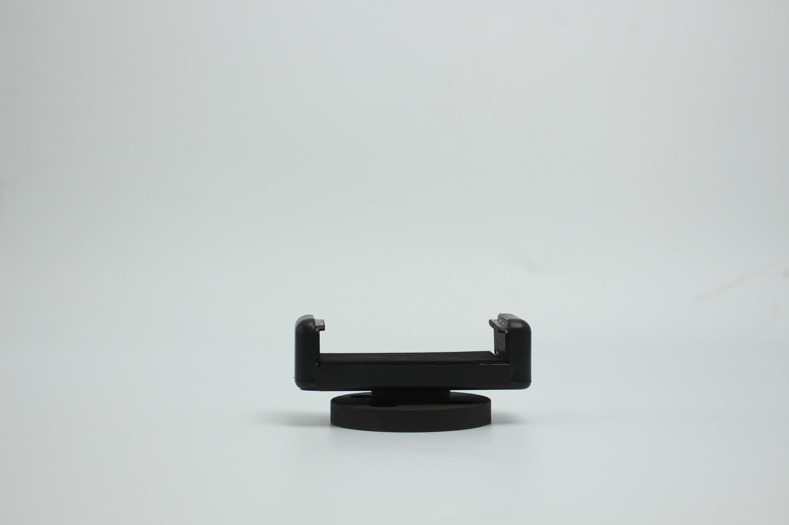

# myCobot Mobile Phone Holder

**Compatible models:** ER myCobot 280 series, ER myPalletizer 260 series, ER mechArm 270 series

**product icon**

**Specifications:**

| **name**                     | **myCobot Mobile Phone Holder**                              |
| ---------------------------- | ------------------------------------------------------------ |
| model                        | myCobot_PhoneHolder_J6                                       |
| Material                     | ABS injection molding                                        |
| size                         | Diameter 34*10                                               |
| color                        | white+black                                                  |
| clamping weight              | 50g                                                          |
| service life                 | two years                                                    |
| a fixed way                  | Lego Connectors                                              |
| Use environment requirements | Temperature and pressure                                     |
| Applicable equipment         | ER myCobot 280 series ER mechArm 270 series ER myPalletizer 260 series |

**myCobot mobile phone holder:** used when holding mobile phones or objects

**Introduction**

- It is suitable for shooting and other equipment that requires physical clamping. It can clamp a variety of mobile phones. It has a simple structure and is easy to install and disassemble.

**Applicable object**

- shooting equipment

Taobao link: No...

 
