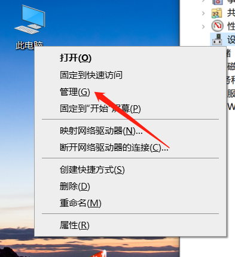
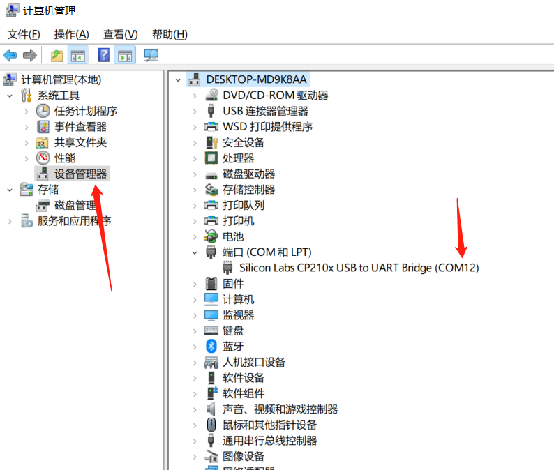

### Instructions for Industry 4.0 Package

Before installing and using the industry 4.0 package, read the [Introduction](https://docs.elephantrobotics.com/docs/elephant-gitbook/3-evelopingPreparation/) of this robot arm, understand the product, and perform the learning and adjustment of it.

#### 1 Installing the package

Perform initial installation of the package according to [Installation Tutorial for myCobot Industry 4.0 Package](https://www.bilibili.com/video/BV1Fp4y1t7Cc?spm_id_from=333.999.0.0) and by following the instructions. 2. The equipment for the package is updated, so update new equipment and their connection methods by referring to the diagram below. **Stand**: The new stand supports the cameras of with a wide range, and a new camera is provided. **tof port**: the position of the tof port is changed. **QR code**: a QR code is added to divide the range of recognition.

#### 2 Installing Python

The language used herein is Python. If you haven\'t install it, install it by following [Installation Tutorial](https://blog.csdn.net/nmjuzi/article/details/79075736). It is recommended to install the latest version.

*PS: If you have installed Python, skip this step.*

#### 3 Installing a third-party package

Install a third-party package of Python through a terminal or compilation software. The installation instructions are as follows:
```
pip install --upgrade pip
pip install opencv-python
pip install opencv-contrib-python
pip install numpy
```

#### 4 Description of codes
```
# mode=1, color recognition
# mode=2, image recognition
mode = 1
    
# If this value is exceeded, there is no object in the box; if it is not exceeded, there is an object in the box.
# to supports the middle box only.
THRESHOLD = 30
    
# to set the initial coordinate of the robot arm when the program runs.
POSITION_INITIAL_X = 168.2
POSITION_INITIAL_Y = -84.1
POSITION_INITIAL_Z = 248.2
    
# to set the coordinate before gripping the objects on the right
CATCH_FROM_BOX_X = 35.6
CATCH_FROM_BOX_Y = -180.7
CATCH_FROM_BOX_Z = 165.5

# to set the coordinate for placing the object on the conveyor belt.
PUT_CUBE_X = 210.3
PUT_CUBE_Y = -113.8
PUT_CUBE_Z = 265.9
    
# to set the coordinate before adsorbing the object on the conveyor belt.
BEFORE_PUMP_X = 215.6
BEFORE_PUMP_Y = 59.2
BEFORE_PUMP_Z = 261.0
```

The coordinates above correspond to the coordinates of ready points respectively. The forward direction of X-axis is the front of the robot arm; the forward direction of Y-axis, the left; and the forward direction of Z-axis, the top. 
The threshold value can be adjusted depending on the height of the object placed.

You can:
```
print(detect.mc.get_tof_distance())
```

Check the current distance value and make proper adjustment to the
threshold value.

```
def run():
    global move_count,mode
    # get which mode should be run
    get_mode = mode
    cap_num = 1
    cap = cv2.VideoCapture(cap_num)
    if not cap.isOpened():
        cap.open()

    if get_mode != 1:
        goal = []
        path = os.getcwd()+'/local_photo/img'
        print(path)
        for i,j,k in os.walk(path):
            for l in k:
                goal.append(cv2.imread('local_photo/img/{}'.format(l)))
    # init a class of Object_detect
    detect = Object_detect("COM9", 115200)
```

1、The value of cap\_num in this part of codes corresponds to the computer camera to an externally connected camera.

2、For the part of detect = Object\_detect("COM9"), modify it according to the actual serial port number of the robot arm.

3、The path output by path is the place where storing identifiable images are saved during image recognition (modifiable).


#### 5 How to check the serial port number of the robot arm

1、Click \"this computer\" to open management and check



2、Select the device manager and check the port in the right list. Check



### Notice

Connect the USB port of the camera directly to the computer, and other devices can be connected to the computer with a transfer port.
