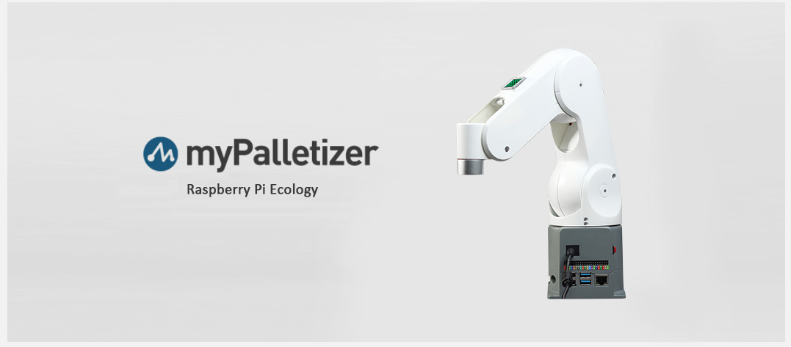

## Adaptive Robots

### myPalltizer 260

<table>
<tr>
    <td>Product</td>
    <td>Image</td>
    <td>Link</td>
</tr>
<tr>
    <td>myPalletizer 260 M5</td>
    <td> </td>
    <td><a href="https://docs.elephantrobotics.com/docs/mypalletizer-m5-en/">Introduction</a></td>
</tr>
<tr>
    <td>myPalletizer 260 PI</td>
    <td> </td>
    <td><a href="https://docs.elephantrobotics.com/docs/mypalletizer-pi-en/">Introduction</a></td>
</tr>
</table>

### mechArm 270

<table>
<tr>
    <td>Product</td>
    <td>Image</td>
    <td>Link</td>
</tr>
<tr>
    <td>mechArm 270 M5</td>
    <td> </td>
    <td><a href="https://docs.elephantrobotics.com/docs/mecharm-m5-en/">Introduction</a></td>
</tr>
<tr>
    <td>mechArm 270 PI</td>
    <td> </td>
    <td><a href="https://docs.elephantrobotics.com/docs/mecharm-pi-en/">Introduction</a></td>
</tr>
</table>

### myCobot 280

<table>
<tr>
    <td>Product</td>
    <td>Image</td>
    <td>Link</td>
</tr>
<tr>
    <td>myCobot 280 M5</td>
    <td> </td>
    <td><a href="https://docs.elephantrobotics.com/docs/mycobot-m5-en/">Introduction</a></td>
</tr>
<tr>
    <td>myCobot 280 PI</td>
    <td> </td>
    <td><a href="https://docs.elephantrobotics.com/docs/mycobot-pi-en/">Introduction</a></td>
</tr>
</table>

### myArm 300 Pi

<table>
<tr>
    <td>Product</td>
    <td>Image</td>
    <td>Link</td>
</tr>
<tr>
    <td>myArm 300 PI</td>
    <td> </td>
    <td><a href="https://docs.elephantrobotics.com/docs/myarm-pi-300-en/">Introduction</a></td>
</tr>

</table>
