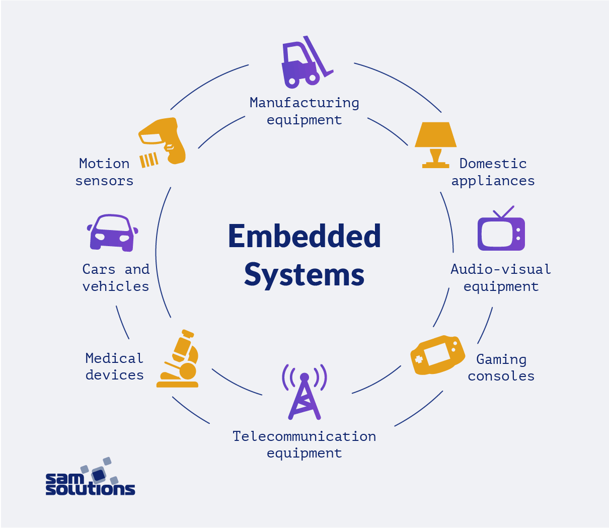
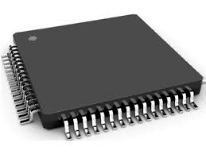

# Electronics

### **Introduction**

Single-Chip Microcomputer (Microcontrollers/SCM) is a kind of integrated circuit chip, which uses VLSI technology to integrate the central processing unit CPU with data processing capabilities, random access memory RAM, read-only memory ROM, various I/O ports, interrupt systems, and timer /Counter and other functions (may also include display drive circuit, pulse width modulation circuit, analog multiplexer, A/D converter and other circuits) integrated into a silicon chip to form a small and complete microcomputer system, widely used in the field of industrial control. From the 1980s, it developed from the 4-bit, 8-bit microcontroller to the current 300M high-speed microcontroller.

### **Basic Structure**

- **Arithmetic Unit**

Arithmetic Unit is composed of arithmetic logic unit (ALU), accumulator and register. The function of ALU is to perform arithmetic or logical operations on the incoming data. The input comes from two 8-bit data sources, one from the accumulator and the other from the data register. ALU can perform various operations on the data, such as Addition, Subtraction, AND, OR, Comparison, etc., and finally store the results in the accumulator.

The arithmetic machine has two functions:

- Perform various arithmetic operations.
- Perform various logical operations and perform logical tests, such as a zero-value test or a comparison of two values.
- All operations performed by arithmetic unit are directed by the control signal issued by the controller, and an arithmetic operation produces an operation, and a logical operation produces a decision.
- **Controller**

Controller is composed of program counter, instruction register, instruction decoder, timing generator and operation controller, etc. It is the "decision-making body" of issuing commands, namely coordinating and directing the operation of the entire microcomputer system. Its main functions are：

- Extract an instruction from memory and indicates the location of the next instruction in memory.
- Decode and test the instructions,then generate the corresponding operation control signal to facilitate the execution of the specified actions.
- Direct and control the direction of data flow between CPU, memory, and input/output devices.

Microprocessor interconnects ALU, counter, register and control parts through an internal bus, and connects the external memory, input and output interface circuit through an external bus. External bus, also known as system bus, is divided into data bus DB, address bus AB and control bus CB. It can be connected with various peripheral devices through the input and output interface circuit. 

******
