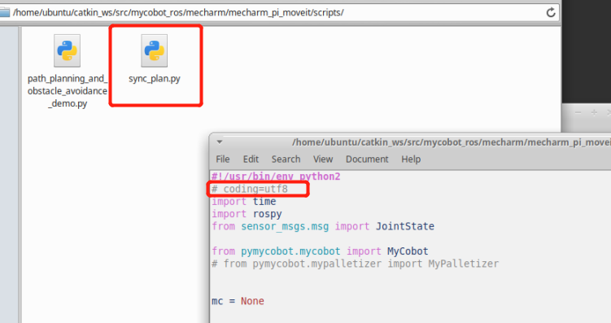
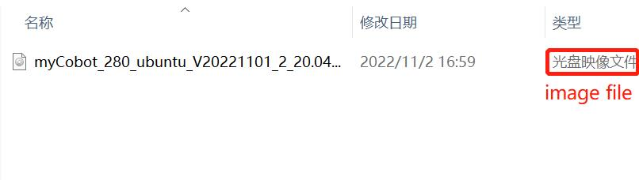
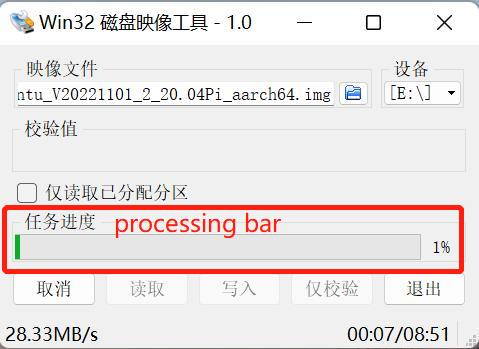

### Introduction to PI version robots

### 1.1 Start to use

- **Connect devices**
  
  - PI version robotic arms does not need to be equipped with a PC, laptop and other equipment, and can be connected to the display for application development（**Tips⚠：Use the delivered HDMI cable to connect the monitor and use the built-in system for development**）
  
  - Plug the HDMI cable into the HDMI port of the monitor.
  

  
  

  
  
  - Plug the other end into the HDMI port of the robotic arm.
  
  

  
  

  
  

  
  

  
  

  
  

  
- **SD card description**

  - 32G TF card，built-in Ubuntu20.04 system，had installed**myStudio**，**myBlockly**，adapted **python ROS** develope env.
  
- **Optional items**

  - A network (Ethernet) cable to connect your Raspberry Pi to your local network and the Internet.  

  - If you aren’t using an HDMI monitor with speakers you might also need some form of sound hardware. Audio can be played through speakers or headphones by connecting them to the AV jack (not available on the Raspberry Pi 400). However speakers must have their own amplification since the output from your Raspberry Pi is not powerful enough to drive them directly.
    

- **Troubleshooting**

  - Make sure you are using a good quality power supply; we recommend using an official  power supply.

  - Make sure you are using a good quality power supply; we recommend using an official Raspberry Pi power supply.

  - You can get help with using the robot on our gitbook

### 1.2 Updates of the system

- **What is Mirroring**
  
  - Mirroring is a form of file saving. It refers to the fact that data saved in one disc also exists in another disc  without any distortion. Mirroring files are often saved as BIN, IMG, TAO, DAO, FCD. It is similar to ZIP packages, which make a series of files into one single file according to certain formats to meet users demands. The most fundamental function of mirroring is that is can be identified by a software immediately and recorded on disc. Generally, mirroring files can be extended to cover more information such as system files. Thus, mirroring files can contain the information of even a hardware. The most typical software for creating mirroring files is Ghost, featuring recording function to save information on a disc. 
  
- **Download system image files**
  
  - Download links
    
    <table>
    <tr>
        <td>Product</td>
        <td>Version</td>
        <td>Link</td>
        <td>SHA256 Hash</td>
    </tr>
    <tr>
        <td>AI Kit 280</td>
        <td>ubuntu 18.04</td>
        <td><a href="https://download-elephantrobotics.oss-cn-shenzhen.aliyuncs.com/Product_software/iMage-ISO/AI_Kit/AI_myCobot_280_ubuntu_V20221030-shrink.zip">Download</a></td>
        <td>d44439be351a52decdb4470cb623a032047e223ffce73477d29aa973bb9100e1</td>
    </tr>
    <tr>
        <td rowspan='2'>myCobot 280 PI</td>
        <td>ubuntu 18.04</td>
        <td><a href="https://download-elephantrobotics.oss-cn-shenzhen.aliyuncs.com/Product_software/iMage-ISO/myCobot-280/myCobot_280_ubuntu_V20221030-shrink.zip">Download</a></td>
        <td>04e40af5b637ec003a8b23ef9012e353361fd336db4e17cf9a65feb75e92927e</td>
    </tr>
    <tr>
        <td>ubuntu 20.04</td>
        <td><a href="https://download-elephantrobotics.oss-cn-shenzhen.aliyuncs.com/Product_software/iMage-ISO/myCobot-280/myCobot_280_ubuntu_V20230222_20.04Pi_aarch64_shrunk.img.gz">Download</a></td>
        <td>ce666e6c1047c512fe6b270336d472e48f231be12808729ed57f743f9d284397</td>
    </tr>
    <tr>
        <td>myCobot 280 JetsonNano</td>
        <td>ubuntu 18.04</td>
        <td><a href="https://download-elephantrobotics.oss-cn-shenzhen.aliyuncs.com/Product_software/iMage-ISO/myCobot-280JetsonNano/myCobot_280_Jetsonnano_V221101-shrink.zip">Download</a></td>
        <td>2f1e40c1480b077bcc83abd3b79ac175f25d21e9cc344a014636167ee2eb087c</td>
    </tr>
    <tr>
        <td rowspan='2'>myCobot 320 PI</td>
        <td>ubuntu 18.04</td>
        <td><a href="https://download-elephantrobotics.oss-cn-shenzhen.aliyuncs.com/Product_software/iMage-ISO/myCobot-320/myCobot_320_ubuntu_V20220805-2.zip">Download</a></td>
        <td>bc2ed6ef8d51a885f45379392b71e35420638a427d5b4b3a3c9d1803d7e589eb</td>
    </tr>
    <tr>
        <td>ubuntu 20.04</td>
        <td><a href="https://download-elephantrobotics.oss-cn-shenzhen.aliyuncs.com/Product_software/iMage-ISO/myCobot-320/myCobot_320_ubuntu_V20221101_20.04Pi_aarch64-shrink.zip">Download</a></td>
        <td>c95633bfd49246254f2be4783c6a91a15212422219157962c93125092aff6b34</td>
    </tr>
    <tr>
        <td rowspan='2'>mechArm 270</td>
        <td>ubuntu 18.04</td>
        <td><a href="https://download-elephantrobotics.oss-cn-shenzhen.aliyuncs.com/Product_software/iMage-ISO/mechArm-270/mechArm270_V221030-shrink.zip">Download</a></td>
        <td>9af1fcbf9c608eda269dc395a8d68ea0a270008a88ec8ec3cf97758371a11178</td>
    </tr>
    <tr>
        <td>Mirror Known Issues</td>
        <td>moveit function abnormal</td>
        <td>Solution:
      Execute moveit and the following prompt will appear, indicating that no permission has been granted:
         
    ​    Enter the path shown in the figure and give the py file executable permission.
    ​        
         Execute moveit and the following prompt will appear, indicating that the encoding format in the code is wrong:
        
         Enter the path shown in the figure, open the py file and enter at the top: #coding=utf8 and save it
         </td>
    </tr>
    <tr>
        <td rowspan='2'>myPalletizer 260</td>
        <td>ubuntu 18.04</td>
        <td><a href="https://download-elephantrobotics.oss-cn-shenzhen.aliyuncs.com/Product_software/iMage-ISO/myCobot-280/myCobot_280_ubuntu_V20221030-shrink.zip">Download</a></td>
        <td>f6fe999519146428e4c60960b242f647ae5c73c704852d686b28580b3a3f695d</td>
    </tr>
    <tr>
        <td>ubuntu 20.04</td>
        <td>-</td>
        <td>-</td>
    </tr>
    <tr>
        <td>myCobot Pro 600</td>
        <td>Raspberry Debian</td>
        <td><a href="https://download-elephantrobotics.oss-cn-shenzhen.aliyuncs.com/Product_software/iMage-ISO/myCobot-Pro-600/myCobot_Pro_600_bebian_V20221021.zip">Download</a></td>
        <td>2e73aaa153bddbf0a49d18669a254b27403f17f8e989c05d13836d7c1f8bd4d9</td>
    </tr>
    <tr>
        <td>myBuddy 280</td>
        <td>ubuntu 20.04</td>
        <td><a href="https://download-elephantrobotics.oss-cn-shenzhen.aliyuncs.com/Product_software/iMage-ISO/myBuddy-280/myBuddy_280_ubuntu_V20221028_20.04Pi_aarch64_shrunk.img.gz">Download</a></td>
        <td>2b5452f665bcb999faf1727b2103dc1e5745705f5706728e140d62906b099920</td>
    </tr>
    <tr>
        <td>myAGV</td>
        <td>ubuntu 18.04</td>
        <td><a href="https://download-elephantrobotics.oss-cn-shenzhen.aliyuncs.com/Product_software/iMage-ISO/myAGV/myAGV_ubuntu18.04_20221028-shrink.zip">Download</a></td>
        <td>bedad7d9769cb69380c6a4b9742ba7aefc21db41ab239172b7a5a7b632453baa</td>
    </tr>
    <tr>
        <td>marsCat</td>
        <td>-</td>
        <td>-</td>
        <td>-</td>
    </tr>
    </table>

- **How to update the system**
  
  **Step 1:** Unzip the package and a file of image style appears.

  

  **Step 2:** Download Win32DiskImager.

  Go to [Win32DiskImager](https://sourceforge.net/projects/win32diskimager/) to download.

  

  **Step 3:** Remove SD card from the pedestal, and then insert the SD card into PC.

  

  **Step 4:** Open Win32DiskImager.

  

  **Step 5:** Select the software and device (E disc) and then write the software into PC.

  

  

  **Step 6:** Successfully processed.

  
