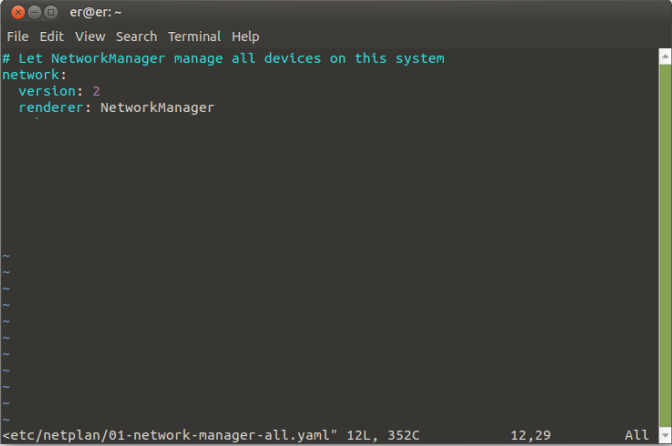
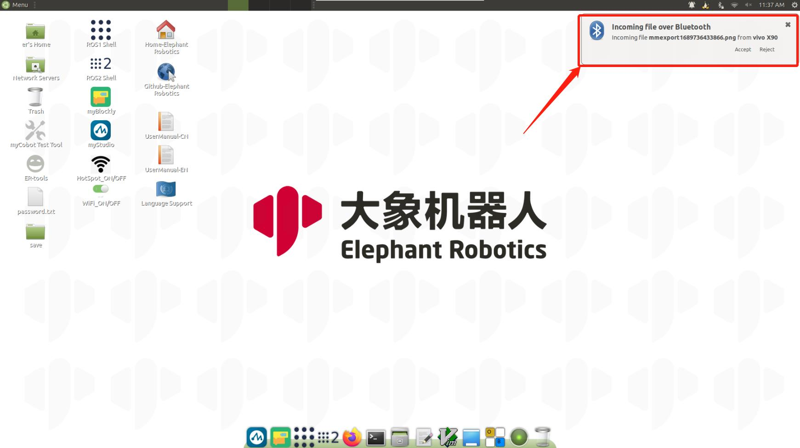
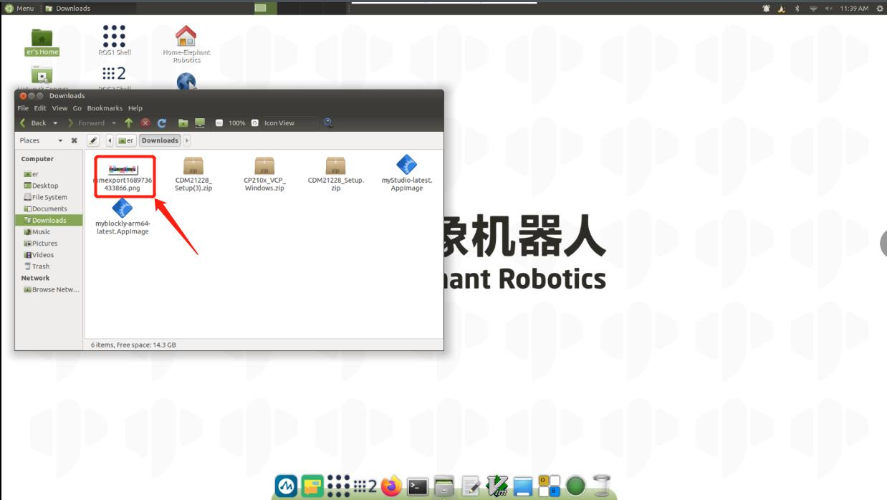
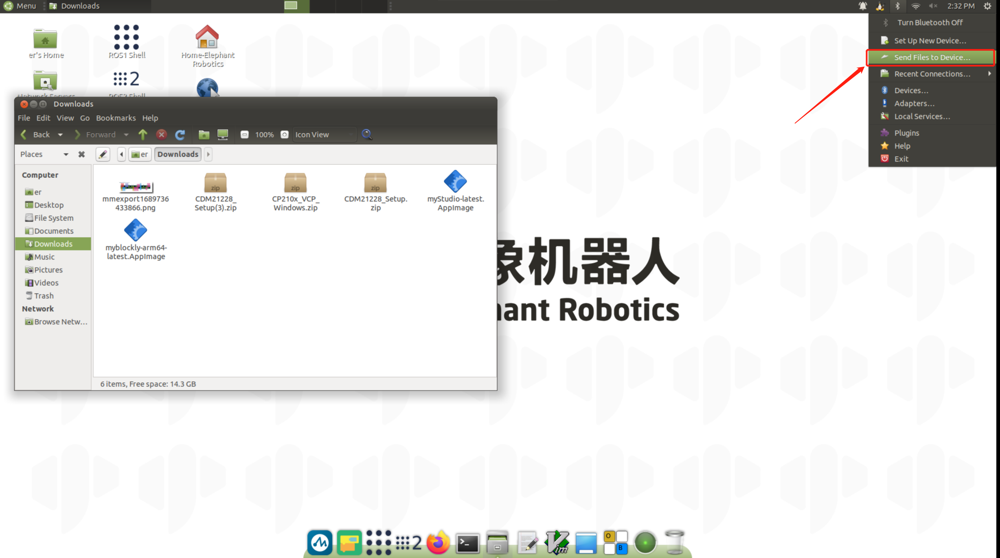
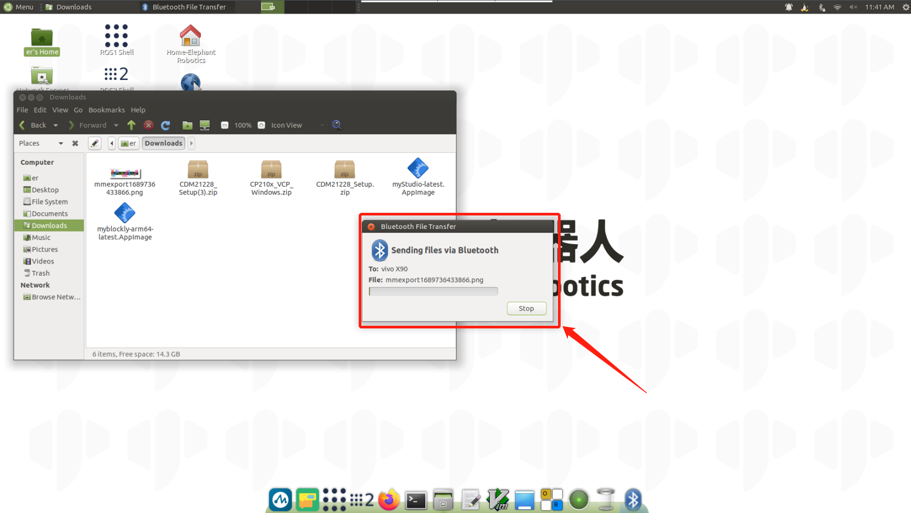
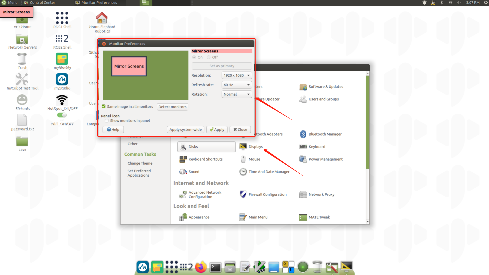
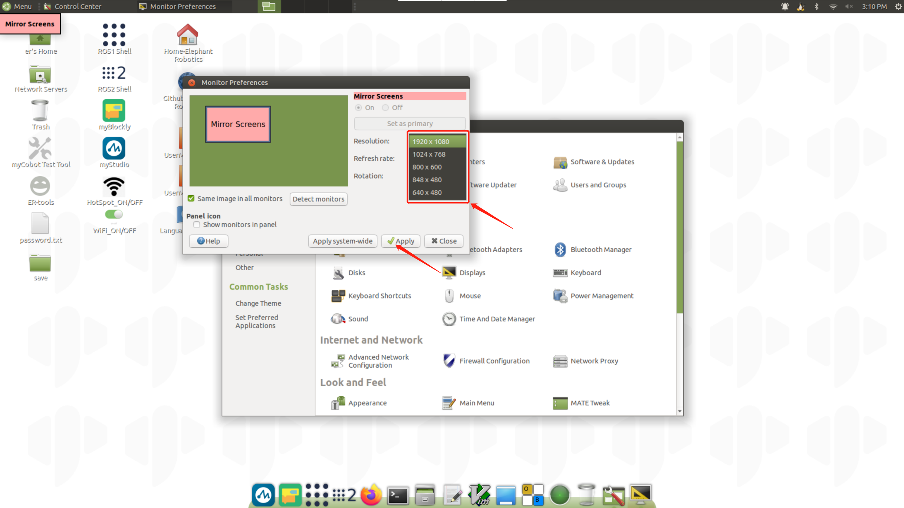
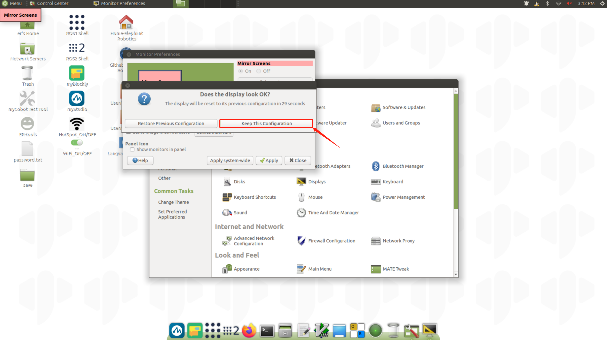

### Description of basic system functions  

### 2.1 Robot system introduction

- **System**

  - Ubuntu is the most widely used linux operating system for personal desktop operating systems. For beginners, familiarity with the linux environment or some embedded hardware operating system is a good choice. The official ubuntu website has also released a dedicated operating system for the Raspberry PI.

    

- **Function introduction**

  - **myStudio**：Firmware burning software for updating and burning new firmware.
  
  
  - **myBlockly**：Graphical programming software, can be directly by dragging building blocks to form running code, control the robot arm
  
  
  - **ROS1 Shell**：Directly enter the compiled ROS1 environment, you can directly enter the corresponding instructions, run the corresponding ROS1 code
  
  
  - **ROS2 Shell**：Directly enter the compiled ROS2 environment, you can directly enter the corresponding instructions, run the corresponding ROS2 code
  
  
  - **Github-ElephantRobotics**：Elephant robotics official open source code repository
  
  
  - **Home-ElephantRobotics**：Elephant robotics website
  
  
  - **UserManual - CN/EN**：Robot use manual，contains everything about robot control
  
  
  - **WiFi_ON/OFF**：WiFi switch, click to turn on/off the WiFi function
  
  
  - **HotSpot_ON/OFF**：Hotspot switch, click to turn on/off the hotspot function, the hotspot name is**ElephantRobotics_AP_XXXX**
  
  
  - **Language Support**：System language setting, click to enter the system language setting interface
  
  

- **System details documentation link**

  - [myPalletizer 260 PI Development environment detailed introduction](https://docs.elephantrobotics.com/docs/mypalletizer-pi-en/)
  - [mechArm270 PI Development environment detailed introduction](https://docs.elephantrobotics.com/docs/mecharm-pi-en/)
  - [myCobot280 PI Development environment detailed introduction](https://docs.elephantrobotics.com/docs/mycobot-pi-en/)
  - [myCobot320 PI Development environment detailed introduction](https://docs.elephantrobotics.com/docs/mycobot-320-pi-en/)

### 2.2 System password description

- **account password & VNC password & SSH password & root account password**

  - Password：**Elephant**
  
- **How to change password**

  - change account password
  
    - Use the shortcut key `ctrl + alt + T` to open the terminal
    
    - Enter  `passwd`
    
    - Enter the new password twice
    
  - change vnc password
  
    - Use the shortcut key `ctrl + alt + T` to open the terminal
    
    - Enter `vncpasswd`
    
    - Enter the new password twice
    
  - change ssh password

    - For SSH remote connection, the password of the administrator account is entered. 
    You do not need to change the password separately
  
  - change root account password

    - Use the shortcut key `ctrl + alt + T` to open the terminal
    
    - Enter `sudo passwd`
    
    - Enter the new password twice
    

### 2.3 VNC

- **VNC Introduction**
  
  - Is a remote control software, generally used to remotely solve computer problems or software debugging
  
- **VNC Port**

  - When the robot arm and PC are connected to the same WiFi, the IP address of the robot arm is the port
  
- **Connect VNC**
  
  - There are two wireless connection modes. The first mode requires an external monitor to do some operations on the system. The specific steps are as follows:：
    Click **“Disconnect”**，disconnect the default hotspot connection

    

    Click **"Enable Wi-Fi"** , and the currently available WiFi will appear

    

    Click on the WiFi you need to connect to, enter the password

    

    After connect successfully，click **"Connection Information"** to check IP address of the robot

    

    As shown in the example，**“192.168.10.64”** is the current IP address of the robot

    

    Connect your PC and the robot to the same WiFi，open the VNC viewer，enter the IP address（examples :  input **192.168.10.64**），enter the password **Elephant**，The user name is not specified by default. The following is an example of a successful connection：

    

  - The second method doesn't need to connect the monitor, directly connect the Ubuntu system hotspot with a PC for remote control, but this connection method does not have the function of Internet surfing, and can only remotely control the robot arm system. The specific steps are as follows:

    Connect tp the hotspot **ElephantRobotics_AP_XXXX**，enter the password **Elephant**

    

    Open VNC viewer，input IP address  **10.42.0.1** ，enter，and then enter the password **Elephant**，The user name is not specified by default. The following is an example of a successful connection：

    

- **How can I improve connection fluency**

  - The fluency of the remote connection depends on the fluency of the connected WiFi. It is recommended to connect to a stable WiFi for remote control

### 2.4 SSH

- **SSH Introduction**
  
  - SSH is a network protocol used for encrypted logins between computers. If a user logs in from a local computer to another remote computer using SSH, we can assume that this login is secure, even if it is intercepted in the middle, the password will not be disclosed.
  
- **SSH Port**
  
  - The default port number is 22
  
- **SSH Connect**
  
  - Confirm the IP address of the robot by following instructions in **2.3 VNC**
  - Click `win + R` and enter `cmd`
    
  - After input, click OK to open the shell interface
    
  - Enter `ssh er@IP address` ，then press `Enter` (the IP address is mainly displayed by the robot arm, the figure is only an example)
    
  - Enter password `Elephant`
    
  - As shown in the above figure, the robot arm has been successfully connected by ssh
  
- **How can I improve connection fluency**

  - The fluency of the remote connection depends on the fluency of the connected WiFi. It is recommended to connect to a stable WiFi for remote controll

### 2.5 Network configuration

- **Default AP usage**
  
  - Power on the robot，by default, the system will connect to the hotspot generated by the PI itself, the hotspot name is**ElephantRobotics_AP_XXXX**，current IP address**10.42.0.1**，this hot spot does not have the function of web surfing, and the transmission rate and information is limited, so there will be some distortion and color difference in the final imaging, and there will be a delay in communication transmission, which is a normal phenomenon
  
- **Connect to WLAN**
  
  Click **"Disconnect"** to turn off default hotspot

  

  Click **"Enable Wi-Fi"** ， wait for the currently available WiFi to be displayed

  

  Click the WiFi you want to connect to and enter the WiFi password

  

  After connect successfully，click **"Connection Information"** to check IP address

  

  As shown in the example，**“192.168.10.64”**, It is the current IP address of the robot

    
  
- **Wired network connection**
  
  Power on the robot, it is connected to the hotspot configured by the system by default: **ElephantRobotics_AP_XXXX**

  

  Click **“Disconnect”**，disconnect from the default hotspot

  

  Connect the network cable to the network port of the robot

  

  Connect the Internet cable to the network port of the robot

  

- **How to set default IP address**
  
  Use shortcut keys `ctrl + alt + T` to open the terminal，enter`sudo vim /etc/netplan/01-network-manager-all.yaml`，modify 01-network-manager-all.yaml file as follows:
  
  
  
  After modification，enter`sudo netplan apply`to make the configuration take effect

- **How to assign IP addresses automatically**
  
  When the system is connected to WiFi, the IP address is automatically assigned, If you want to change the fixed IP address to automatically assign an IP address, modify /etc/netplan/01-network-manager-all.yaml file as follows:
  
  
  
  After modification，enter`sudo netplan apply`to make the configuration take effect
  
### 2.6 BT configuration

- The Bluetooth of the system is turned on by default. Use the PC/Phone directly , and you can search the robot's BT. The default name of the BT is **MyCobot-Pi**
  
  

- Transfers files from PC/Phone to the robot system

    - Select the file you want to transfer
    
    - Operate in the robot system and click **Accept** to receive file

      

    - Wait for the BT transfer to complete

      

    - Can check received files in **/home/er/Downloads ** folder

      


- Transfers files from the robot system to PC/Phone 
  
  - Click BT icon，select **Send Files to Device**
  
    
  
  - Choose PC/Phone
  
    
  
    
  
  - On  PC/ mobile phone, allow the device to receive files

    


### 2.7 Language configuration

- **How to change language**
  
  Click **Language Support**，drag the language you want to the top and restart the system
  
  
  
- **How to download language**
  
  Click **Language Support**，choose language，click to download，enter password **Elephant**
  
  

### 2.8 System resolution switch

- Click the icon in the upper right corner of the screen and select **System Settings** to enter the control panel
  
  
  
  

- Choose  **Display**
  
  
  
- Toggle the selected resolution and click **Apply** to check and click **Keep this Configuration** to save the configuration
  
  
  
  


### 2.9 python

- **Python introduction**
  
  Built-in installation **Python3.8**, no need to install it yourself
  
  Installed libraries：  
  
  
  | Package | Version|
  | :------: | :------: |
  | pymycobot | 3.1.5 |
  | pyserial | 3.5 |
  | numpy | 1.23.5|
  | opencv-contrib-python | 4.7.0.72|
  | rospkg | 1.4.0 |
  | rospkg-modules | 1.4.0 |
  
- **Try to program**
  
  If you are new to the python programming language, you can follow the following video to program
  
  <video id="my-video" class="video-js" controls preload="auto" width="100%"
  poster="" data-setup='{"aspectRatio":"16:9"}'>
    <source src="../../resourse/2-serialproduct/2.1-280/Pi/2.1.5.4/python-terminal.mp4" type='video/mp4' >
  </video>
  
  <video id="my-video" class="video-js" controls preload="auto" width="100%"
  poster="" data-setup='{"aspectRatio":"16:9"}'>
    <source src="../../resourse/2-serialproduct/2.1-280/Pi/2.1.5.4/python-program.mp4" type='video/mp4' >
  </video>
  
  
  
  
  You can try this code in the following input fields:
  
  ```eval-python
    
    print ("Hello World!")
    
  ```


- **Run demo**

  Specific case codes can be viewed [Python](../../7-ApplicationBasePython/README.md)，just copy the code in the cases and use it
  
- **Corresponding chapter case**

  [1 Joint control](../../7-ApplicationBasePython/7.3_angle.md)
  
  [2 Coord control](../../7-ApplicationBasePython/7.4_coord.md)
  
  [3 IO control](../../7-ApplicationBasePython/7.6_IO.md)
  
  [4 Gripper control](../../7-ApplicationBasePython/7.5_gripper.md)
  
  [5 TCP/IP control](../../7-ApplicationBasePython/7.9_TCPIP.md)
  
  [6 Handle control](../../7-ApplicationBasePython/7.8_Handle_control.md)
  
  [7 Example and videos](../../7-ApplicationBasePython/7.7_example.md)
  
  