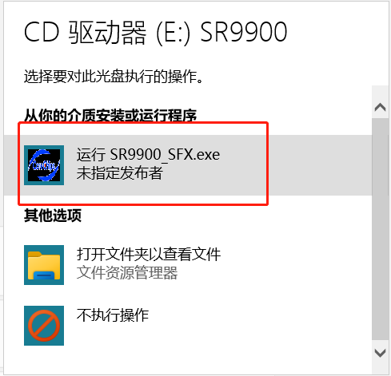
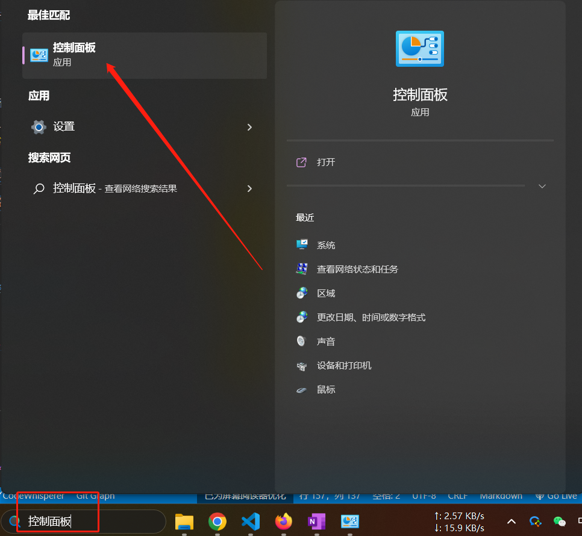
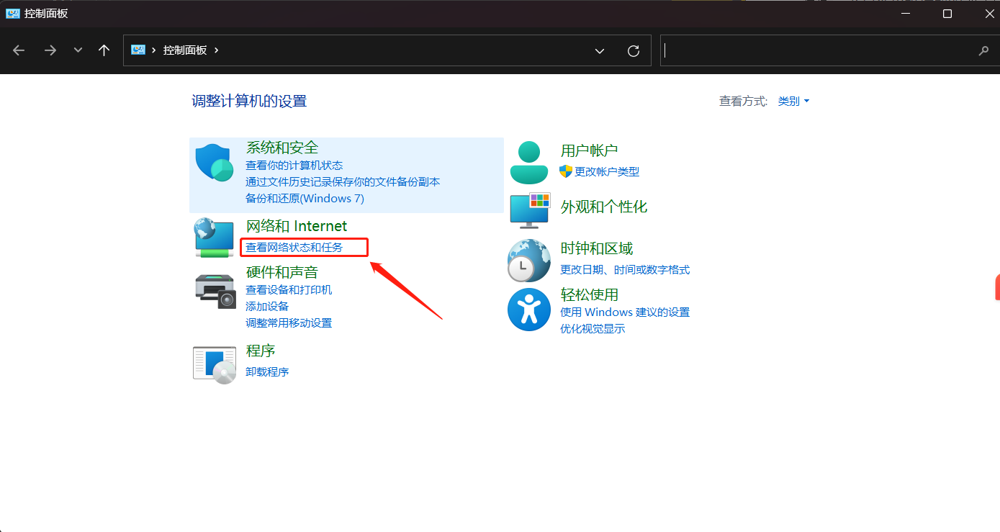
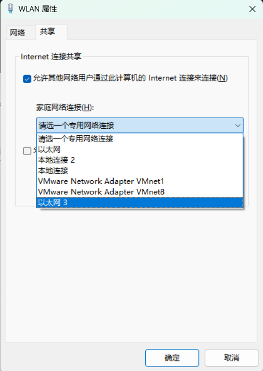

## Jetson nano version robot instructions

### 1 Getting Started with Robots

### 1.1 Robot Equipment Description

- **Supported Device Models**
  
   - myCobot280 Jetson nano
  
  
- **Brief Description of Jetson Nano Model Device Features**
  
   - The Jetson nano version machine is the official joint product of Elephant Robot and **Invidia**, and the robotic arm uses [**Jetson nano**](https://developer.nvidia.com/embedded/learn/jetson-nano-2gb-devkit-user-guide#id-.JetsonNano2GBDeveloperKitUserGuidevbatuu_v1.0-Introduction) The core processor is designed to meet the needs of customers **Linux** system applications and the needs of integrated robot development and convenient equipment. The product retains Jetson nano's native hardware interface, and the device has a built-in **Ubuntu 20.04** operating system, **python ROS myBlockly** and other development environments,
  
   - Jetson nano version machine is embedded with Jetson nano, 1.43GHz 4-core microprocessor, runs Debian/Ubuntu platform, supports 3-way USB, 1-way HDMI, standardized GPIO interface, TF card can be plugged and unplugged
  

- **Jetson nano model robot is the host computer**

   - The essence of the Jetson nano version machine is a development board with an independent system, which can be regarded as a miniature computer host, and the communication between the host and the host cannot be simply formed through a wire. It can only be connected to an independent monitor, and with a power supply, mouse, and keyboard, it can be developed and operated after entering the built-in system of the development board

  

### 1.2 Start using your device

- **Connect external devices**
  
   - The Jetson nano version machine does not need to be equipped with PCs, notebooks and other equipment, and can be connected to the monitor for application development (**Reminder⚠: Please use the included HDMI cable to connect the monitor and use the built-in system for development**)
  
   - First plug the HDMI cable into the HDMI interface of the monitor

  <div align=center>
  
  </div>

  - Then plug the other end into the HDMI port of the robotic arm

  <div align=center>
  
  </div>

  - myCobot 280 Jetson Nano has 3-way USB ports, which can be directly plugged into mouse, keyboard and other peripheral devices
  <div align=center>
  
  </div>

  - After connecting the required external devices, press the button as shown in the figure to start the machine
    <div align=center>
    
    </div>


[>>> unboxing video](https://www.elephantrobotics.com/wp-content/uploads/2022/03/280jn%E5%BC%80%E7%AE%B1%E4%B8%AD%E6%96%8720220314_4.mp4#t=4)

- **System Card Description**
  
  - The factory comes with a 64G TF card, built-in Ubuntu20.04 system, installed **myStudio firmware burning software**, **myBlockly graphical programming software**, and has been adapted to **python, ROS** development environment


  - **troubleshooting**
    
     - Make sure you are using a good quality power supply, we recommend using the official power supply

     - Before shutting down the robotic arm, make sure the operating system is shut down properly

     - You can get help with using the robotic arm on our gitbook
    
  
### 1.3 Update and upgrade of the operating system

- **Burn system image to system card**
  
   - The specific burning steps can be viewed [here](../../19-mirroring/镜像与烧录/15.2-mirroring-burning.md)
  
  
- **Download system patch package**
  
   - Under development, stay tuned
  
  
- **troubleshooting**
  
  
## 2 Operating System Description

### 2.1 Robot System Introduction

- **introduction**
  
   - Ubuntu is the most widely used linux operating system among personal desktop operating systems. For beginners, it is a good choice to be familiar with the linux environment or some embedded hardware operating systems.

    

- **Introduction to system functions**
  
   - **myStudio**: firmware burning software, used to update and burn new version firmware
  
   - **myBlockly**: Graphical programming software, which can directly compose and run codes by dragging and dropping blocks to control the robotic arm
  
   - **ROS1 Shell**: Directly enter the compiled ROS1 environment, you can directly enter the corresponding command, and run the corresponding ROS1 generation
    
   - **ROS2 Shell**: Directly enter the compiled ROS2 environment, you can directly enter the corresponding command, and run the corresponding ROS2 code directly
  
   - **Github-ElephantRobotics**: The official open source code warehouse of Elephant Robotics
  
   - **Home-ElephantRobotics**: Elephant Robotics official website homepage
  
   - **UserManual - CN/EN**: machine manual, contains all the content about the control of the robotic arm
  
   - **Language Support**: System language setting, click to enter the system language setting interface

### 2.2 System Password Description

- **Boot account password & VNC connection password & SSH connection password & administrator account password**
  
   - Unified as: **Elephant**
  
  
- **How to define a new password**
  
   - Change account password
  
     - Use the shortcut `ctrl + alt + T` to open the terminal
    
     - Enter `passwd` to modify the account password
    
     - Enter the new password twice
    
    
   - Change VNC connection password
  
     - Use the shortcut `ctrl + alt + T` to open the terminal
    
     - Enter `vncpasswd` to modify the account password
    
     - Enter the new password twice
    
    
   - Change SSH connection password
  
     - SSH remote connection input is the administrator account password, no need to modify it separately
    
    
   - Change administrator account password
  
     - Use the shortcut `ctrl + alt + T` to open the terminal
    
     - Enter `sudo passwd` to modify the account password
    
     - Enter the new password twice
    
### 2.3 Connect Network

The Jetson nano version of the robotic arm only supports wired network connections. The following describes the connection method for PCs to share the network through network cables:
   - 1. You need to prepare a network cable and a USB docking station with a network port
     
   - 2. Connect one end of the network cable to the network port of the robot arm, and the other end to the network card of the expansion dock, and connect the USB interface of the expansion dock to the PC.
     - The first connection to the PC will appear in the form of a driver, and a new driver needs to be installed to recognize the Ethernet of the robotic arm. The following prompt will appear in the lower right corner of the desktop:
         
         Clicking the prompt will open the following interface, click Run:
         
         After the operation is completed, the PC can recognize the Ethernet of the robotic arm.

   - 3. PC search `control panel` through the search bar, open the control panel Select `View network status and tasks`Click `Change Adapter Settings`Select PC Connected network, right click and click `Properties` and then Select `Sharing`, check `Allow other network users to connect through this computer's Internet connection`, and select the `Ethernet` of the robotic arm (some computers do not have this option, just leave it unchecked), click `OK` to exit .
   
   
   - 3. After completing the above steps, the robotic arm system, through the shortcut keys `ctrl`+`alt`+`t`, open the terminal, enter `ifconfig` and press Enter, and `eth0` appears, indicating that the networking is successful:
    

### 2.4 VNC

***The premise of using VNC is that the robot arm has been connected to the network, and [VNC viewer](https://vnc-viewer.en.softonic.com/) software needs to be installed on the PC side***

- **VNC function introduction**
  
   - It is a remote control software, generally used to remotely solve computer failures or software debugging
  
  
- **VNC port description**
  
   - The robot arm and the PC are connected under the same WiFi or share the network to the robot arm through a network cable, and the IP address of the robot arm is the port
  
  
- **Connect to VNC**
   - After connecting to the network through a network cable, use the shortcut keys `ctrl`+`alt`+`t` to open the terminal, enter `ifconfig` and press Enter, you can get the network IP address of the robotic arm:
     
   - Open the VNC viewer software on the PC, enter the IP address of the robotic arm, and press Back
    
    
  - 
  
  
  
### 2.5 SSH

- **SSH function introduction**
  
   - Simply put, SSH is a network protocol for encrypted logins between computers. If a user logs in to another remote computer using the SSH protocol from a local computer, we can assume that this login is safe, even if it is intercepted midway, the password will not be revealed.
  
  
- **SSH port description**
  
   - default port 22, no need to change
  
  
- **SSH First Connection**
    
   - Press `win + R` on the personal computer to open the running interface, and enter `cmd` in the input box
     
   - After inputting, click OK to open the shell interface
     
   - Type `ssh er@er.local` and press Enter.
   - The following prompt appears, enter `yes` and press Enter
     
   - Then enter the password `Elephant`, the entered password will not be displayed, just enter it normally.
As shown in the figure above, the remote ssh connection has been successful

### 2.6 Language Configuration

- **How to switch languages**
  
   Click **Language Support** on the desktop to enter the language switching interface, drag and drop the language you want to change to the top, and restart the system
  
   
  
  
- **How to download languages**
  

   Click **Language Support** on the desktop to enter the language switching interface, select the language, click Download, and enter the password **Elephant**
  
   

### 2.7 python

- **Introduction to robot system python**
  
   **Python3.8** is installed in the system, no need to install it yourself
  
   Python dependencies installed:
  
  
  | Package | Version|
  | :------: | :------: |
  | pymycobot | 3.1.6 |
  | pyserial | 3.5 |
  | numpy | 1.23.5|
  | opencv-contrib-python | 4.7.0.72|
  | rospkg | 1.4.0 |
  | rospkg-modules | 1.4.0 |
  
  
- **Using python for the first time**
  

   For the first time to contact the python programming language, you can follow the following video for programming
  
  <video id="my-video" class="video-js" controls preload="auto" width="100%"
  poster="" data-setup='{"aspectRatio":"16:9"}'>
    <source src="../../resourse/2-serialproduct/2.1-280/Pi/2.1.5.4/python-terminal.mp4" type='video/mp4' >
  </video>
  
  <video id="my-video" class="video-js" controls preload="auto" width="100%"
  poster="" data-setup='{"aspectRatio":"16:9"}'>
    <source src="../../resourse/2-serialproduct/2.1-280/Pi/2.1.5.4/python-program.mp4" type='video/mp4' >
  </video>
  
  
  
  
  Try this code in the input box:
  
  ```eval-python
    
    print ("Hello World!")
    
  ```


- **Run Robot Case Code**
  
   The specific case code can be found in the [Python chapter](../../7-ApplicationBasePython/README.md), directly copy the code in the case and use it
  
- **Corresponding chapter case**
  
   [1 Joint Control](../../7-ApplicationBasePython/7.3_angle.md)
  
   [2 Coord Control](../../7-ApplicationBasePython/7.4_coord.md)
  
   [3 IO Control](../../7-ApplicationBasePython/7.5_IO.md)
  
   [4 Gripper Control](../.7-ApplicationBasePython/7.6_gripper.md)
  
   [5 TCP/IP connections](../../7-ApplicationBasePython/7.7_TCPIP.md)
  
   [6 Bluetooth Handle Control](../../7-ApplicationBasePython/7.9_HandleControl.md)
  
   [7 Cases and Operation Effects](../../7-ApplicationBasePython/7.8_example.md)
  
  