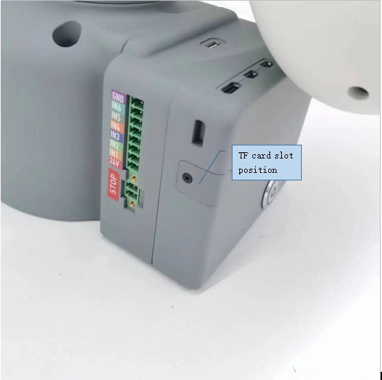
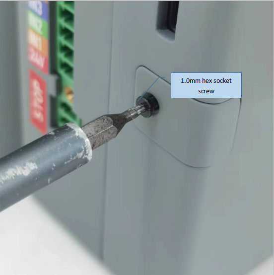
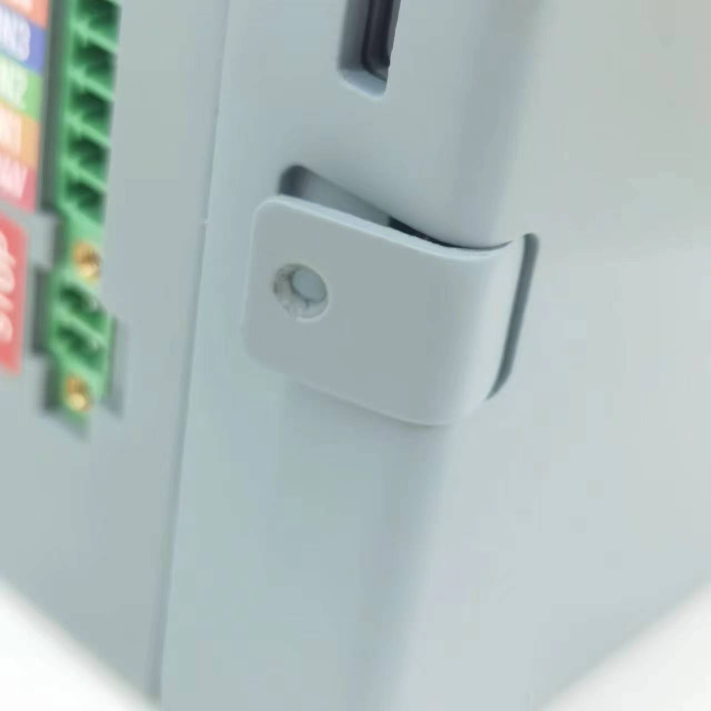

### ***myCobot 320***  PI

### Tutorial on Replacing TF Cards

Front view of equipment base

 

  
  

- Step 1: Check and confirm the position of the TF card slot

  
  

- Step 2: Use an Allen screwdriver to remove the screw

  
  

- Step 3: Remove the TF card protection cover plate

  
  

- Step 4: Remove the TF card or replace it. (Note that power off operation is required)

  
  

  
  
  
