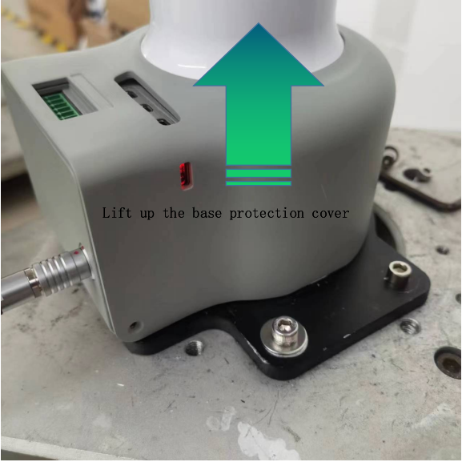
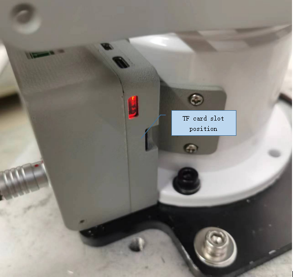
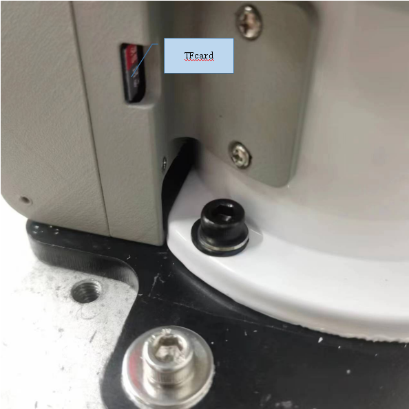

### ***myCobot Pro 600*** 

### Tutorial on Replacing TF Cards

Device Name

  
  

- Step 1: Lift up the base protection cover

  
  

- Step 2: Check and confirm the position of the TF card slot  

  
  

- Step 3: Remove the TF card or replace it. (Note that power outage operation is required

  
  
