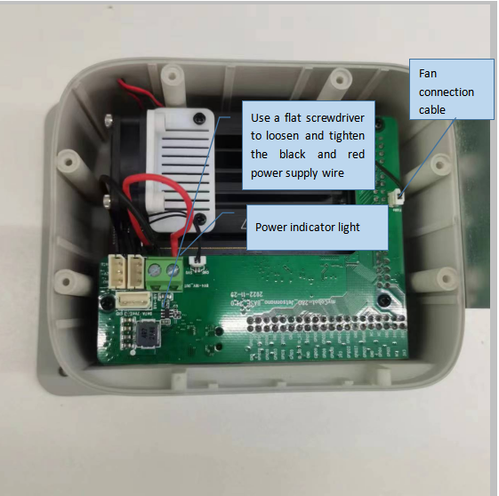
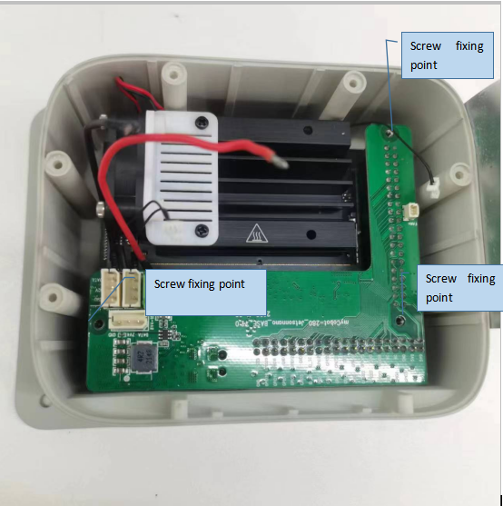
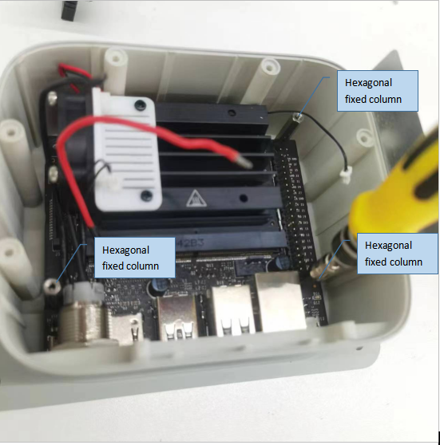
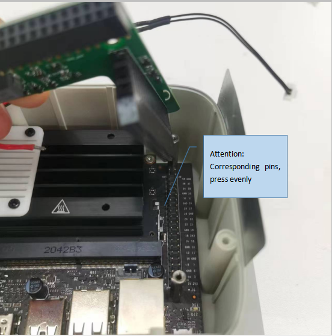
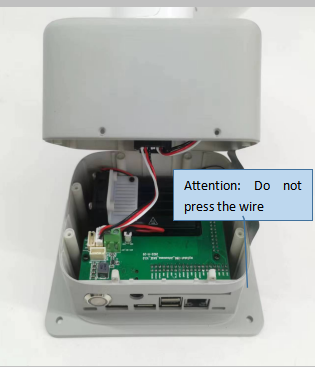
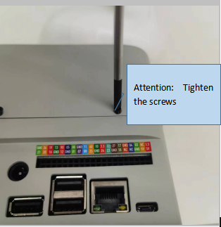

### ***myCobot 280 Jetson Nano***

### **Tutorial on Replacing TF Cards**

Front view of equipment base

 

  
  

- Step 1: Check and confirm the position of the TF card slot. The TF card is inside the device, and you need to manually remove the lower cover of the base to replace it

  

  
  

- Step 2: Remove the two front fixing screws and use a 1.5 Phillips screwdriver

  
  

- Step 3: Remove six 2 * 8 fixing screws from the bottom surface and use a 1.5MM Phillips screwdriver

  
  

- Step 4: Unplug the connection cable of the steering gear (black, red, and white 3PIN)

  
  

- Step 5: It is necessary to unplug the fan connection cable, power indicator light connection cable, and power black and red cable

  
  

- Step 6: Remove the green PCBA board in the picture and remove the three fixing screws on the board

  
  

- Step 7: Remove 3 hexagonal fixing columns

  
  

- Step 8: Remove the main control board (please pay attention to anti-static measures)

  
  

- Step 9: Remove the TF card or replace it. (Please pay attention to anti-static measures)

  
  

  
  

- Step 10: Install the main control board back

  
  

- Step 11: Assembly precautions

  
  

- Step 12: Assembly precautions

  
  

  
  
