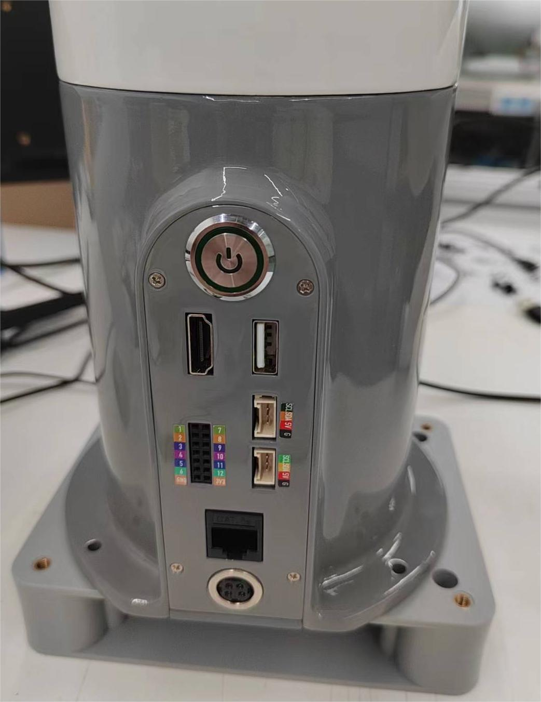
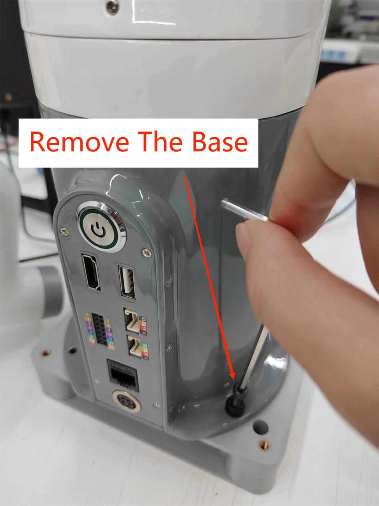
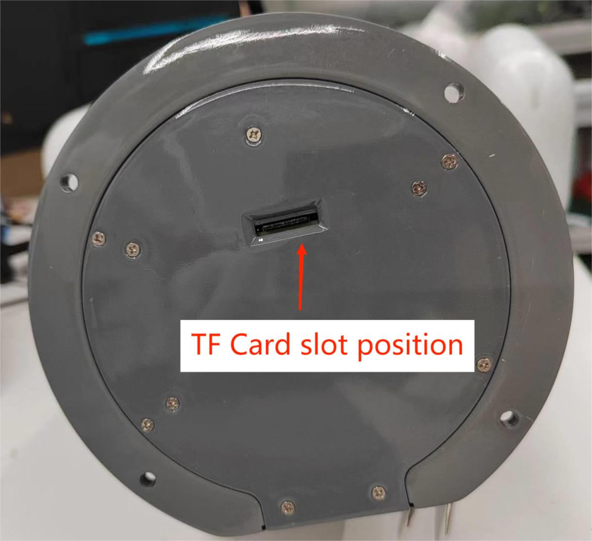
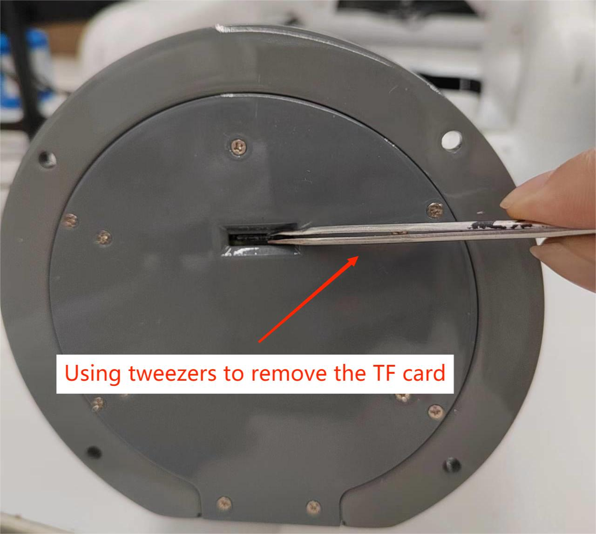
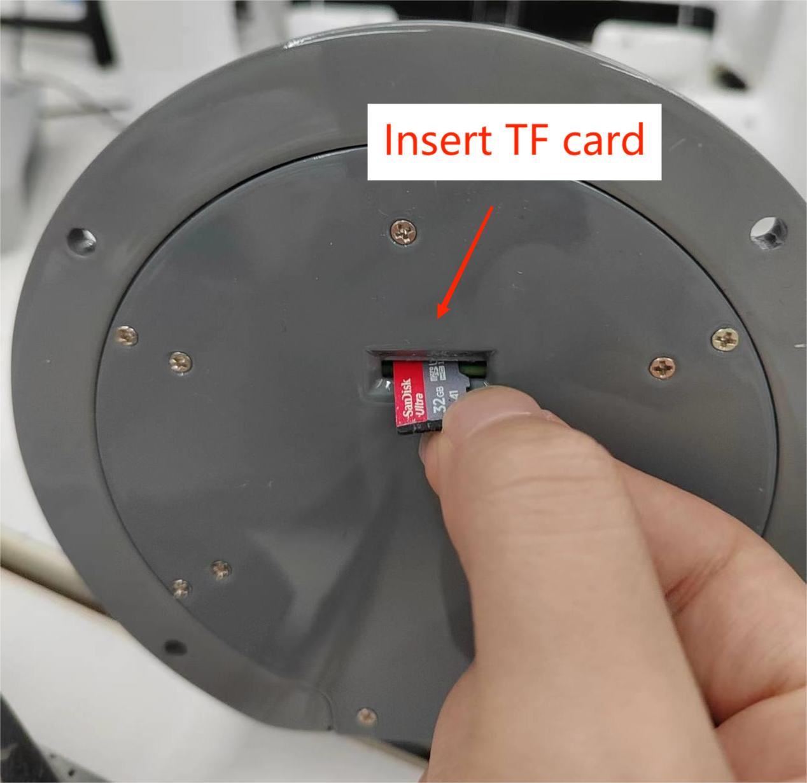

### ***myBuddy***

### Tutorial on Replacing TF Cards

Front view of equipment base

 

  
  

- Step 1:  Use an Allen wrench to remove the base(You need to remove the base to see the position of the TF card slot)

  
  

- Step 2:Check and confirm the position of the TF card slot 

  
  

  

- Step 3: Remove the TF card or replace it. (Note that power off operation is required and tweezers are used to remove the TF card to avoid damaging it)

  
  

  
  
  
