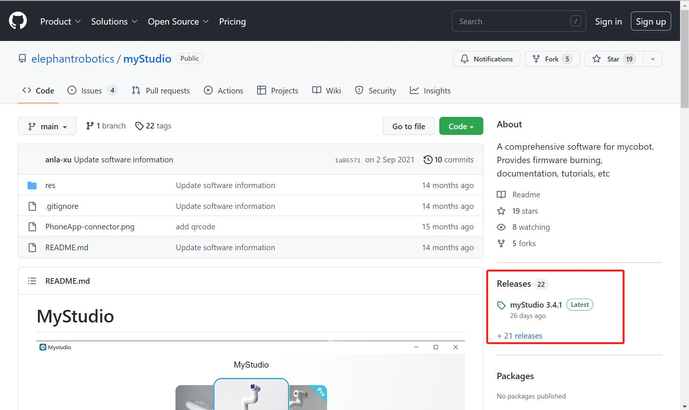
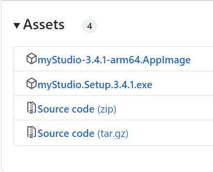
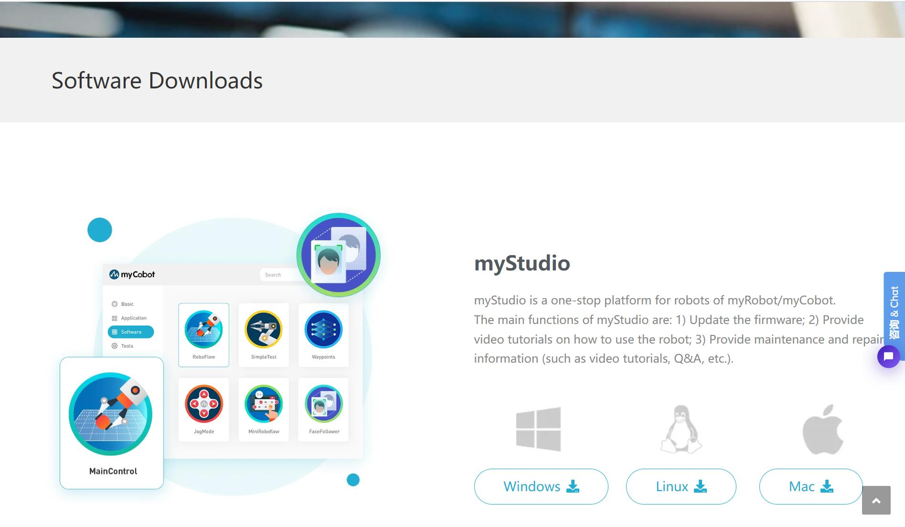

1 Environment Building
=================================
1.1 Download and Installation
---------------------------
>Note：The installation path of myStudio installation cannot have any spaces

address for downloading:

**1. [GitHub](https://github.com/elephantrobotics/myStudio)**

* Click on `myStudio`  at the right side and download the version corresponding to your PC. **Do not install myStudio into files with space directory.** 

* Different suffixes signifies versions applicable for different systems. - 

  * *.tra.xz is applicable to Linux

  - *.dmg is applicable to Mac

  - *.exe is applicable to Window

**2. [Elephant Robotics Official Website](https://www.elephantrobotics.com/download/)**

> **Notice:** Download the latest version. You can log in to check the present version of myStudio and update to the latest.
>
> 

1.2 Serial Port Driver Installation
-----------------------------

Download corresponding serial port driver according to the USB chip on your PC. CP210X is suitable for CP2104 version and CP34X is suitable for CH9102 version. You can install both of them if you are unable to confirm the type of USB chip. Go to the address below to download and install serial port driver.

- serial port driver for M5Stack Basic:
  - CP210X: **[Windows 10](https://download.elephantrobotics.com/software/drivers/CP210x_VCP_Windows.zip)**, **[MacOS](https://download.elephantrobotics.com/software/drivers/CP210x_VCP_MacOS.zip)**, **[Linux](https://download.elephantrobotics.com/software/drivers/CP210x_VCP_Linux.zip)**
  - CP34X: **[Windows 10](https://download.elephantrobotics.com/software/drivers/CH9102_VCP_SER_Windows.exe)**, **[MacOS](https://download.elephantrobotics.com/software/drivers/CH9102_VCP_MacOS.zip)**

-   serial port driver for Atom:
    - **[Windows 10](https://download.elephantrobotics.com/software/drivers/CDM21228_Setup.zip)**

>  **Notice:**
>
> * An error may be reported during installation of CH9102_VCP_SER_MacOS. However, the installation already completes. Just ignore the error.
> * Make sure that settings of the system \"Preferred settings -> Security and privacy ->General\" is correct and allow the user to get it from App Store or an approved developer.

1.3 How to distinguish between CP210X chip and CP34X chip
-------------------------------------------------------------

-   As shown in the GIF below, go to `equipment manager` and  check `ports (COM and LPT)` .

   * If the `ports (COM and LPT)` show `USB-Enhanced-SERIAL CH9102`, the chip is CP34X.

   * If the `ports (COM and LPT)` show `Silicon Labs CP210x USB to UART Bridge`, the chip is CP210X.

