2 Burning and Updating Firmwares
===============================
**Tutorial Video:  [https://www.bilibili.com/video/BV1Qr4y1N7B5/](https://www.bilibili.com/video/BV1Qr4y1N7B5/)**

2.1 Burning M5Stack-basic Firmwares
----------------------------------------

> **Notice:** PI version is not required to burn M5Stack-basic firmwares

**Step 1:** Connect M5Stack-basic with PC with USB.

**Step 2:** Select `USB Port`. After connecting with PC, `USB Port` shows `M5Stack-basic`. The figure below takes myPalletizer 260 M5 as an example.

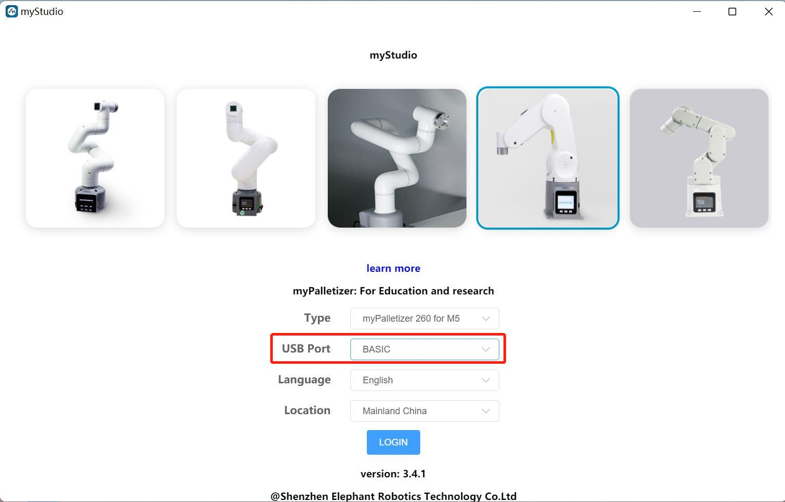

-   Click on `LOGIN`-> `M5Stack-basic`, and then you can burn firmwares.

> **Notice:** As 280 PI/Jetson nano/Arduino versions do not have M5Stack-basic, the `USB Port` cannot show anything after connection.

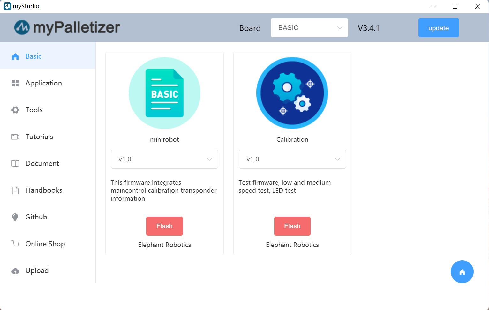

## 2.2 Burning Atom Firmware

**Step 1:** Connect Atom with PC with USB.

**Step 2:** Select `ATOM` at Board, and then burn AtomMain. The picture below takes myCobot 320 as an example.

## 2.3 Firmware Burning for myCobot 320 series

M5Stack-basic and picoMain are required to be burnt on myCobot 320 series. It should be noted that the two firmwares are burnt by different type-c interfaces.

### 1.Burning M5Stack-basic: miniRobot

**Step 1:** Connect M5Stack-basic and PC.

**Step 2:** Select the 320 series, language and region, and then click on `LOGIN`.

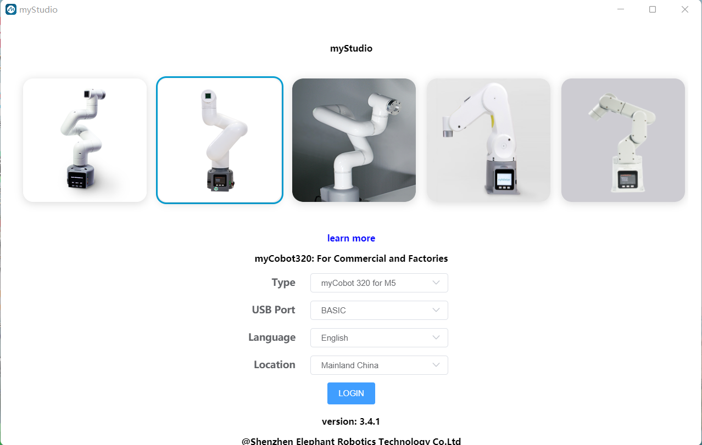

**Step 3:** Click on `Basic`, and select minirobot to burn.

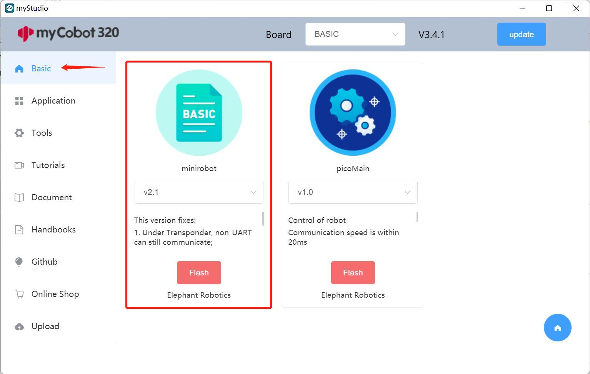

### 2.Burning Pico Firmware: picoMain

**Step 1:** Connect M5Stack-basic with PC.

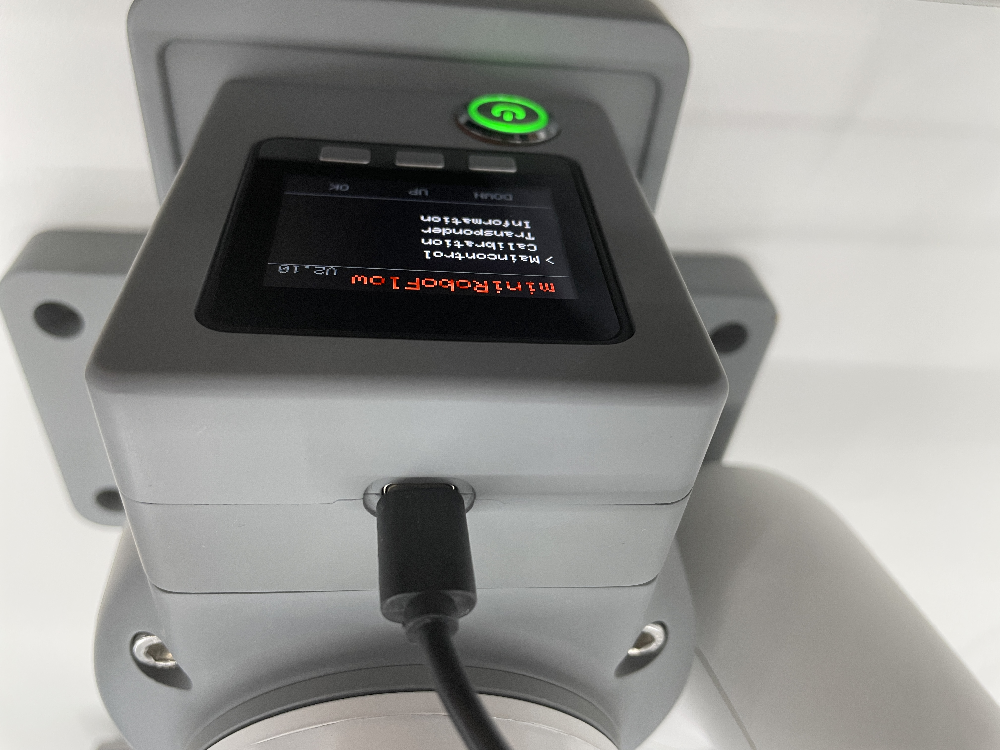

**Step 2:** Select `Flash` (press `UP` once or `DOWN` four times), and then the screen goes dark for approximately 30 seconds.

**Step 3:** select picoMain to burn via myStudio.

> **Notice:** picoMain is required to be burnt during the sleep period of `Flash` mode. Otherwise it may fail to burn picoMain.

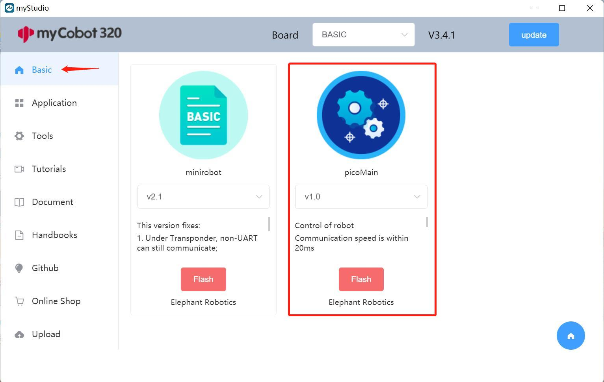

## 2.4 myAGV Firmware burning

### 1.Burning Pico Firmware: picoMain

Step 1: Turn on the computer and connect the screen.

For detailed tutorials, please refer to：[2.5.1 First-time Use · GitBook (elephantrobotics.com)](https://docs.elephantrobotics.com/docs/gitbook-en/13-AdvancedKit/13.2MobileCompoundRobot/13.2.1quickstart.html)

Step 2: Select the myAGV image, select the model language and region, and click to log in.

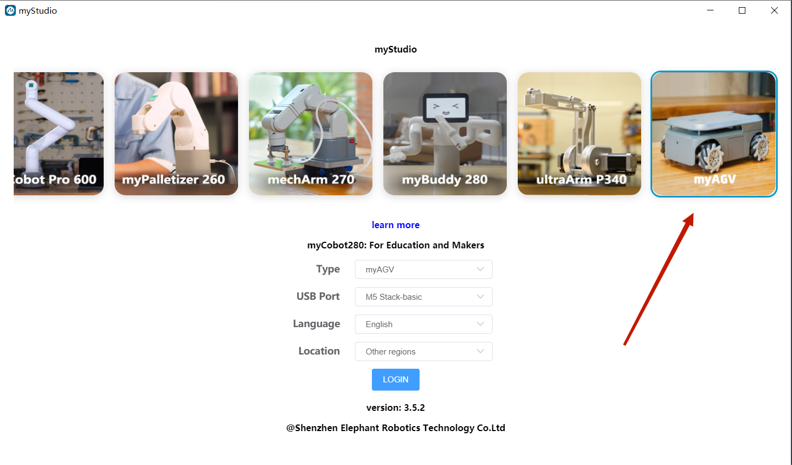

Step 3: After logging in, click 'Basic' and select picoMain to burn.

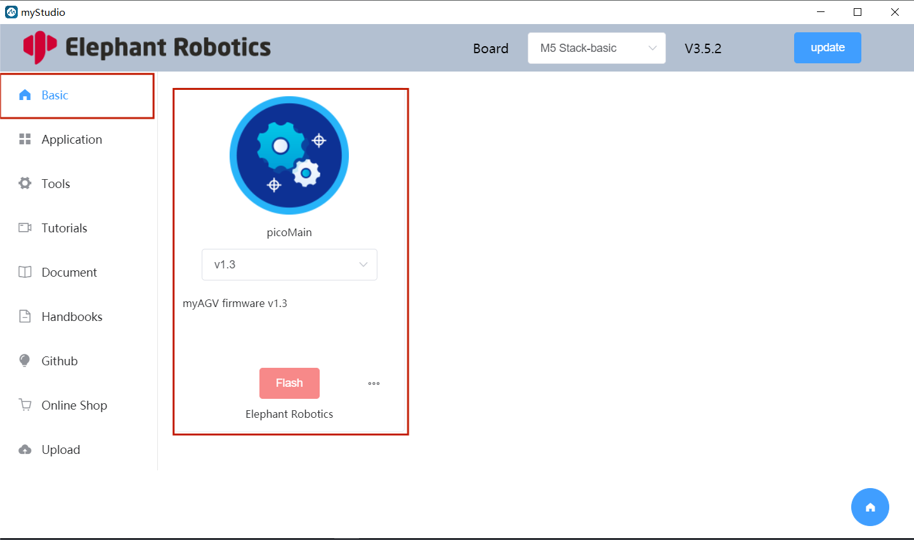

## 2.5 myArm Firmware burning

### 1.Burning Atom Firmware

Step 1: Connects to a PC. Use USB to connect the Atom interface (labeled 11 as Atom Type C interface).

Step 2: Select the myArm image, select the model language and region, and click to login.

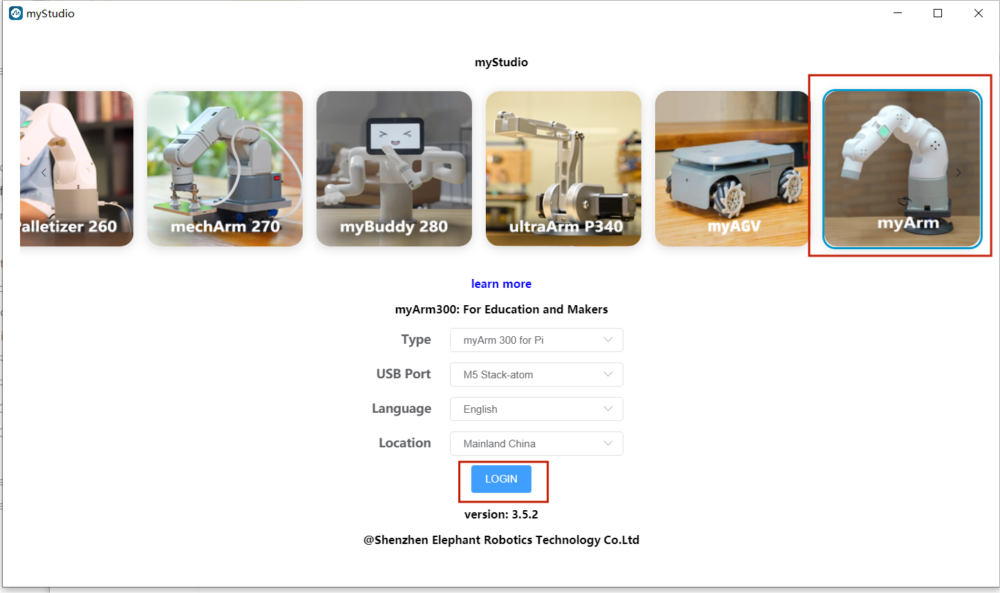

Step 3: After login, click 'Basic', select AtomMain, click download, and then click the burn button to burn.

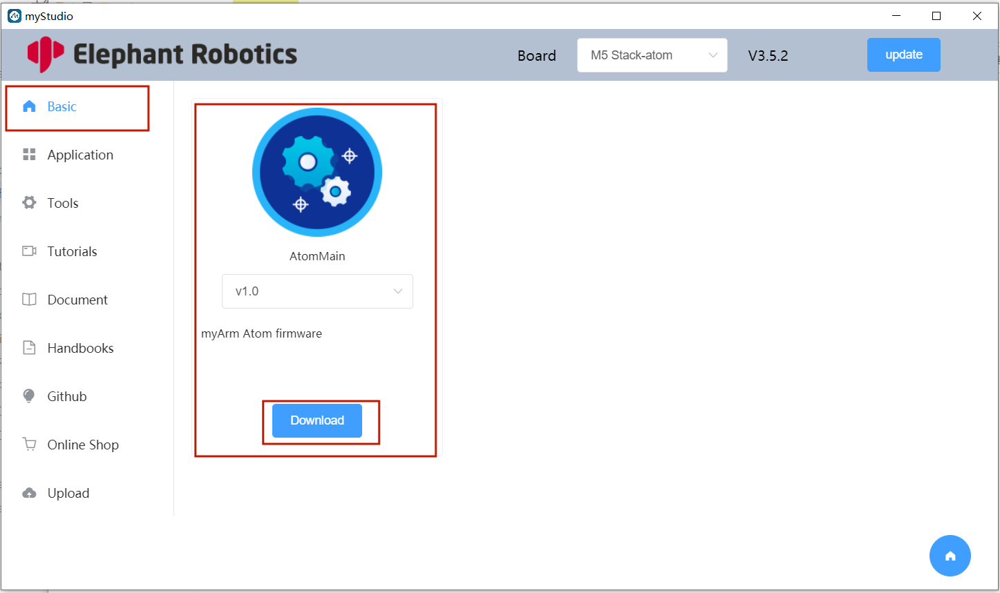

### 2.Burning Pico Firmware: picoMain
Step 1: Turn on the computer and connect the screen.

For detailed tutorials, please refer to：[initial-setup](https://docs.elephantrobotics.com/docs/myarm-pi-300-en/2-serialproduct/2.12-myArm/3-UnpackingAndFirstUse.html#2-initial-setup)

Step 2: Select the myArm image, select the model language and region, and click to login.

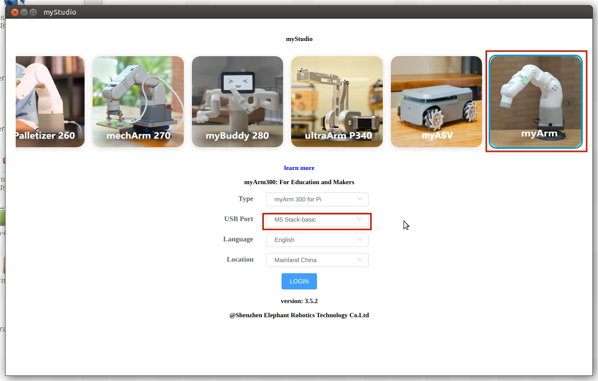

Step 3: After login, click 'Basic', select picoMain, click download, and then click the burn button to burn.

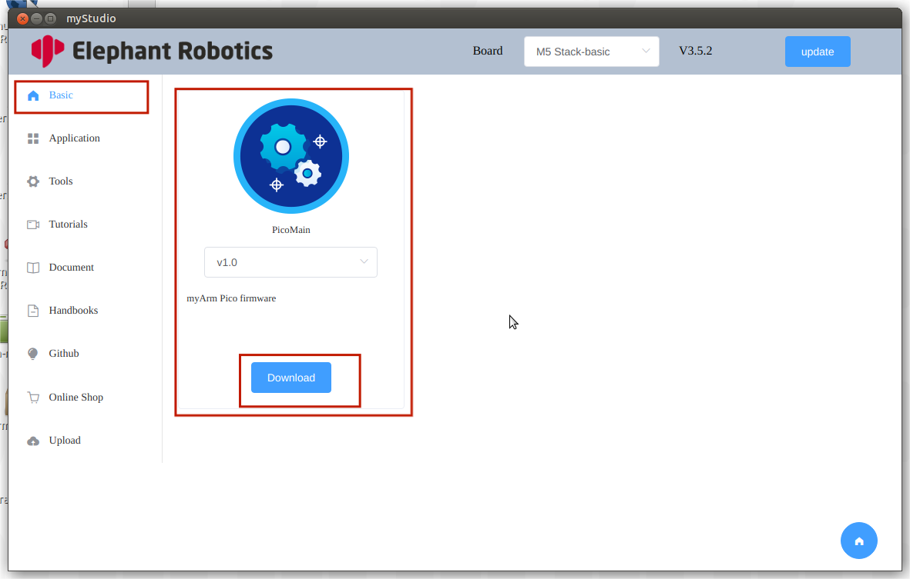

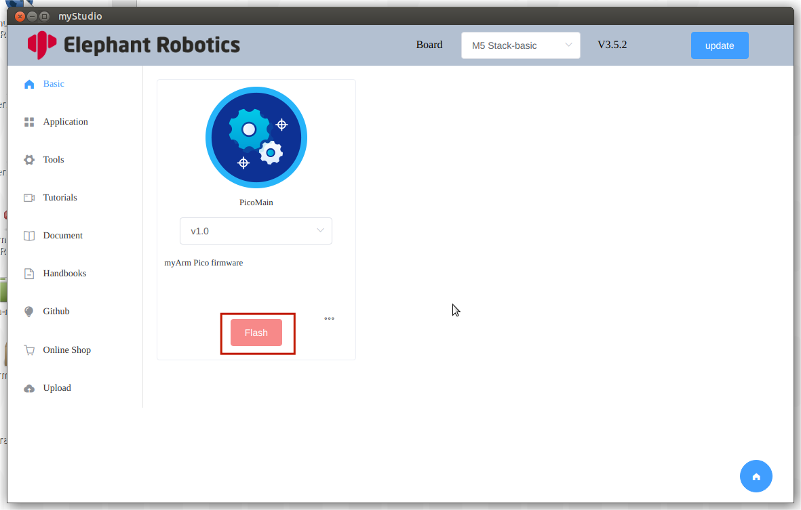