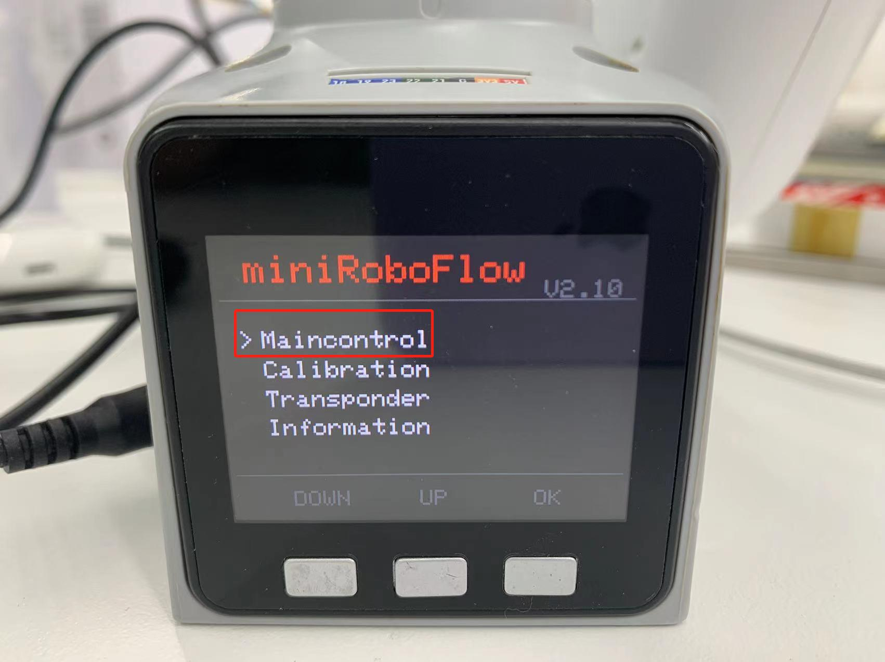
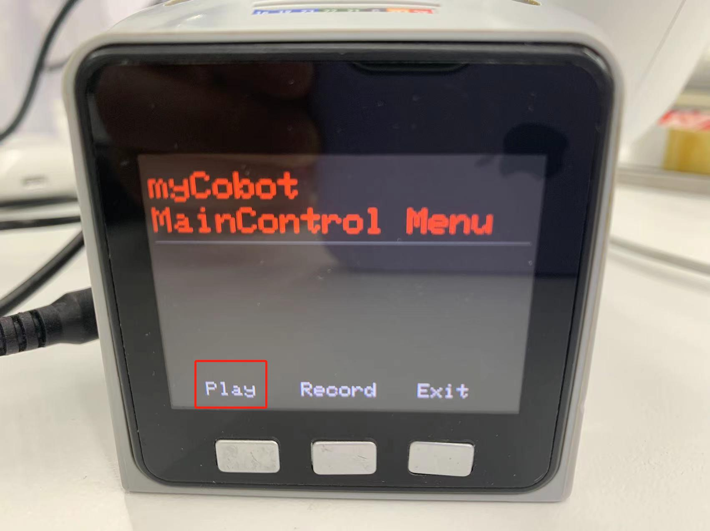

# Drag-and-Record Demonstration

## 1 Applicable Robotic Arms
- myCobot 280 M5
- myCobot 320 M5
- myPalletizer 260 M5
- mechArm 270 M5

## 2 Steps to Operate the Arms

**Step1:** Burn the latest **atomMain** for **Atom.**

**Step 2:** Burn**minirobot**for**M5Stack-basic**, and press **Maincontrol**.

**Step 3:** Press **Record**.

**Step 4:** Select path for storage, and press **Ram** or **Flash**.

**Step 5:** Move the joints of the robot arm to specific positions. After that, press any one of the three buttons so as to stop recording and save the motion.

**Step 6:** Press **Play** to let the robot perform the motion recorded just now.

> **Notice:** 
>
> **Pause**: pause the movement
>
> **Stop**: stop the movement
>
> **Play**: resume the movement

## 3 Tutorial Video

Address: [https://www.bilibili.com/video/BV16t4y167vw/](https://www.bilibili.com/video/BV16t4y167vw/)
