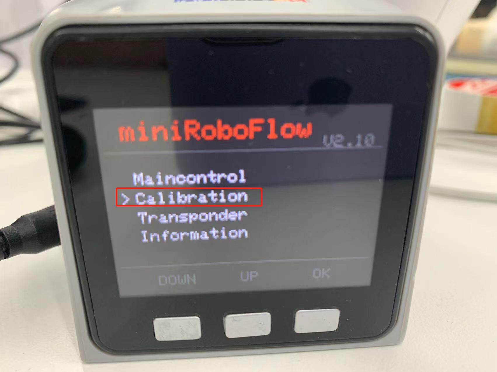
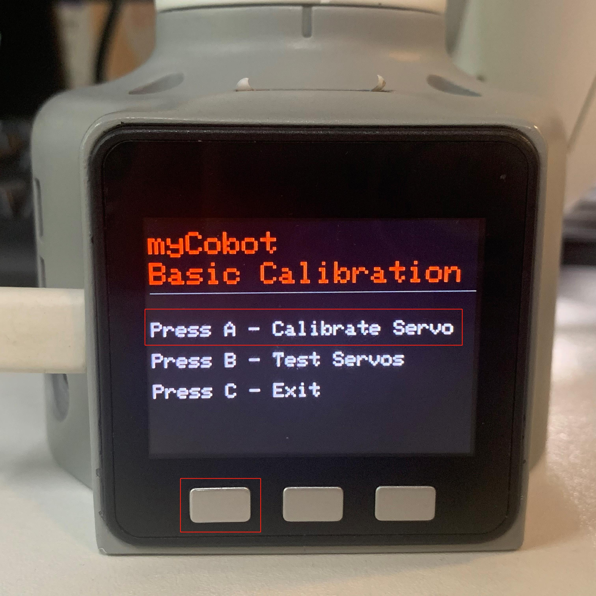
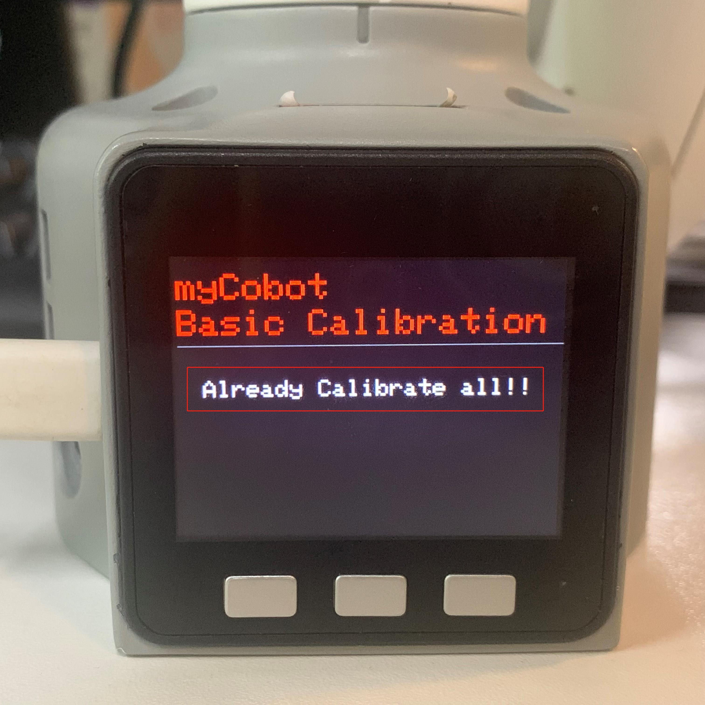
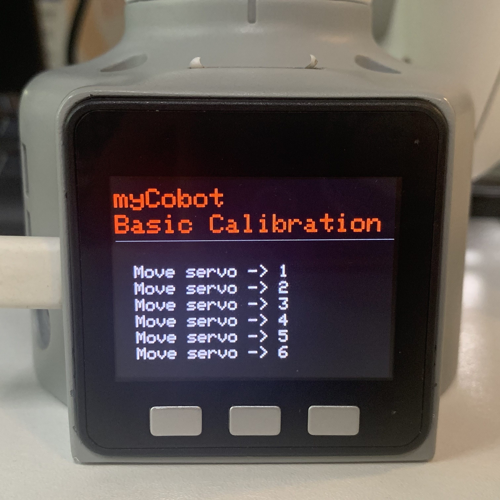
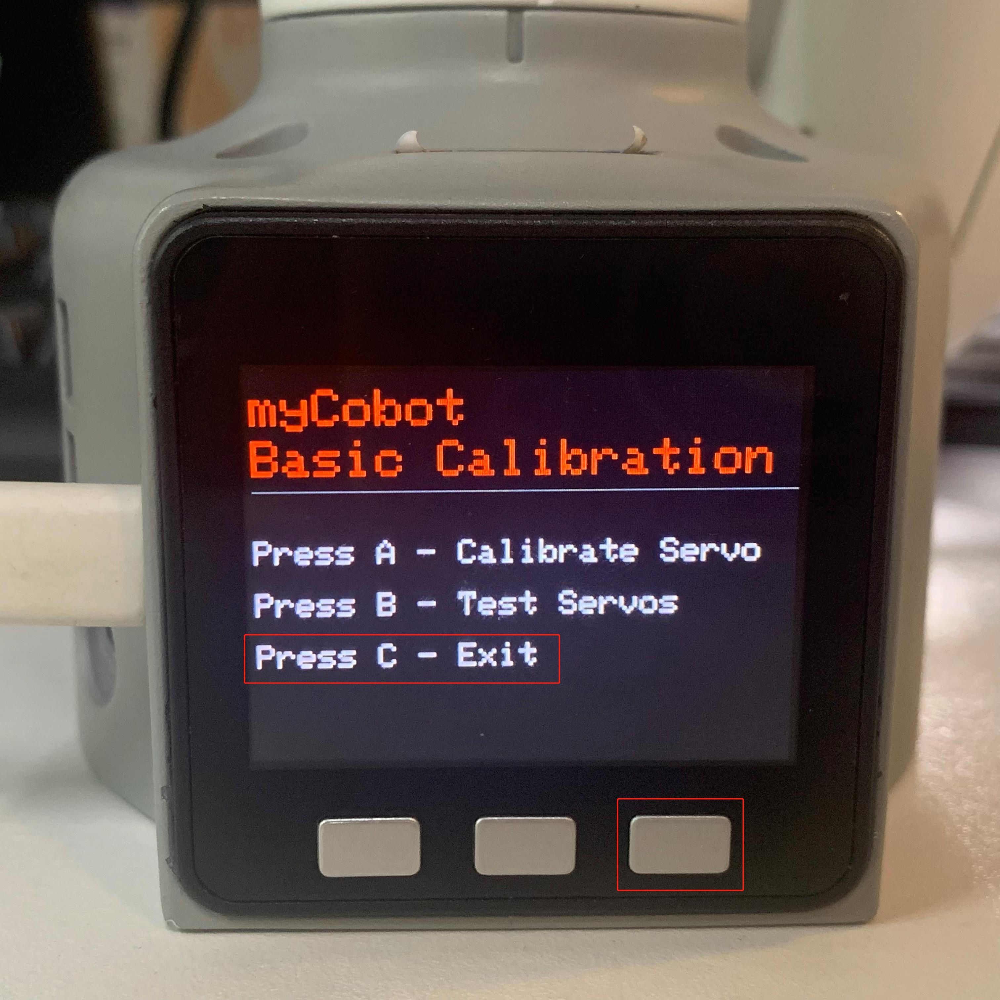

# Calibration

## 1Applicable Robotic Arms

- myCobot 280 M5
- myCobot 320 M5
- myPalletizer 260 M5
- mechArm 270 M5

## 2 Steps to Operate the Arm

**Step 1:** Burn the latest **atomMain** for **Atom**.

**Step 2:** Burn the **minirobot** for **M5Stack-basic**, and press **Calibration**.

**Step 2:** Press **A** to start robot arm calibration.

**Step 3:** Align each joint with zero-position line in sequence.

**Step 4:** After finishing calibrating all joints, a signal **Already Calibrate all !!** emerges on the screen.

**Step 5:** Press **EXIT** to stop calibration and then press **B** to test the zero positions of all joints.

**Step 6:** Press **C** to exit this function. Calibration completes.

## 3 Tutorial Video 

Video Address: [https://www.bilibili.com/video/BV1FT4y1P7BV/](https://www.bilibili.com/video/BV1FT4y1P7BV/)

