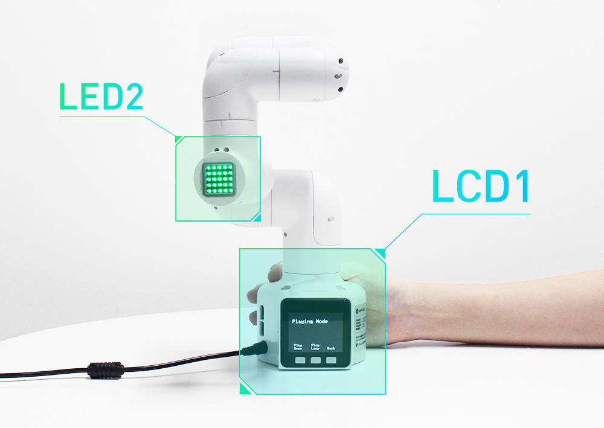

# Communication forwarding

Communication timeliness is vital to the micro-controller robot arm. For such arm, we often send control instructions to M5Stack-basic of the stand. Through communication forwarding, the end effector analyzes the instructions and then implements target actions.

This function is mainly used for the customer to develop robot arms independently in different environments.

**Different types of equipment have different operating methods**. They
have the approximate steps below: 
- Burn the latest version of **atomMain** for **Atom**, and the **minirobot** for **M5Stack-basic**. 
- Choose the **Transponder** function (It is unnecessary to burn **M5Stack-basic** for
micro-CPU devices)
- press the detection key to detect whether the communication between M5Stack-basic and the end effector Atom is normal
- press the exit button to exit this function.

In this chapter, we can perform real-time detection of the communication between M5Stack-basic and the end effector Atom to see whether it is normal.
