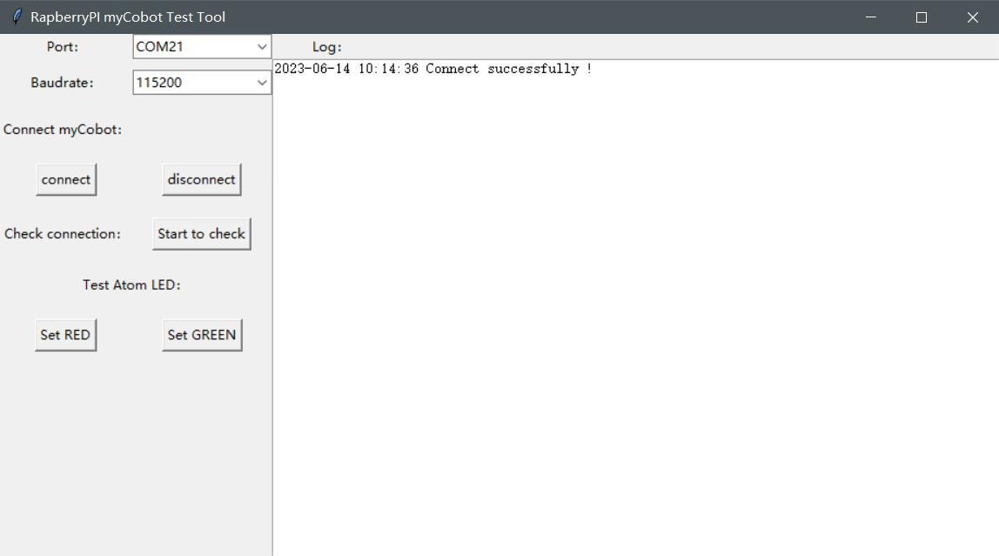
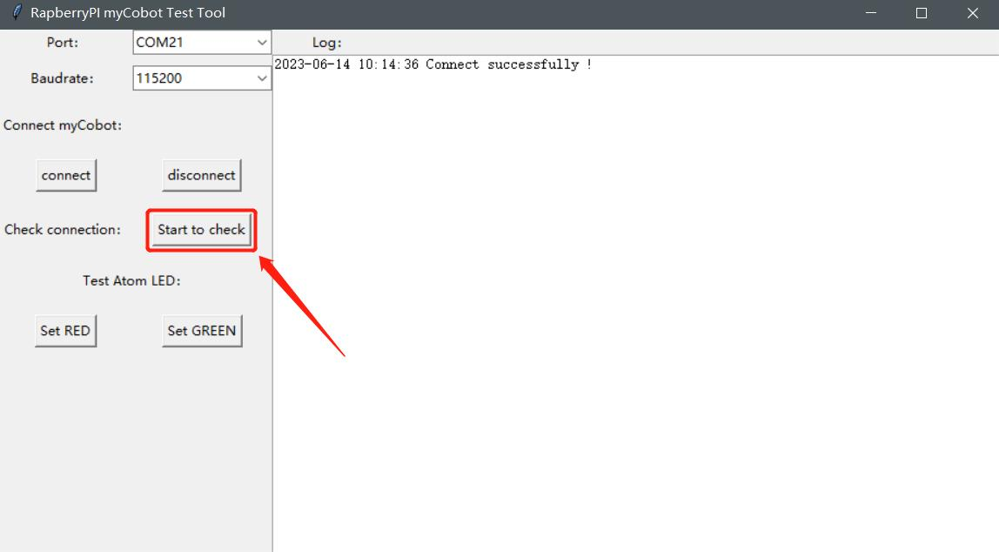
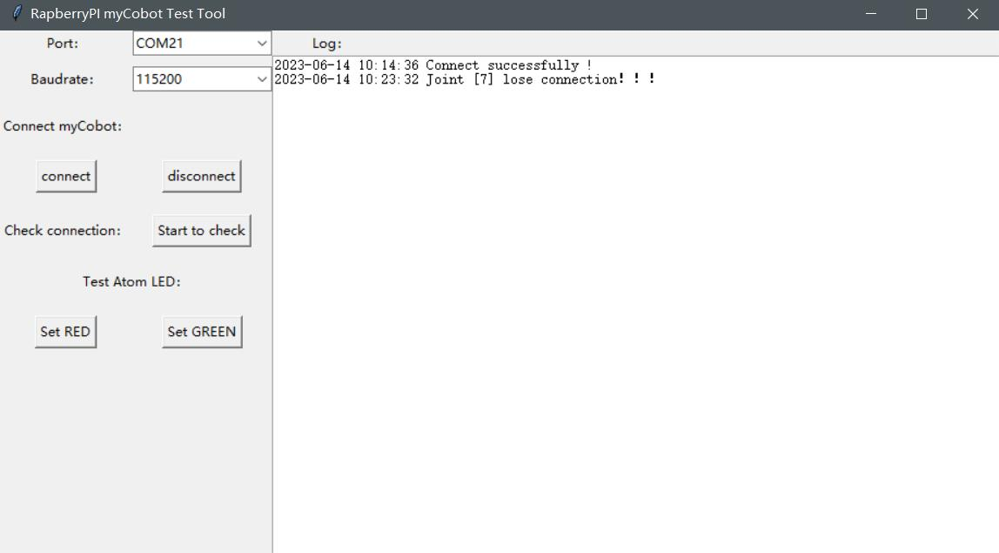
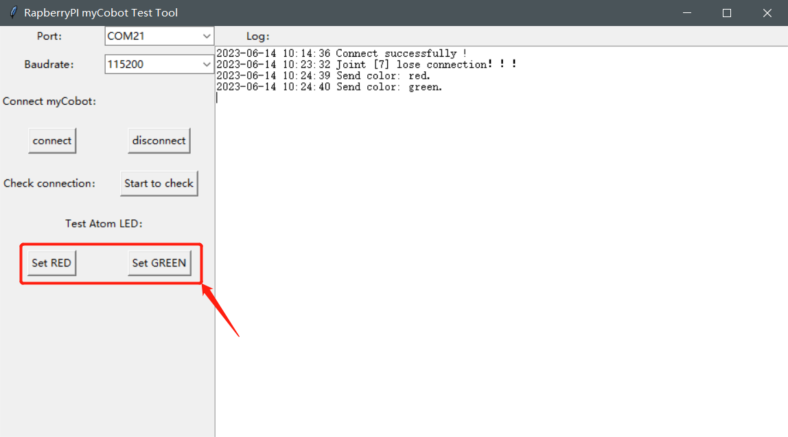
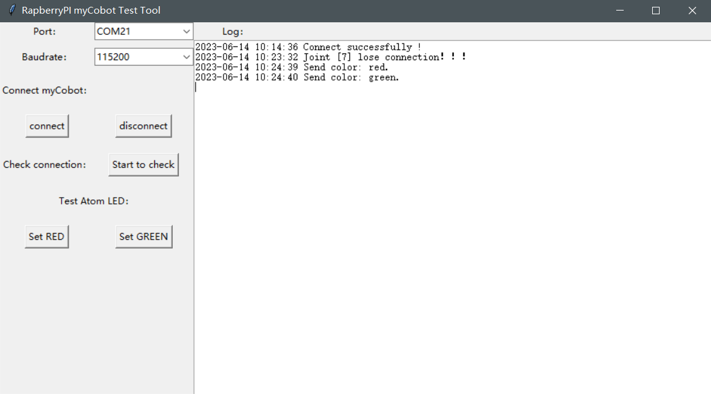

# Connection Detection

## 1 Applicable Robotic Arm
- myCobot 280 Pi
- myCobot 320 Pi
- mechArm 270 Pi

## 2 Steps to Operate

**Step 1:** Burn the latest **atomMain** for **Atom**.

**Step 2:** Create a new Python file named as rasp\_mycobot\_test\_gui.py and copy the following codes.

*Go to [GitHub](https://github.com/elephantrobotics/pymycobot/tree/main/tests) to download the codes.*

```python
#!/usr/bin/env python3
import tkinter
from tkinter import ttk
import time
import serial
import serial.tools.list_ports

from pymycobot.mycobot import MyCobot

LOG_NUM = 0

class MycobotTest(object):
    def __init__(self):
        self.mycobot = None

        self.win = tkinter.Tk()
        self.win.title("RapberryPI myCobot Test Tool")
        self.win.geometry("918x480+10+10")

        self.port_label = tkinter.Label(self.win, text="Port：")
        self.port_label.grid(row=0)
        self.port_list = ttk.Combobox(
            self.win, width=15, postcommand=self.get_serial_port_list
        )
        self.get_serial_port_list()
        self.port_list.current(0)
        self.port_list.grid(row=0, column=1)

        self.baud_label = tkinter.Label(self.win, text="Baudrate：")
        self.baud_label.grid(row=1)
        self.baud_list = ttk.Combobox(self.win, width=15)
        self.baud_list["value"] = ("1000000", "115200")
        self.baud_list.current(1)
        self.baud_list.grid(row=1, column=1)

        # Connect
        self.connect_label = tkinter.Label(self.win, text="Connect myCobot：")
        self.connect_label.grid(row=2)
        self.connect = tkinter.Button(self.win, text="connect", command=self.connect_mycobot)
        self.disconnect = tkinter.Button(
            self.win, text="disconnect", command=self.disconnect_mycobot
        )
        self.connect.grid(row=3)
        self.disconnect.grid(row=3, column=1)

        # Check servo.
        self.check_label = tkinter.Label(self.win, text="Check connection：")
        self.check_label.grid(row=4)
        self.check_btn = tkinter.Button(
            self.win, text="Start to check", command=self.check_mycobot_servos
        )
        self.check_btn.grid(row=4, column=1)

        # LED.
        self.set_color_label = tkinter.Label(self.win, text="Test Atom LED：")
        self.set_color_label.grid(row=5, columnspan=2)
        self.color_red = tkinter.Button(
            self.win, text="Set RED", command=lambda: self.send_color("red")
        )
        self.color_green = tkinter.Button(
            self.win, text="Set GREEN", command=lambda: self.send_color("green")
        )
        self.color_red.grid(row=6)
        self.color_green.grid(row=6, column=1)

        # Log output.
        self.log_label = tkinter.Label(self.win, text="Log：")
        self.log_label.grid(row=0, column=12)
        _f = tkinter.Frame(self.win)
        _bar = tkinter.Scrollbar(_f, orient=tkinter.VERTICAL)
        self.log_data_Text = tkinter.Text(
            _f, width=100, height=35, yscrollcommand=_bar.set
        )
        _bar.pack(side=tkinter.RIGHT, fill=tkinter.Y)
        _bar.config(command=self.log_data_Text.yview)
        self.log_data_Text.pack()
        # self.log_data_Text.grid(row=1, column=12, rowspan=15, columnspan=10)
        _f.grid(row=1, column=12, rowspan=15, columnspan=10)

    def run(self):
        self.win.mainloop()  # run

    # ============================================================
    # Connect method
    # ============================================================
    def connect_mycobot(self):
        self.prot = port = self.port_list.get()
        if not port:
            self.write_log_to_Text("Please choose port")
            return
        self.baud = baud = self.baud_list.get()
        if not baud:
            self.write_log_to_Text("Please choose baudrate")
            return
        baud = int(baud)

        try:
            # self.mycobot = MyCobot(PI_PORT, PI_BAUD)
            self.mycobot = MyCobot(port, baud)
            time.sleep(0.5)
            self.mycobot._write([255,255,3,22,1,250])
            time.sleep(0.5)
            # self.mycobot = MyCobot("/dev/cu.usbserial-0213245D", 115200)
            self.write_log_to_Text("Connect successfully !")
        except Exception as e:
            err_log = """\
                \r连接失败 !!!
                \r=================================================
                {}
                \r=================================================
            """.format(
                e
            )
            self.write_log_to_Text(err_log)

    def disconnect_mycobot(self):
        if not self.has_mycobot():
            return

        try:
            del self.mycobot
            self.mycobot = None
            self.write_log_to_Text("Disconnect !")
        except AttributeError:
            self.write_log_to_Text("Please connect myCobot first！！！")

    # ============================================================
    #  Function method
    # ============================================================

    def check_mycobot_servos(self):
        if not self.has_mycobot():
            return

        res = []
        for i in range(1,8):
            _data = self.mycobot.get_servo_data(i , 5)
            time.sleep(0.02)
            if _data != i:
                res.append(i)
        if res:
            self.write_log_to_Text("Joint {} lose connection！！！".format(res))
        else:
            self.write_log_to_Text("All joints' connections are normal。")

    def send_color(self, color: str):
        if not self.has_mycobot():
            return

        color_dict = {
            "red": [255, 0, 0],
            "green": [0, 255, 0],
            "blue": [0, 0, 255],
        }
        self.mycobot.set_color(*color_dict[color])
        self.write_log_to_Text("Send color: {}.".format(color))


    # ============================================================
    # Utils method
    # ============================================================
    def has_mycobot(self):
        """Check whether it is connected on mycobot"""
        if not self.mycobot:
            self.write_log_to_Text("Please connect myCobot first！！！")
            return False
        return True

    def get_serial_port_list(self):
        plist = [
            str(x).split(" - ")[0].strip() for x in serial.tools.list_ports.comports()
        ]
        print(plist)
        self.port_list["value"] = plist
        return plist

    def get_current_time(self):
        """Get current time with format."""
        current_time = time.strftime("%Y-%m-%d %H:%M:%S", time.localtime(time.time()))
        return current_time

    def write_log_to_Text(self, logmsg: str):
        global LOG_NUM
        current_time = self.get_current_time()
        logmsg_in = str(current_time) + " " + str(logmsg) + "\n"

        if LOG_NUM <= 18:
            self.log_data_Text.insert(tkinter.END, logmsg_in)
            LOG_NUM += len(logmsg_in.split("\n"))
            # print(LOG_NUM)
        else:
            self.log_data_Text.insert(tkinter.END, logmsg_in)
            self.log_data_Text.yview("end")


if __name__ == "__main__":
    MycobotTest().run()

```

**Step 3:** Open the terminal (CTRL+ALT+T) and type the following commands. And then, click on ENTER:


```bash
cd Desktop
python3 rasp_mycobot_test_gui.py
```

**Step 4:** Choose the corresponding serial port and baud rate at the left top corner. After that, choose the baud rate corresponding to the device, and click on **Connect**.

-   *myCobot 280 Pi:1000000*

-   *myCobot 320 Pi:115200*



**Step 5:** Set all joints of the robot arm to the zero position, and click  on **Start to check**



**Step 6:** When the prompt `Joint [7] lose connection！！！`， which means that joint 7 fails to communicate, the detection completes.



**Step 7: ** These two buttons are able to change the color of Atom LED.





