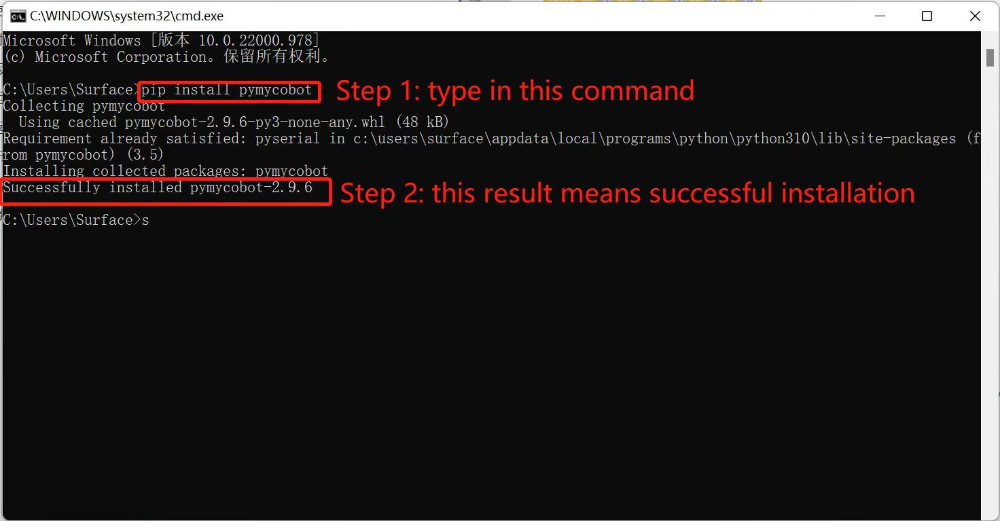
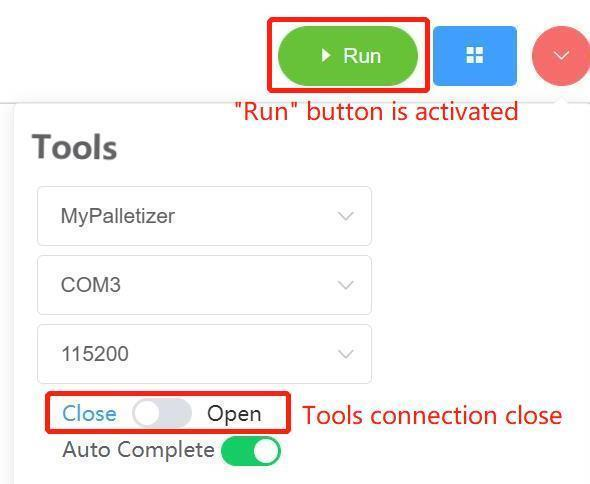
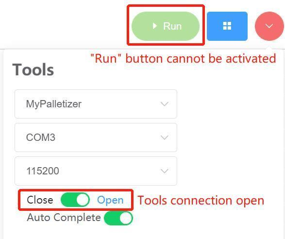

# 10 Q&A

Usual problems and due solving methods are listed below for reference.

**Q1: Why `ModuleNotFoundError: No module named 'pymycobot'` is reported?**

A: This error is reported when pymycobot is not installed in Python environment. 

* Installation of pymycobot: open terminal on PC (Win+R, and then type in `cmd`) --> type in `pip install pymycobot --upgrade --user` --> press "Return". The result "Successfully installed pymycobot" signals installation succeeds.

**Q2: Why the robotic arm has no response.**

A: As the robotic arms require time to complete the specified movement, it is necessary to set a `Sleep` module following the action modules, providing enough time for the robotic arm. The minimum time for action is no less than 0.5 second, and users can set the specific time according to own demands.

**Q3: How to activate `Running` button?**

A: If the robotic arm is connected to the PC, check that:

(1) whether the serial port is occupied by any background system;

(2) the connection of Tools at top right corner if program cannot run successfully.

**Q4: Why the system reports a number of errors after running myBlockly?**

A: Make sure the following settings are correct.

* Number of the port. 

  Following the steps below to check the number of port.

  * For Windows users, go to Device Manager to check the number. If COM and LPT shows USB-Enhanced-SERIAL CH9102, the port is compatible with CP34X chip. If COM and LPT shows Silicon Labs CP210x USB to UART Bridge, the port is compatible with CP210X chip. 
  * For Linux users, open the terminal, type in `ls/dev/tty *` and then press "Return". The number of the serial port will be presented on the screen, namely AMA0 or USB0.
  * For Mac users, type in `cd/dev/`, press "Return" and then `ls -al tty`.

* Baud rate. The baud rate of M5, myCobot 320 Pi-2020, myCobot 320 Pi-2022, myCobot 280 Jetson nano and myCobot 280 Arudino is 115200. The baud rate of myCobot 280 Pi, myPalletizer 260 Pi, mecahrm 270 Pi, myBuddy 280 and Pro 600 is 1000000.

Besides, make sure that the type of robotic arm, type of port and baud rate in `Tools` is the same as that of Blockly programs.

**Q3: Why `MyCobot._int_() takes 2 positional arguments but 3 were given` is reported?**

A: This error is reported due to the old version of myBlockly, which is not compatible with pymycobot. Please update myBlockly.

**Q4: What does `child process exited with code 1` mean?**

A: It means that program has run completely and successfully.
