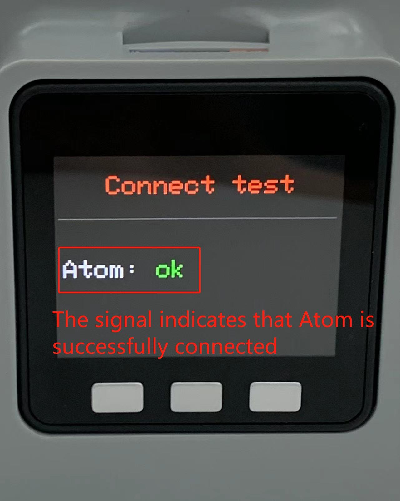
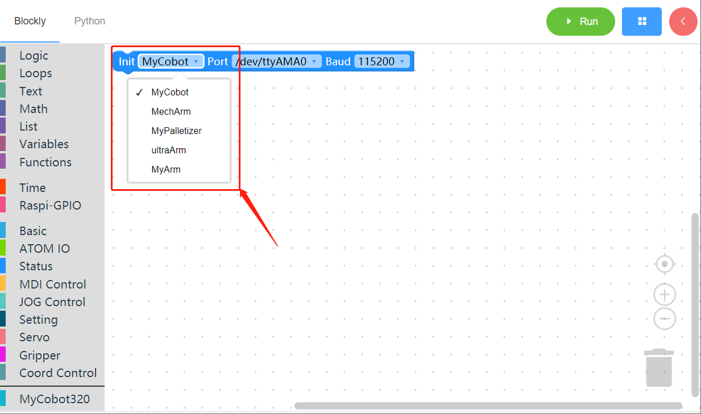
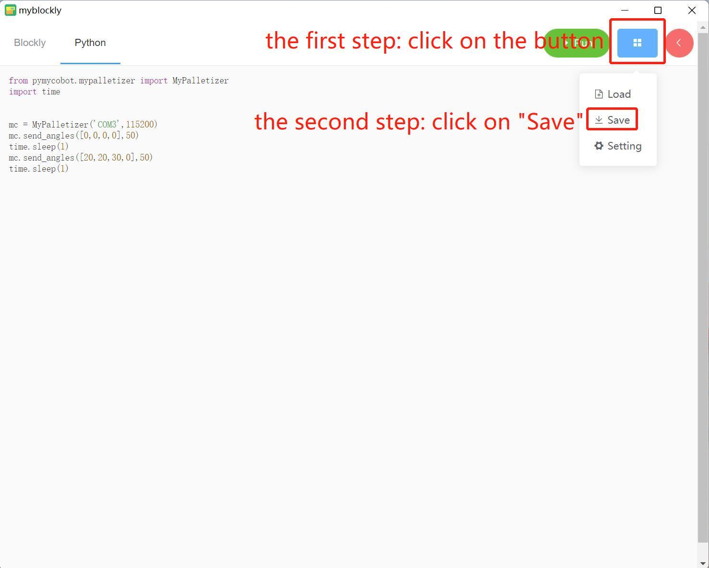

# First-Time Use

## Preparing for the first-time use

Follow the steps below to download Python and burn firmware via MyStudio.

**Step 1** Download Python. myBlockly is used in Python environment. Make sure Python is downloaded on PC (**[Reference for information about configuration of Python environment](https://docs.elephantrobotics.com/docs/gitbook/7-ApplicationBasePython/7.1_download.html)**).

**Step 2** Burning firmware. 

* Before burning firmware, download corresponding serial port driver according to the USB chip on your PC. CP210X is suitable for CP2104 version and CP34X is suitable for CH9102 version. You can install both of them if you are unable to confirm the type of USB chip. Go to the address below to download and install serial port driver.
  * serial port driver for M5Stack-basic:
    * CP210X: **[Windows 10](https://download.elephantrobotics.com/software/drivers/CP210x_VCP_Windows.zip)**, **[MacOS](https://download.elephantrobotics.com/software/drivers/CP210x_VCP_MacOS.zip)**, **[Linux](https://download.elephantrobotics.com/software/drivers/CP210x_VCP_Linux.zip)**
    * CP34X: **[Windows 10](https://download.elephantrobotics.com/software/drivers/CH9102_VCP_SER_Windows.exe)**, **[MacOS](https://download.elephantrobotics.com/software/drivers/CH9102_VCP_MacOS.zip)**
  * serial port driver for Atom:
    * **[Windows 10](https://download.elephantrobotics.com/software/drivers/CDM21228_Setup.zip)**

> **Notice:**
>
> *  An error may be reported during installation of CH9102_VCP_SER_MacOS. However, the installation already completes. Just ignore the error.
> *  Go to **[4.1.1 MyStudio Installing driver](https://docs.elephantrobotics.com/docs/gitbook/4-BasicApplication/4.1-myStudio/4.1.1-myStudio_download_driverinstalled.html)** for specific information about serial port driver installation.
> *  Make sure that settings of the system \"Preferred settings -> Security and privacy ->General\" is correct and allow the user to get it from App Store or an approved developer.

**Step 3** M5Stack-basic burning is not required on Raspberry Pi series and JETSON NANO series, and their lasted atomMain on Atom is factory burnt.

**Step 4** For M5Stack series, miniRobot is required to be burnt on M5Stack-basic via MyStudio.  The lasted atomMain on Atom is factory burnt. Go to **[4.1 MyStudio](https://docs.elephantrobotics.com/docs/gitbook/4-BasicApplication/4.1-myStudio/)** for its download and installation. Follow the steps below to burn miniRobot.

**Step 5** Press "Transponder" button on M5Stack-basic, and then press "Atom ConnectTest".

## Installing myBlockly

Go to the addresses below to download myBlockly.

* **[Github](https://github.com/elephantrobotics/myblockly-package/releases)**
* **[Official Web](https://www.elephantrobotics.com/download/)**

> **Notice:**
>
> Make sure to download the latest version.

## Before use

- Before start to programming, be sure to select the ** corresponding machine model **, otherwise it is easy to cause hardware damage

- When controling robot by quick move，be sure to select the ** corresponding machine model **, otherwise it is easy to cause hardware damage

## myBlockly View

* API blocks:

  * Display API used to generate programs
  * API used for MyCobot 320

* Other tools controlling robots:

  * Click on the pink icon in the top right corner to select the corresponding robot type, serial port and baud rate.
  * Tap `Joints Control`  or `Coordination Control` for joints' real-time angles and coords.
  * Tap `+` or `-` to control robot movements.

* Generated program:

  * Make sure to select the correct robot type, serial port and baud rate before utilization. Otherwise the program may report an error. Check the version of myBlockly if serial port and baud rate do not change correspondingly.
  * Programs are created by dragging API blocks from the left side.

**Notice:**

1. Baud rate for M5Stack series and Raspberry Pi series is 115200 and 1000000 respectively.

  | Robot | Port | Baudrate |
  |:---------:| :--------:|:--------:|
  |260 M5| Win: COM*; Linux: /dev/ttyUSB*;|115200|
  |270 M5| Win: COM*; Linux: /dev/ttyUSB*;|115200|
  |280 M5| Win: COM*; Linux: /dev/ttyUSB*;|115200|
  |320 M5| Win: COM*; Linux: /dev/ttyUSB*;|115200|
  |260 PI|  /dev/ttyAMA0|1000000|
  |270 PI|  /dev/ttyAMA0|1000000|
  |280 PI|  /dev/ttyAMA0|1000000|
  |320 PI|  /dev/ttyAMA0|115200|
  |280 Jetson Nano|  /dev/ttyTHS1|1000000|

2. Go to **[4.1.1 Download and Installation of myStudio](https://docs.elephantrobotics.com/docs/gitbook-en/4-BasicApplication/4.1-myStudio/4.1.1-myStudio_download_driverinstalled.html)** for serial port and baud rate of different types of robots.

3. Check connection of `Tools` in top right corner if program cannot run successfully.

  

  

4. API for MyCobot 320 is specifically set in the bottom left corner. It does not affect any program.

  

## Running Program

Drag API blocks from the left side to integrate them with each other for program edition. Then, tap "Run" button to run the program.

**Notice:**

`Sleep` block is required to provide no less than 0.5 second for a robot to move. Otherwise the robot cannot run successfully.

Click on `Python` for Python codes corresponding to blocks edited in myBlockly.

## Saving and Loading Programs

* myBlockly files are saved as "*.json" format. Click on the blue button in the top left corner, and then click on "Save".

* Click on "Load" button to import existing programs.

## How to install and update the software

The installation and update of myBlockly need to go to the [official website](https://www.elephantrobotics.com/en/downloads/)  to download the latest version.

Inside the software, you can update the software through the following steps.

- 1 Mouse move here
- 2 Click setting
- 3 This is your current version
- 4 Click this link to view the latest version and download

And if you need to know the detailed update log of the software, you can go to [github](https://github.com/elephantrobotics/myblockly-package/releases) to view.

## How to run the sample code

We provide a wealth of sample codes, please select the code you are interested in, then find the sample building blocks from the left menu bar, drag them to the workspace, and click Run to see the result.

- [Setting the Color of RGB Light Panel](../../5-ProgramingApplication-myblockly-uiflow-mind/5.1-myBlockly/5.1.2Setting_the_Color_of_RGB_Light_Panel.md)
- [Setting All Arms to Starting Point](../../5-ProgramingApplication-myblockly-uiflow-mind/5.1-myBlockly/5.1.3Setting_All_Arms_to_Starting_Point.md)
- [Controlling Single-Joint Motion](../../5-ProgramingApplication-myblockly-uiflow-mind/5.1-myBlockly/5.1.4Controlling_Single-Joint_Motion.md)
- [Controlling Multi-Joint Motion](../../5-ProgramingApplication-myblockly-uiflow-mind/5.1-myBlockly/5.1.5Controlling_Multi-Joint_Motion.md)
- [Swinging Arms Left and Right](../../5-ProgramingApplication-myblockly-uiflow-mind/5.1-myBlockly/5.1.6Swinging_Arms_Left_and_Right.md)
- [Let Robot Dance](../../5-ProgramingApplication-myblockly-uiflow-mind/5.1-myBlockly/5.1.7Let_Robot_Dance.md)
- [The Use of Gripper](../../5-ProgramingApplication-myblockly-uiflow-mind/5.1-myBlockly/5.1.8The_Use_of_Gripper.md)
- [The Use of Sucking Pump](../../5-ProgramingApplication-myblockly-uiflow-mind/5.1-myBlockly/5.1.9The_Use_of_Sucking_Pump.md)

## How to view the drive library open interface

Myblockly implements all interfaces of [pymycobot](https://pypi.org/project/pymycobot/). You only need to find the corresponding block of the interface you want to use in the menu bar on the left side of the workspace, and then drag it to the workspace to use it.