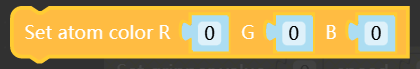

#### IO Control

```
set_color
description:set the color of LED at the top
parameters: 
1. r 0 ~ 255
2. g 0 ~ 255
3. b 0 ~ 255
returned value:none
```


```
set_gripper_value
description:control gripper angle
parameters:
1. value angle value(int) 0 ~ 4096
2. speed 0 ~ 100
returned value:none
```
