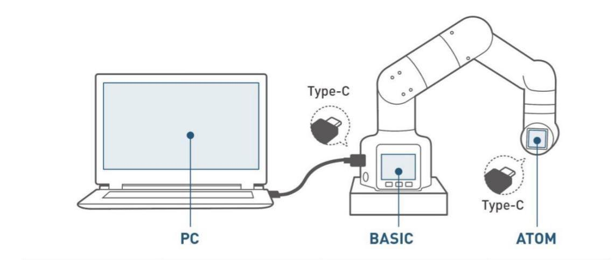

# RoboFlow environment building

## 1 Preparations before use
Notice: This software only supports robot arm devices. 
Device connection 
 
[Device firmware burning](README.md) 

Notice: Burn the corresponding firmware by using [**mystudio**](../4-BasicApplication/4.1-myStudio). Burn the minirobot in M5Stack-basic, choose the transponder function, and burn the latest version of atomMain in Atom. 

## 2 Downloading and installation 
Downloading RoboFlow 

- [myCobot 280-M5](https://www.elephantrobotics.com/software/RoboFlow/myCobot/RoboFlow_3.4.0-p8_windows_x86_64_mycobot.rar)

- [myCobot 320-M5](https://www.elephantrobotics.com/software/RoboFlow/myCobotPro/3.4.0-preview/RoboFlow_3.4.0-p8_windows_x86_64_mycobotPro.rar)

- [myPalletizer 260](https://www.elephantrobotics.com/software/MyPalletizers/v1.0/RoboFlow_MyPalletizer.rar)

- [myCobot 280-Pi](https://www.elephantrobotics.com/software/RoboFlow/myCobot/RoboFlow_3.4.0-p8_Linux_armv7l_mycobot.tar.gz)

- [myCobot 320-Pi](https://www.elephantrobotics.com/software/RoboFlow/myCobotPro/3.4.0-preview/RoboFlow_3.4.0-p8_Linux_armv7l_mycobotPro.tar.gz) 
Notice: **myCobot 280-Pi** , **myCobot 320-Pi** and **myCobot Pro 600** systems will be equipped with RoboFlow, so it is unnecessary to download it. 
