# Simple use of RoboFlow

## 1 Procedure description

### 1.1 Preparations
**Precondition**  
- a complete robot system  
- No faults 
**Preparations**  
- Plug the power plug into a AC 220V power strip.  
- Turn on the power switch (There is no power switch for myCobot 280-m5).  
**myCobot 280-m5**, **320-m5** and **myPalletizer 260** enter Transponder -> UART USB interface (a communication interface) before RoboFlow is run. 

### 1.2 Flowchart

As shown in figure 6.2.1.2-1 is the flow chart of program editor 
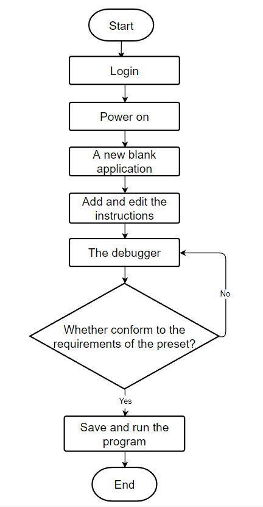 

Figure 6.2.1.2-1 Program editing flow chart
 

## 2 Operation steps

### 2.1 Login

Note: The login password for MyCobot280 and 320 is mycobot; the login password for myPalletizer 260, mypartner; and the login password for myCobot Pro 600, elephant. 

After the system starts successfully, it will enter the login interface of the RoboFlow operating system shown in Figure 6.2.1.1-1. 
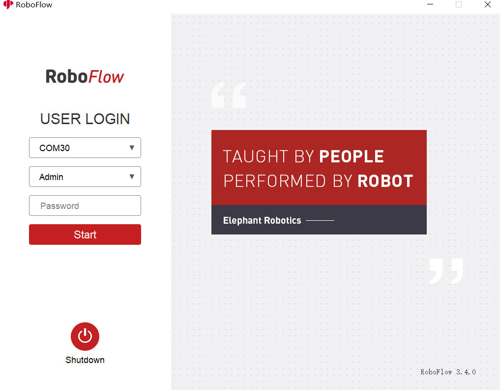 

Figure 6.2.1.1-1 Login page

Select the login user name "Admin" or another administrator user name (Only administrators are allowed to edit and debug programs), click the password box, and a pop-up window will appear as shown in Figure 6.2.2.1-2. 
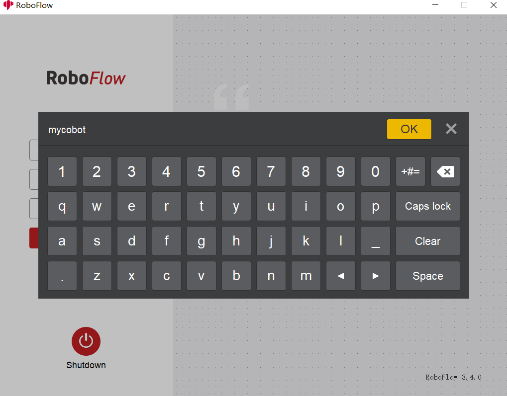 

Figure 6.2.2.1-2 Input keyboard
 

The login password corresponding to the default administrator user "Admin" is "aaa" (If you select another administrator user name, enter the corresponding login password). Enter the password and click "OK" to return to the interface shown in Figure 6.2.1.1-1. Then click "Login", and you will login successfully. 

### 2.2 Powering up

After successful login, you will enter the main menu interface shown in Figure 6.2.2.2-1. 
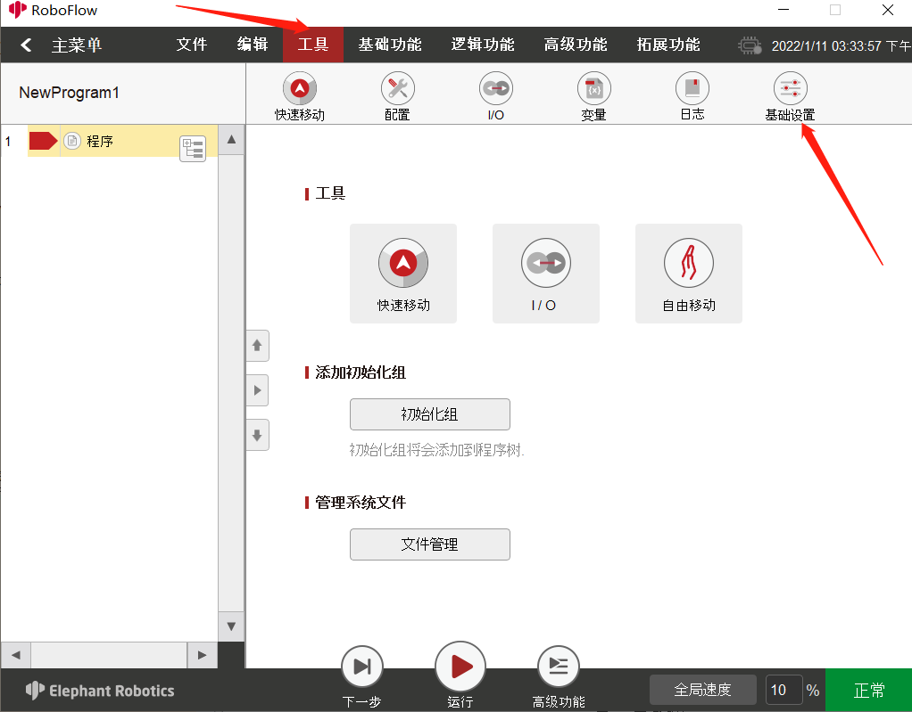 

Figure 6.2.2.2-1 Main menu
 

In this interface, select "Configuration Center", and you will enter the interface shown in Figure 6.2.2.2-2(No power at this point). 

After making sure that the emergency stop knob is not pressed, click the "Start Robot" button shown in Figure 6.2.2.2-2. At this point, the interface will change, and a "Powering up is in process" icon will appear as shown in Figure 6.2.2.2-3. If powering up is successful, the "normal" state shown in Figure 6.2.2.2-4 will appear. If it fails, check to see which steps are not implemented. 

After completing the previous step, click the "< Main Menu" button in the configuration center to return to the main menu. 
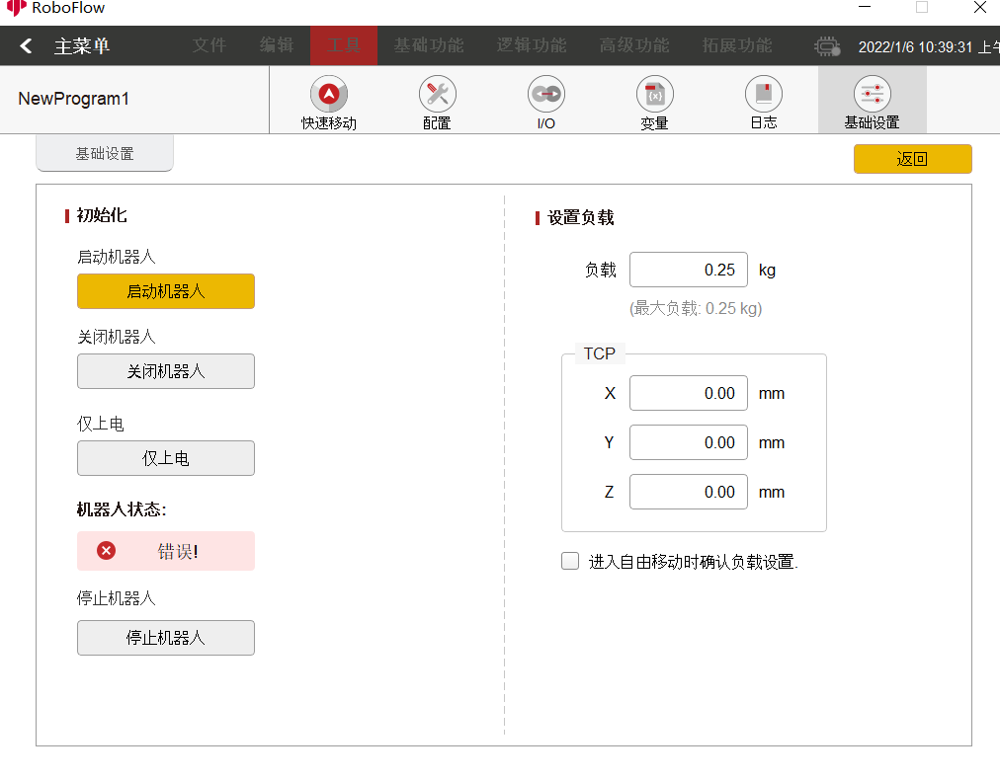 

Figure 6.2.2.2-2 Power-off status
 

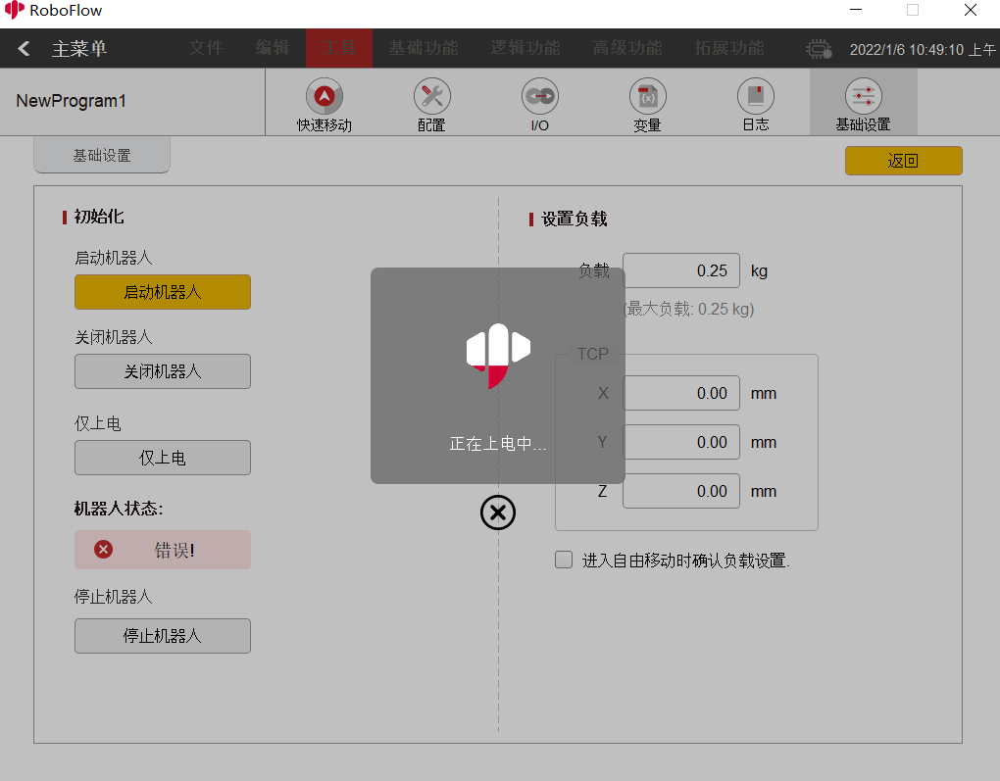 

Figure 6.2.2.2-3 Power-on process
 

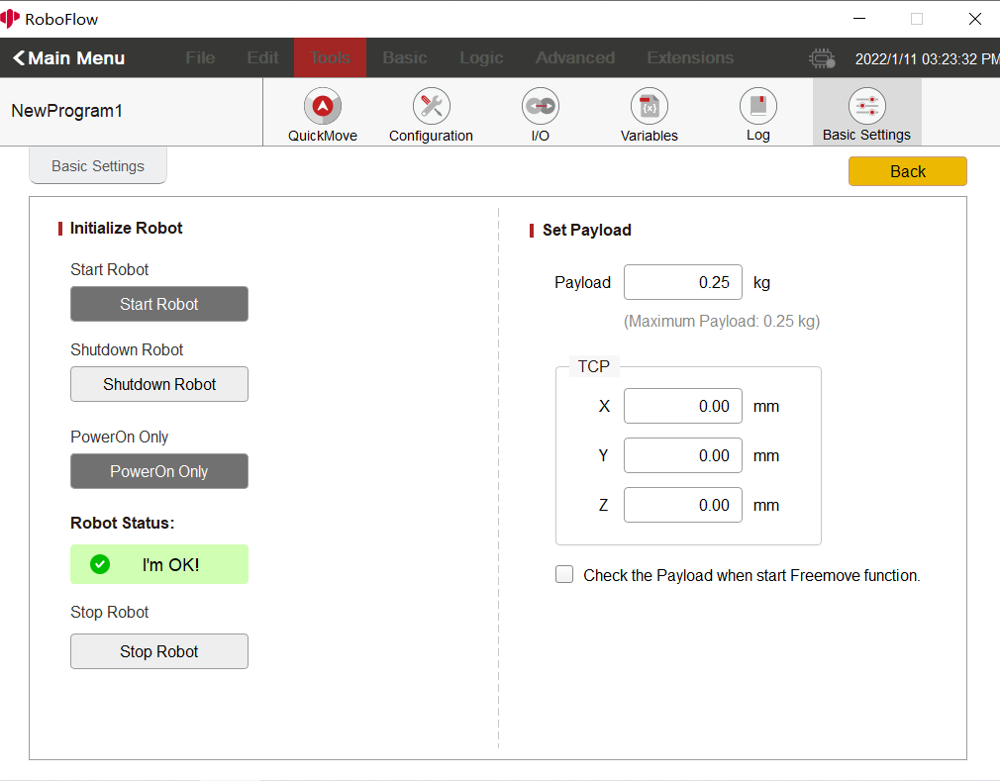 

Figure 6.2.2.2-4 Power-on is complete
 

### 2.3 Creating a new blank program

As shown in Figure 6.2-2.3, click "Write program" and select "Blank program". 
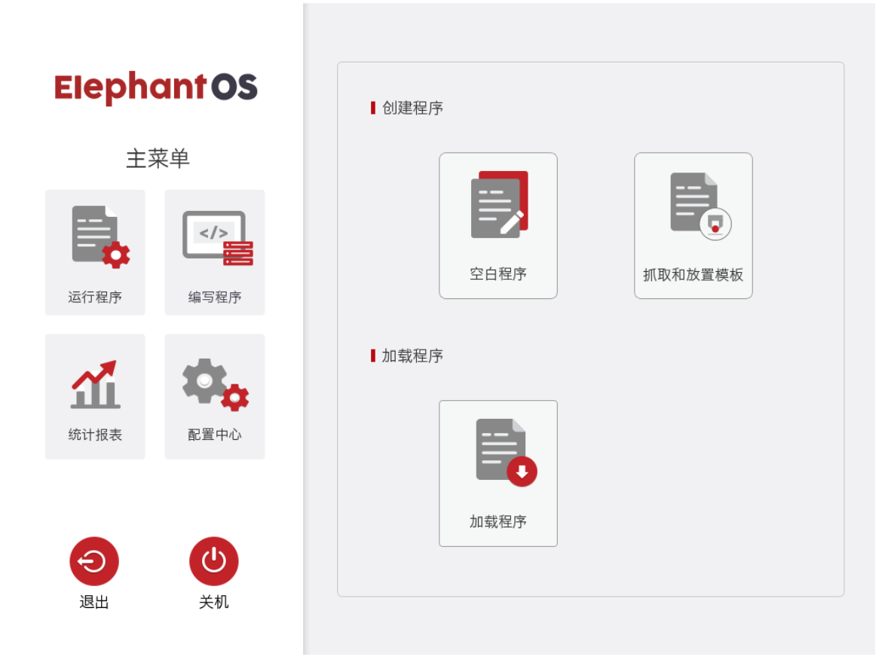 

Figure 6.2-2.3 Selecting "Blank program"
 

After performing the previous step, enter the program editing interface shown in Figure 6.2.2.3-2: 
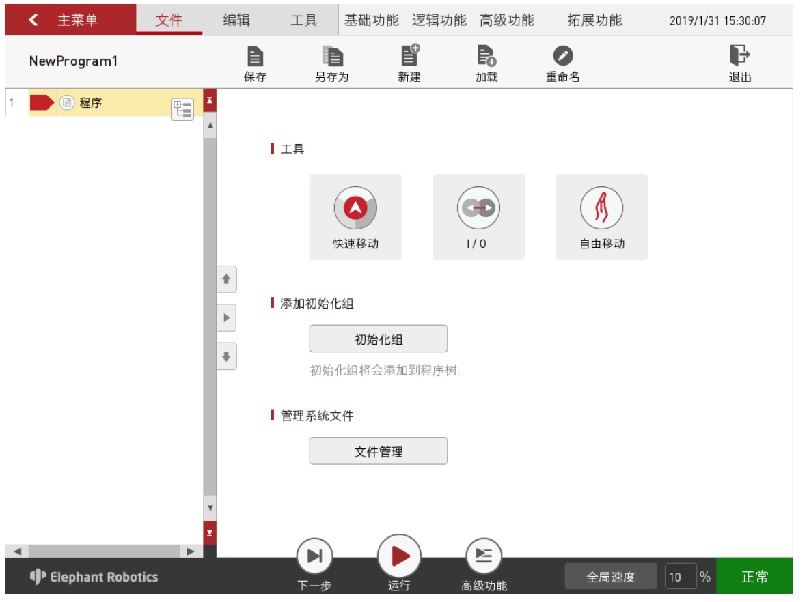 

Figure 6.2.2.3-2 Entering the Program Editing Interface
 

### 2.4 Adding and editing instructions

As shown in Figure 6.2.2.4-1, add two waypoints: absolute point command, and teach two points (That is to say, control the robot to move it to a certain posture and then move it back to its original position by controlling the robot with a fast moving tool manually, and click "Save current point". The teaching procedure for both points is the same. To verify the saved point, long press the "Move to this point" button to manually control the robot to move it to the teaching point). 

After editing, don't forget to save the program file. Click "Save" in the file option bar shown in Figure 6.2.2.4-1 , and the window shown in Figure 6.2.2.4-2 will pop up. Click "File name", and the input keyboard shown in Figure 6.2.2.4-3 will appear. After entering a file name, click "OK". It will return to the save interface. And then click "OK" to save the program file successfully. After successful saving, the program name at the upper left corner of the program editing interface will be changed, as shown in Figure 6.2.2.4. 
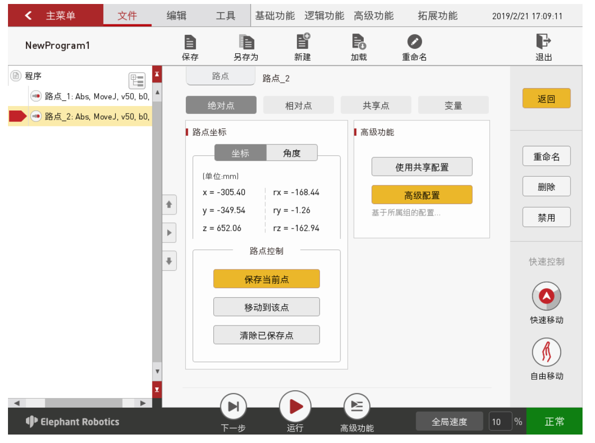 

Figure 6.2.2.4-1 Program editing
 

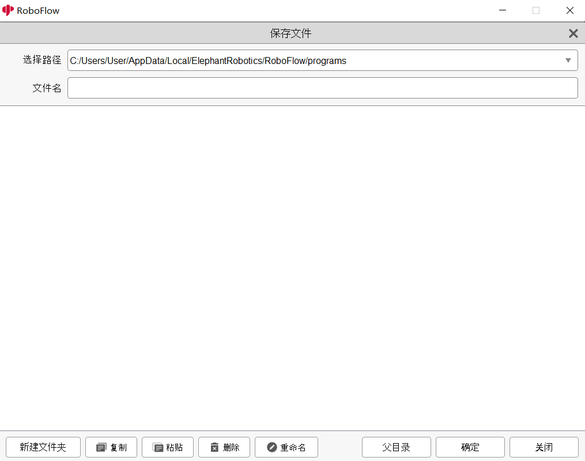 

Figure 6.2.2.4-2 The page for saving the file is displayed
 

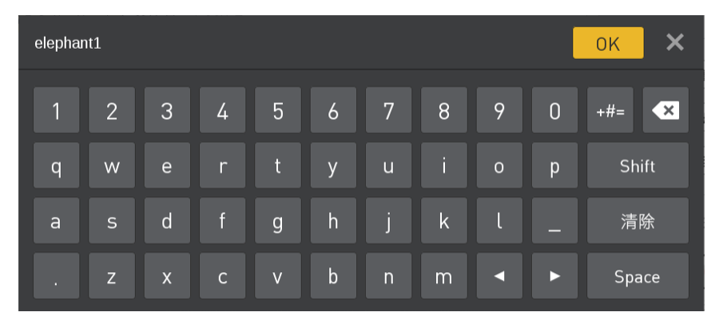 

Figure 6.2.2.4-3 Entering the program name
 

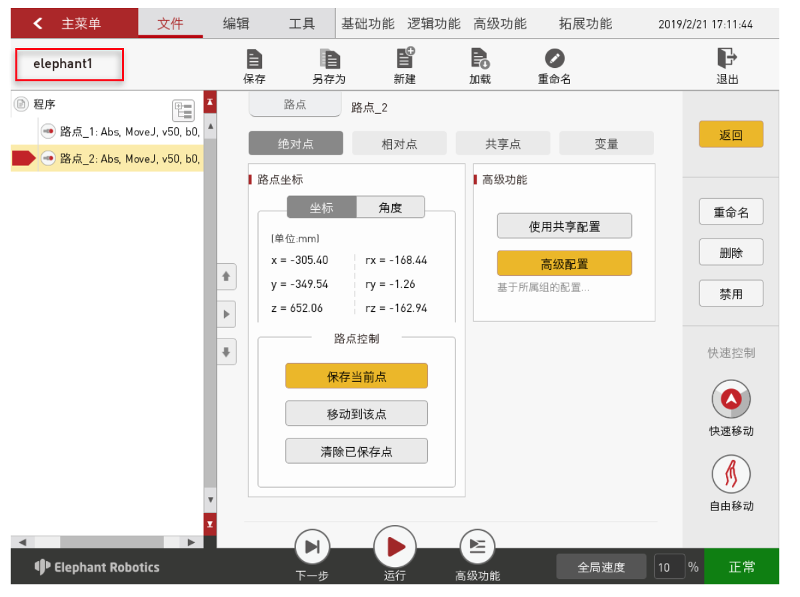 

Figure 6.2.2.4 Saving the file successfully
 

### 2.5 Debugging the program

In addition to the two functions of "Next" and "Run" provided in the program running control bar, click "Advanced function" to enter the interface for more settings, as shown in Figure 6.2.2.5-1. 

Among them, the "Next" function corresponds to step-by-step execution of the program. Click it once, and only a step will be run. If you want to continue running, click "Next" again. The "Run" function corresponds to automatically running the program once. 

In the "Advanced function", you can set the number of loop runs, or you can run it in an infinite loop. You can also control the program to make it run in an automatic or manual mode. In the automatic mode, "Next", "Run" and loop run are available. In the interface shown in Figure 6.2.2.5-1, select "Manual mode", and then select "Run" or "Infinite loop" in the loop run. Then you will enter the running interface in the manual mode as shown in Figure 6.2.2.5-1. 

If you debugs the program in the manual mode, you have to keep pressing the "Press Down" button to continue running. If you release the button, the program pauses; and if you press the button again, it will continue to run. 
 

Figure 6.2.2.5-1 Debugger
 

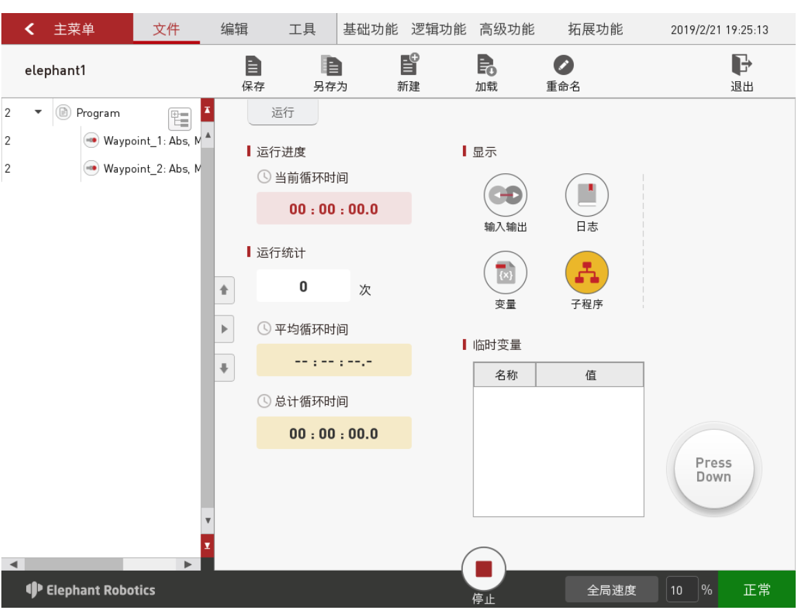 

Figure 6.2.2.5-2 Debug program in manual mode
 

### 2.6 Saving and running the program

If debugging is completed, be sure to save the debugged program. After returning to the main menu, select Write program -> "Load program". The pop-up window shown in Figure 6.2.2.6-1 will appear. At this point, select the program that has been debugged, and then click "OK". 
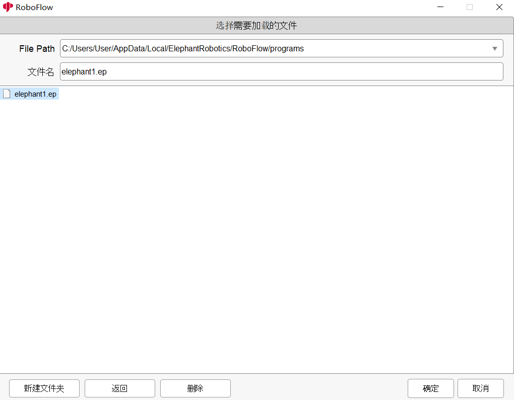 

Figure 6.2.2.6-1 Selection program
 

After selecting the program, you will enter the program running interface shown in Figure 6.2.2.6-2. And in this interface, you can run the program and view the information on the program running. 
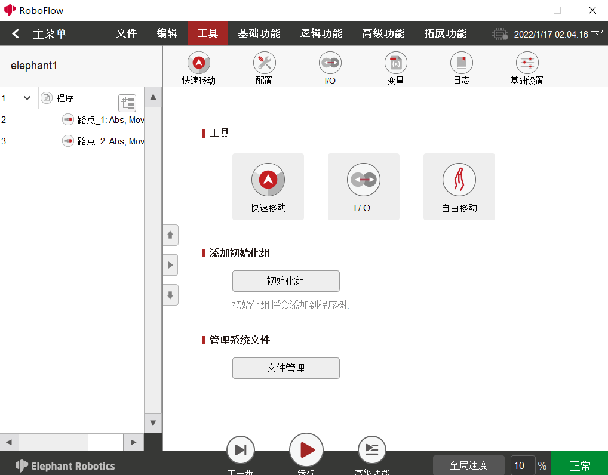 

Figure 6.2.2.6-2 Running the program
 

Note: If you cannot control the robot arm, check whether the robot arm is powered up successfully (If powering up is not successful, check whether the m5 firmware is under Tansponder -> UART USB function), and then select Tools -> Basic settings. The following picture shows the status of successful powering up: (You can also check the powering-up steps described in 6.2.2.2). 
 
