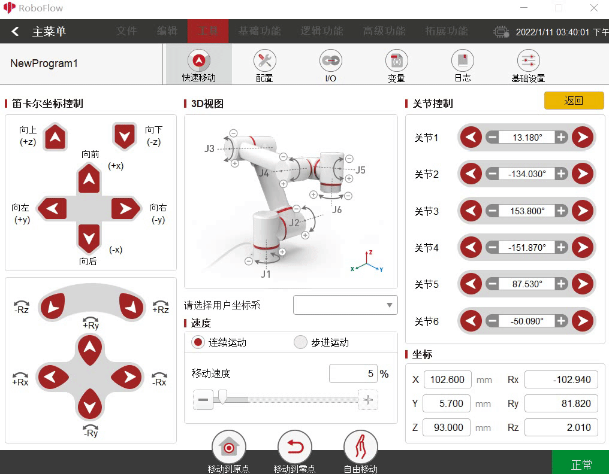
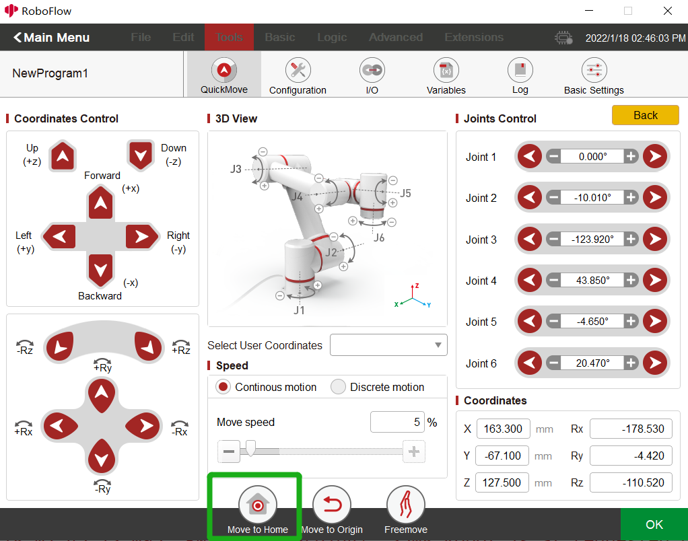
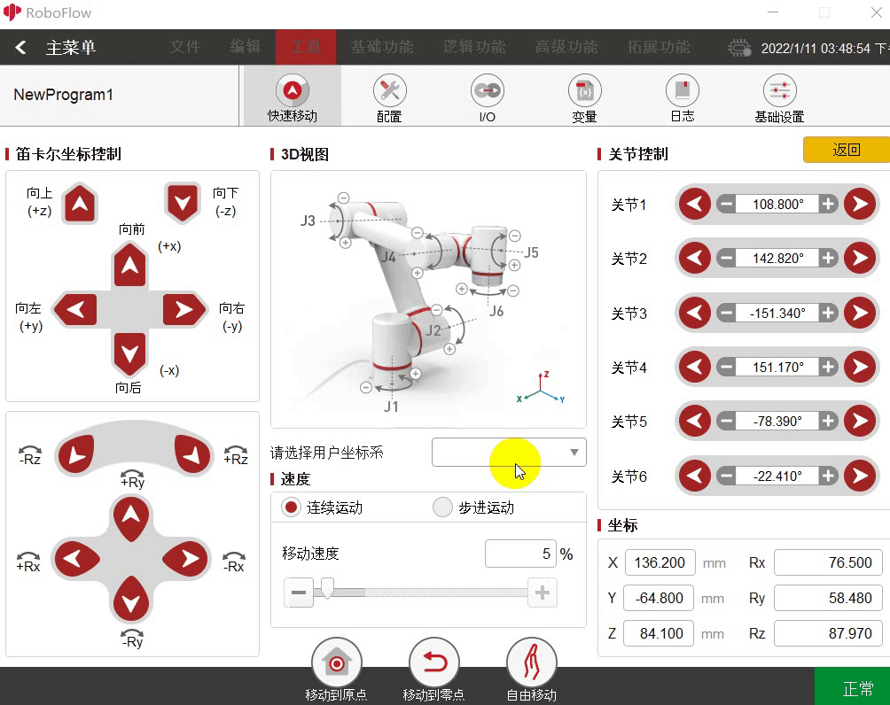

# Control of joints and coordinates
In RoboFlow, the control of joints and coordinates are performed on the **QuickMove** page. Run RoboFlow, enter the program editing interface, and select **Tools–QuickMove** (For the way to enter the interface, see **6.2 Simple use of RoboFlow**). The way to control the robot arm is divided into **continuous motion** and **discrete motion**. For the former, press the button, and the robot arm will stop moving until the button is released; for the latter, set an increment, and the robot arm will stop when it reaches a set point.  

## 1 Joint control
Joint Control means the control of joints. Joints 1-6 correspond to the joints 1, 2, 3, 4, 5 and 6 respectively (myPalletizer 260 has four joints, and joint 1-4 corresponds to the joints 1, 2, 3 and 4 respectively).  

Function description:  
1.1 Select Continuous Motion or Discrete Motion at speed. If the latter is selected, an increment needs to be set;  
1.2 Each joint at Joint Control is provided with the buttons for increasing and decreasing angles. To decrease an angle, press the button on the side of the minus sign, and press the button on the side of the plus sign to increase the angle. Continuous motion. After pressing the button, the robot arm will stop until the button is released (It will also stop after reaching the limited position). For discrete motion, the robot arm will stop when it reaches a set point (For example, the angle of the joint 1 is 30 now, and the increment is 50. Press the button on the side of the minus sign, and then the robot arm will stop when it reaches -20). The steps are shown in the following figure:  
 

## 2 Coordinate control
Note: Before using the coordinate control, you have to press the home button (For 280, press the home button, while for 320 click the home button) to make the robot arm reach a certain posture; after that, click the home button again, a prompt that "The robot arm has reached the required point" will be provided.  
 

Coordinates Control means the control of coordinates.  
Function description:  
2.1 Select Continuous Motion or Discrete Motion at speed. If the latter is selected, an increment needs to be set;  
2.2 Each coordinate axis at Coordinates Control is provided with increasing and decreasing buttons. To decrease a coordinate, press the button on the side of the minus sign, and press the button on the side of the plus sign to increase the coordinate. Continuous motion. After pressing the button, the robot arm will stop until the button is released (It will also stop after reaching the limited position). For discrete motion, the robot arm will stop when it reaches a set point (For example, the coordinate of X-axis is 30 now, and the increment is 50. Press the button on the side of the plug sign, and then the robot arm will stop when it reaches 80). The steps are shown in the following figure:  
 