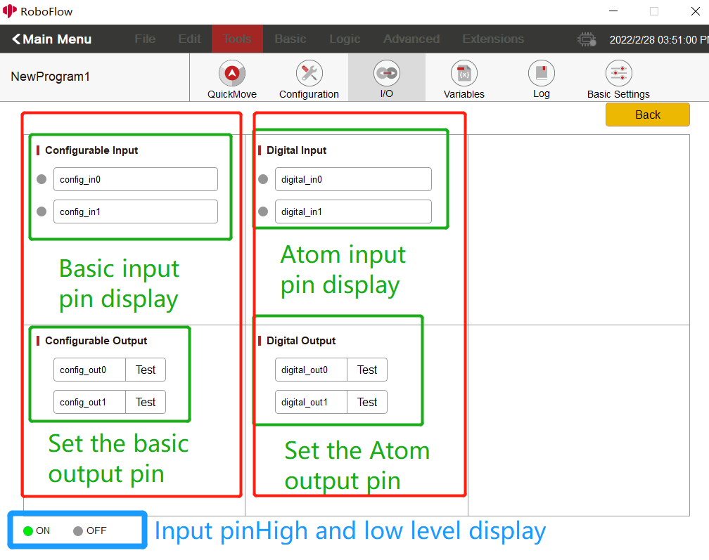
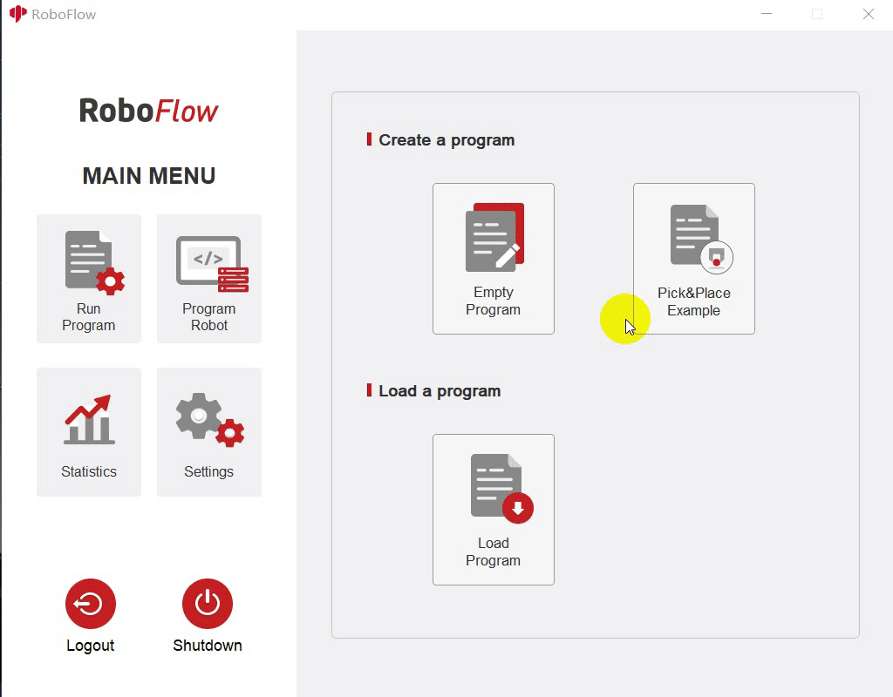
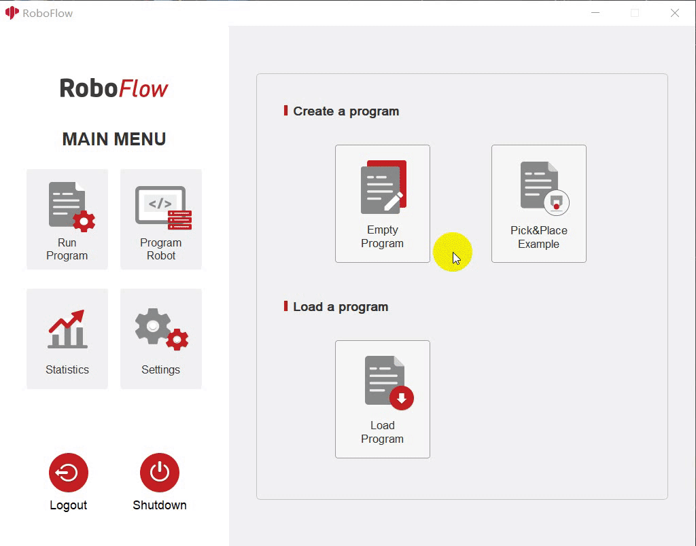

# io control

There are pins on the M5Stack-basic at the bottom of the robot arm and on the Atom at the end. The adsorption pump and other tools can be controlled by setting high and low levels of the pins through io control.
Notice: **Start RoboFlow, and set the level of all output pins to low. For the numbers of input and output pins for each type of robot arm, refer to the following description table.**

Table of Description of Input and Output Pins on the M5Stack-basic

|Mechanical arm model |Input pin number |Output pin number |
|:----: | :----: | :----: |
|myCobot 280-M5	|35、36| 2、5、26|
|myCobot 320-M5 |35、36| 5、15|
|myPalletizer 260 |35、36| 2、5、26|

Table of Description of Input and Output Pins on the Atom

|Mechanical arm model |Input pin number |Output pin number |
|:----: | :----: | :----: |
|myCobot 280-M5	|19、22| 23、33|
|myCobot 280-Pi	|19、22| 23、33|
|myCobot 320-M5	|None| None|
|myCobot 320-Pi	|None| None|
|myPalletizer 260 |19、22| 23、33|

## 1 I/O interface io control 
1.1 Enter RoboFlow program editing interface, select **Tools -> Basic Settings -> Select I/O **(For the way to enter the interface, see 6.2 Simple use of RoboFlow). 
1.2 The I/O interface is shown in the figure below. Configuration output is to set the M5Stack-basic output pin, and digital output is to set Atom output pin; configuration input is to display M5Stack-basic input pin status, and digital input is to show Atom input pin status. Input pin display: When the level of the input pin is high, the dot shown in the figure below will become green; when the level is low, the dot will become gray. (For the pin number represented by onfig_out0, config_out1..., see the interface description table below) . 
 
1.3 Output pin settings: Click the Test button and set high and low levels. If the button shows Test, click the button, the output pin will be set to high level; if the button doesn't show Test, click the button, the output pin will be set to low level. For details, you can see the prompt details after clicking the button. (When you click the Test button for the first time, you will be prompted whether to set the output io to a high level. After selecting ok, Test will disappear at the button; if you click the button again, you will be prompted whether to set the output io to a low level. After selecting ok, Test will be displayed at the button). See the following figure for details:  
 

Table of Description of M5Stack-basic Configurable Interface:  

|Configurable|myCobot 280-M5|myCobot 320-M5|myPalletizer 260|
|:--:|:--:|:--:|:--:|
|config_out0|26|None|26|
|config_out1|5|15|5|
|config_out2|2|5|2|
|config_in0|36|36|36|
|config_in1|35|35|35|

Table of Description of Atom Digital Interface: 

|Digital|myCobot 280-M5|myCobot 320-M5|myPalletizer 260|
|:--:|:--:|:--:|:--:|
|digital_out0|5|15|5|
|digital_out1|2|5|2|
|digital_in0|36|36|36|
|digital_in1|35|35|35|

## 2 Setting interface io control
This function can be used if you need to set the high and low levels of the output io cyclically or add other events in the middle.  
2.1 Run RoboFlow, enter the program editing interface, and select Tools -> select Basic Settings -> select Settings (For the way to enter the interface, see **6.2 Simple use of RoboFlow**).  
2.2 The setting interface is shown in the figure below. Click the drop-down box to select the output pin to be set (The drop-down box is in white font and may not be clear; the pin will be displayed when the mouse is placed on it), and then select the high and low levels (On for High and Off for Low).  
 
2.3 How to cycle. For example, first set an output pin to high level in the first setting interface, add a wait interface, set waiting for a few seconds, and finally add a setting interface to set an output pin to low level, as shown in the figure below:  
 