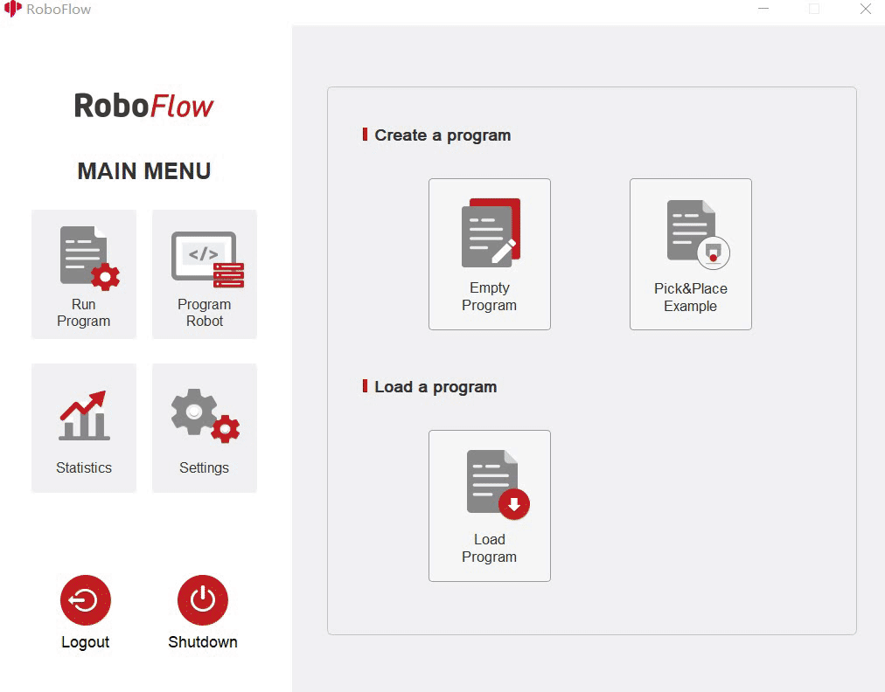

# Gripper control
Installing the gripper:  
- For an adaptive gripper, insert it on the pin on the atom, as shown in the following figure:   
 
- For an electric gripper, insert it into the 485 interface on the top, as shown in the following figure:   
 
## 1 The equipment that the adaptive gripper 
supports: myCobot280, myCobot320 and myPalletizer 260. 
Function description:  
- Run RoboFlow, enter the program editing interface, and select M5Stack-basic – Gripper (For the way to enter the program editing interface, see 6.2 Simple use of RoboFlow);  

- IO mode (I/O is selected by the Tool, and the overall steps are shown in the figure)

- 

- IO controls the jaw opening and closing, the pin tool_out0 is closed, and the jaw is opened when it tool_out1 is opened

- 

- IO controls the jaw opening and closing, the pin tool_out0 is closed, and the jaw is opened when it tool_out1 is opened

  

- click Define New Gripper, fill in Gripper Name as " CAG-1 ” (must be this name), and then click Save;  

- select open or close for Saved status. The overall steps are shown in the following figure:  
  
   (Note: Before using the transparent transmission mode, you need to set the gripper to the transparent transmission mode, that is, set_cag_gripper_mode (0), please refer to [Socket API](http://localhost:4000/2-serialproduct/2.3-myCobot_Pro_600/2.3.5%20socket%20API%20interface%20description.html)) for detailed interface use.)
  
-  

## 2 Electric gripper
It supports myCobot320. Function Description:  
- Run RoboFlow and select M5Stack-basic – Gripper ;  
- click Define New Gripper, fill in Gripper Name as "DH PGE 8” (must be this name), and then click Save;  
- select open or close for Saved status. The overall steps are shown in the following figure:  
 
