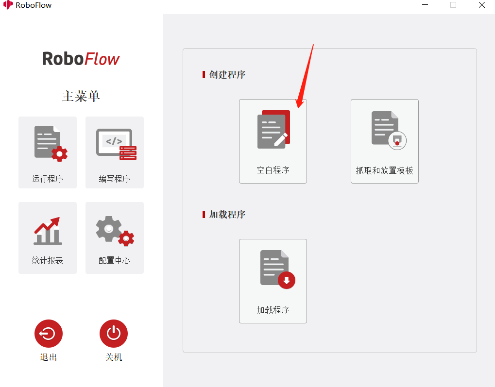
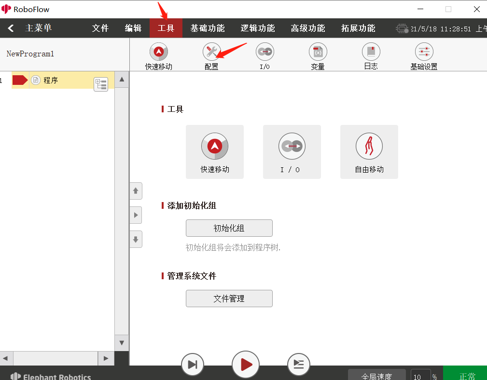
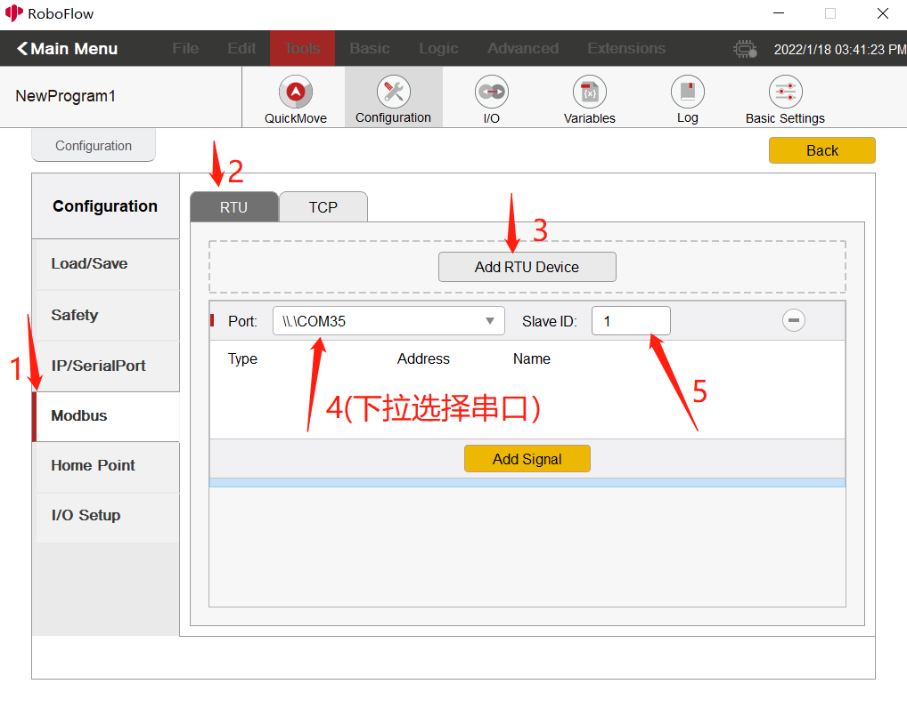
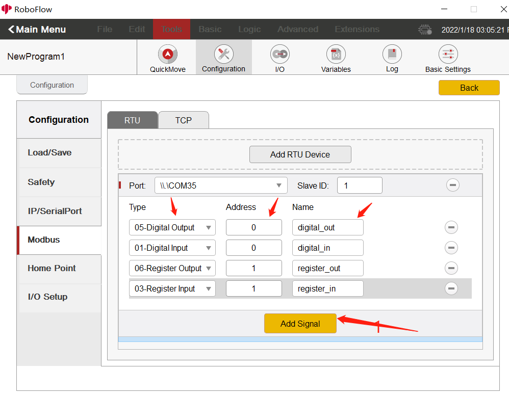
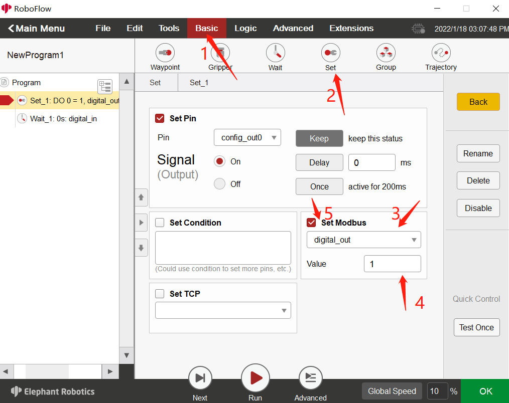
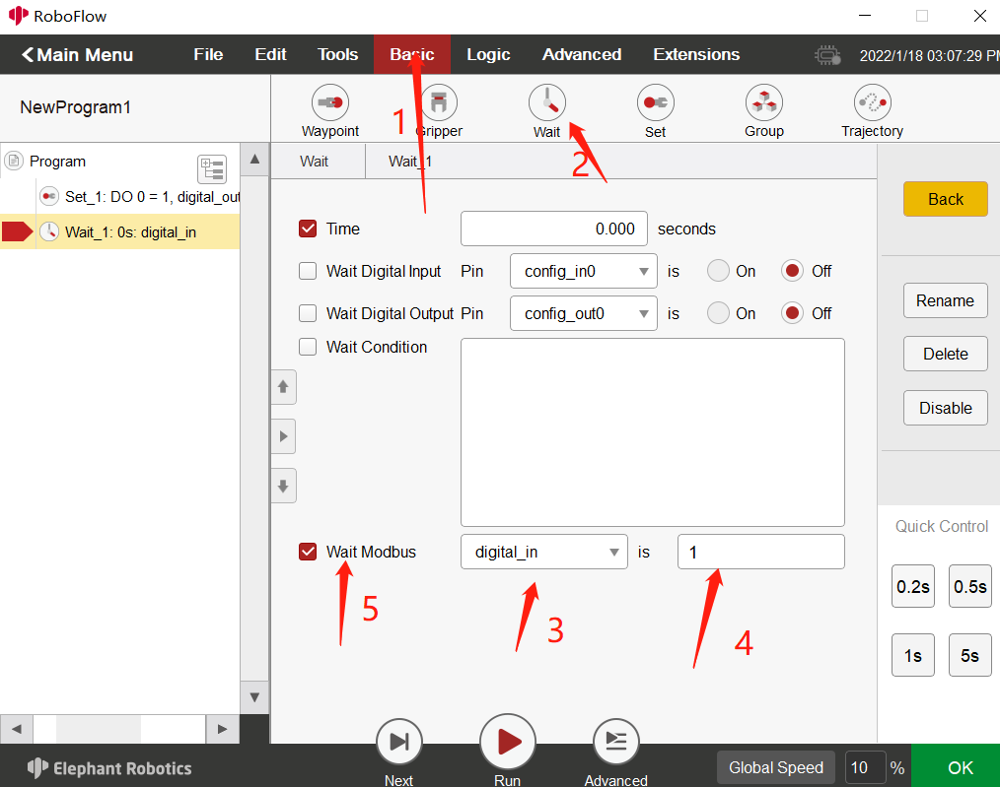
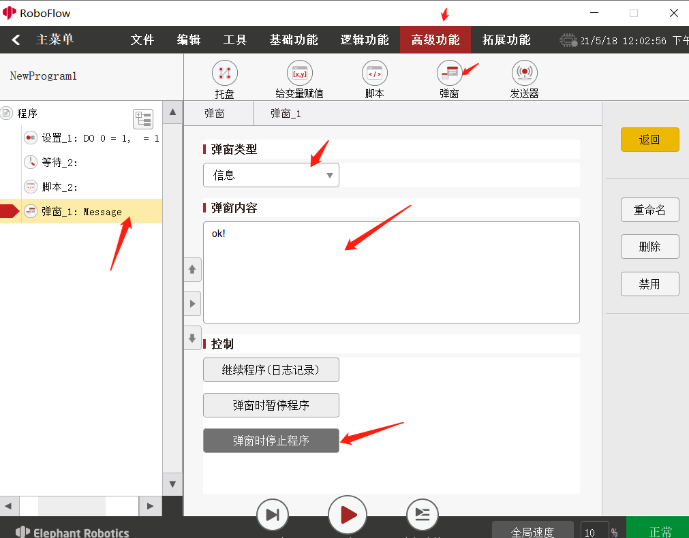
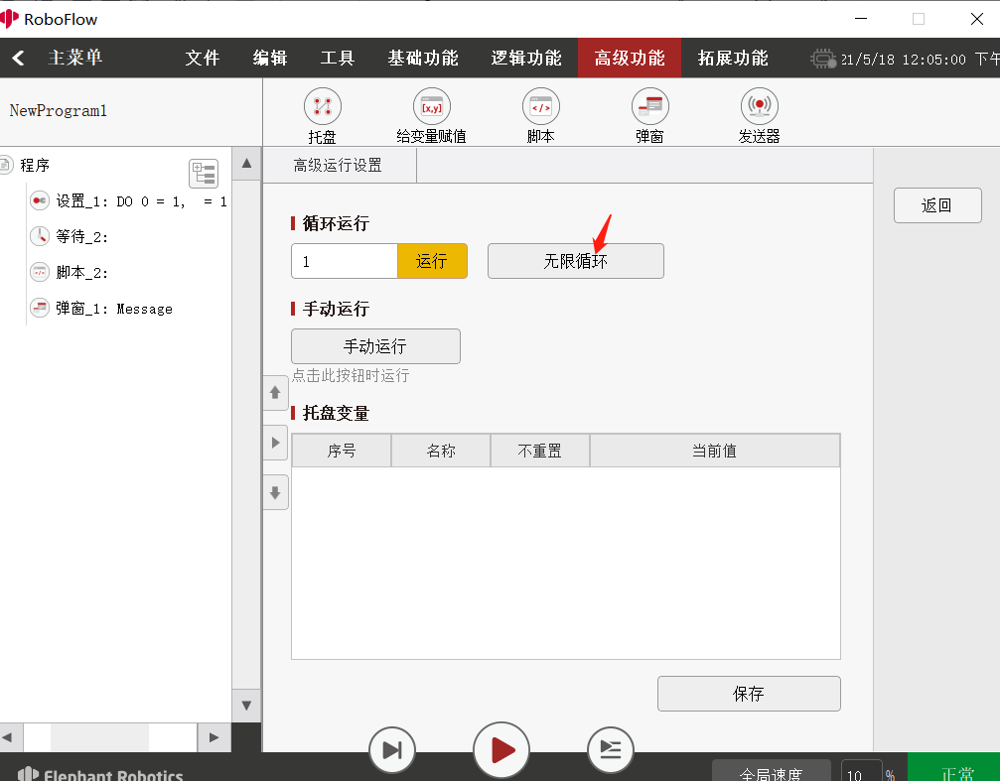

# Modbus

##  Operation steps

### 1 Entering the program editing interface
After running RoboFlow, select an empty program, as shown in the following figure:  
 

### 2 Entering the configuration interface
Select Tools -> Configuration, as shown in the following figure:  
 

### 3 Adding a RTU device
Select modbus –> RTU –> add RTU device –> select the port number (485USB) –> set the slave device ID to 1 (This ID is unique here. if multiple RTU devices are added, the slave device ID for each device should not be set to the same ID), as shown in the following figure:  
 

### 4 Adding signals
Click Add signal -> select type (i.e. modbus function code protocol) -> set address -> name (set a name that you can identify easily), as shown in the following figure: Function code protocol:  
- 05-Digital Output: do writing operation to a single coil;  
- 01-Digital Input: read coil registers (a single or multiple registers can be read).  
- 06-Register Output: write a single holding register, and write the set binary value to a single register (Only one can be written);  
- 04-Register Input: read input registers (A single or multiple registers can be read).  
 

### 5 Setting the configuration interface
Click Basic Functions -> Settings -> Select Protocol - > Set Value (digital value is 0/1, and regesiter has no limit) -> Check Set Modbus, as shown in the following figure:  
 

### 6 Waiting for the configuration interface
Click Basic Functions -> Wait -> Check Wait Modbus -> Select Protocol -> Set Value (If the value is not the set value during running, it will wait all the time), as shown in the following figure:  
 

### 7 Setting pop-up windows
Click Advanced Functions -> Pop-up Window -> Pop-up Window Content (which can be set by yourself) -> Stop the program when the pop-up window is selected at control. The function here is: After clicking Run, if the values set in the waiting place are the same, an ok pop-up window will appear! If such values are not inconsistent, the pop-up window will not appear, and loop goes on all the time, as shown in the following figure:  
 

### 8 Running
- Click the Advanced Function below the pop-up window -> click infinite loop, as shown in the following figure:  
 
