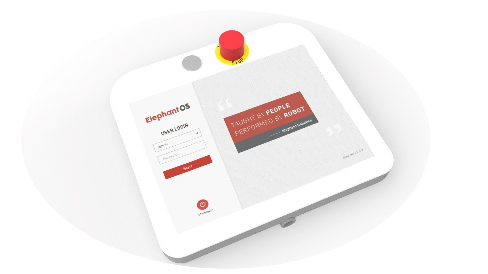

# RoboFlow
 

## Introduction of RoboFlow Operating System
The RoboFlow operating system is a system used for the cobots produced by Elephant Robotics. It provides man-machine interfaces (with coordinate control, angle control, IO control, track recording, gripper control and other functions) to make it easy for the operator to interact with the the cobot and to use them properly. Namely, when the user is using the cobot, most of the time such use is done by using the RoboFlow operating system. 

Fox example, because the RoboFlow operating system runs in a teaching pendant, the user may use the pendant to control the cobot manually, do programming and perform other operations. The user also can use the operating system (OS) to realize the communication between the cobot system and other robots or devices. In one word, with friendly interfaces, rich functions and other advantages, the RoboFlow operating system makes it easier for the user to use the cobot, thus making each user become a robot commander. 

**Applicable equipment:** 

- myCobot PRO 600  

<!-- 

**Preconditions for use:**  

- **M5** series version， the bottom **M5Stack-basic** is programmed to miniRobot , select the  **Transponder** function, and the end **ATOM** is programmed to the latest version of atomMain (the factory default has been programmed)
- **Pi \ jetsonnano** series, **ATOM** burns the latest version of **atomMain** (factory default already burnt)
 

Note: All of the pictures used in the following chapters take myCobot 280-m5 as an example; and each type of robot arm has its own RoboFlow, which is not universal. 6 RoboFlow mainly introduces the simple operations of RoboFlow, such as how to log in, preparations for the robot arm, how to control the joints, coordinates, io, gripper, modbus, etc. For detailed description of operations, refer to [RoboFlow Operation and Programming Manual](https://static.elephantrobotics.com/wp-content/uploads/2019/06/%E6%93%8D%E4%BD%9C%E4%B8%8E%E7%BC%96%E7%A8%8B%E6%89%8B%E5%86%8C-CN.pdf).  
-->

For detailed instructions, please check [Pro 600 development environment and construction](https://docs.elephantrobotics.com/docs/gitbook-en/2-serialproduct/2.3-myCobot_Pro_600/2.3.4%20development%20environment%20and%20construction.html)