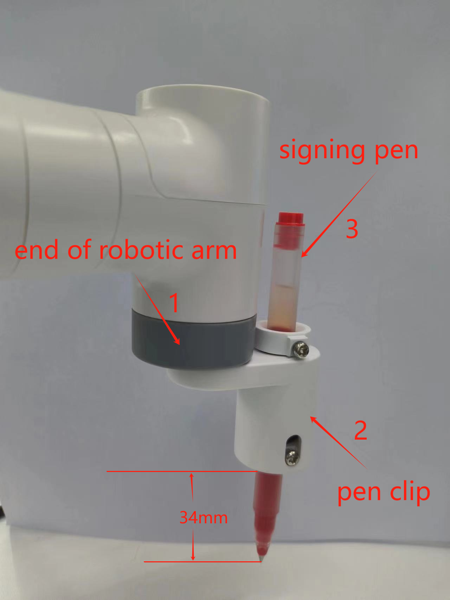

# Draw a pattern

The movement of the robotic arm can be controlled by parsing the instructions in a gcode file to achieve drawing operations.

## Installation diagram

>Note: The end of the robotic arm and the pen clip are connected using Lego Technic parts.

> 

## Instructions for use

### 1.Connect devices

Connect MyCobot to the computer, install the pen clip to the end of the robotic arm, place the pen in the pen clip and tighten the screws to secure it.

>Note: Use the G-type base 2.0 to fix the robotic arm on the desktop, and place A4 white paper on the desktop for drawing patterns.

### 2.Install required packages

Download code: https://github.com/elephantrobotics/pymycobot

Open the terminal, switch the path to the `pymycobot/demo/myCobot_280_demo` folder, and run the following command:

```bash
pip install pyserial pymycobot
```

### 3.Modify port number

Edit the 280_draw_gcode.py file

```python
# Change COM14 to the actual port number detected by your computer
import time
from pymycobot.mycobot import MyCobot  # import mycobot library,if don't have, first 'pip install pymycobot'

# use PC and M5 control
mc = MyCobot('COM14', 115200)  # WINDOWS use ，need check port number when you PC
# mc = MyCobot('/dev/ttyUSB0',115200)           # VM linux use
time.sleep(0.5)
...
```
Just run the program.

```bash
python 280_draw_gcode.py
```

Then according to the terminal prompts, enter different numbers to select different patterns:

```bash
1-square 
2-triangle 
3-five point star 
4-quit
```

>Note: The initial point of the robot arm can be changed by itself, but the posture of the J6 joint must be vertically downward, and the speed can also be changed by itself. The default is 100 mm per second.

```bash
...

# Send the initial point angle of the robot arm, the speed is 50,
# it can be customized and modified, as long as the end is facing down
mc.send_angles([0, -40, -130, 80, 0, 50], 50)
# Wait 3 seconds for the robot arm to move to the specified angle
time.sleep(3)
# Get the current coordinates of the robot arm
get_coords = mc.get_coords()
time.sleep(1.5)
# Save the parsed coordinates
data_coords = []
# Set the drawing speed to 100, and the speed range is 0~100
draw_speed = 100

...

```