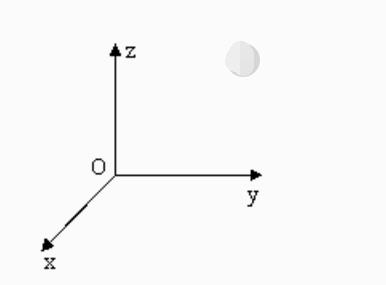

# Coordinate Control

It is mainly used to make intelligent route planning to move the robot arms from one position to another specified position. The coordinate is `[x, y, z, rx, ry, rz]`.  `[x,y,z]` represents the position of the robot arm head in space (the coordinate system is [cartesian coordinate system](https://zhidao.baidu.com/question/2125035227927850747.html)). `[rx,ry,rz]` represents the posture of such head at this point (the coordinate system is euler coordinates). The above simple explaination helps you to use functions better.

> **Note:** When setting the coordinates, different series of manipulators have different joint structures. For the same set of coordinates, different series of manipulators will show different postures.
>
> 

## mechArm

### Single-Parameter Coordinate

**send_coord(id,coord,speed)**

- **Function:** to send a single coordinate value to the robot arm to
  make it move.
- **Parameter:**
  -   `id`: represents the coordinates of the robotic arm. Six axis
      means that the robot arm has six joints, and four-axis means it
      has four joints. and there are specific representation methods
      therefor. The way to represent X coordinate:`Coord.X.value`.
      There is also a simple representation method. For example, you
      can fill in 1 for X-axis, 2 for Y-axis, and so on.
  -   `coord`: Input the coordinate value you want. 
  -   `speed`: means the movement speed of the robot arm, ranging from
      0 to 100.
- **Return Value:** None


### Multiple parameter coordinates

**get_coords()**

- **Function:** to obtain the current coordinate and posture.
- **Return Value:** `list`: a list containing coordinates and
  postures.
  -   Six axes: The length is 6, and they are
      `[x, y, z, rx, ry, rz]` in order.
  -   Four axes: The length is 6, and they are `[x, y, z, rx]` in
      order.


**send_coords(coords, speed, mode)**

- **Function:** to send the overall coordinates and postures to move
  the robot arm head from the original point to the point you have
  specified.
- **Parameters:**
  -   `coords`:
      -   Six axes: The length of the coordinate value of `[x, y, z,
          rx, ry, rz]` is 6.
      -   Four axes: The length of the coordinate value of `[x,y,z,rx]` is 4.
  -   `speed`: means the movement speed of the robot arm, ranging from
      0 to 100.
  -   `mode`: (`int` ): The value is limited to 0 and 1.
      -   0 means that the movement path of the robot arm head is
          non-linear, i.e. the movement route is randomly planned just
          to make sure that the head moves to a specified point with a
          specified posture.
      -   1 means that the movement path of the robot arm head is
          linear, i.e. the movement route is intelligently planned
          just to make sure that the head moves to a specified point
          with a specified posture in a linear manner.
- **Return Value:** None


**set_tool_reference(coords)**

- **Function：** Set Tool coordinate system。
- **Parameters：**
  - `coords`: 
    The coordinate value of [x, y, z, rx, ry, rz] has a length of 6, x, y, z ranging from - 280 to 280, and rx, ry, yz ranging from - 314 to 314
- **Return Value：** None

**get_tool_reference()**

- **Function：** Get Tool coordinate system。
- **Return Value：** Returns a coordinate list with a length of 6

**get_world_reference()**

- **Function：** Get World coordinate system。
- **Return Value：** Returns a coordinate list with a length of 6

**set_world_reference(coords)**

- **Function：** Set World coordinate system。
- **Parameters：**
  - `coords`: 
    The coordinate value of [x, y, z, rx, ry, rz] has a length of 6, x, y, z ranging from - 280 to 280, and rx, ry, yz ranging from - 314 to 314
- **Return Value：** None

**set_reference_frame(rftype)**

- **Function：** Set Base coordinate system。
- **Parameters：**
  - `rftype`: 0 - Base coordinate system(default)，1 - World coordinate system
- **Return Value：** None

**get_reference_frame()**

- **Function：** Get Base coordinate system。
- **Return Value：** 0 - Base coordinate system，1 - World coordinate system，-1 - error

**set_end_type(end)**

- **Function：** Set end coordinate system。
- **Parameters：**
  - `end`: 0 - flange(default)，1 - tool
- **Return Value：** None

**get_end_type()**

- **Function：** Get end coordinate system
- **Return Value：** 0 - flange(default)，1 - tool, -1 - error

### Simple Demo

  ```python
from pymycobot.mecharm import MechArm
from pymycobot.genre import Coord
from pymycobot import PI_PORT, PI_BAUD  # When using the Raspberry Pi version of MechArm, you can refer to these two variables to initialize MechArm
import time

# MechArm class initialization requires two parameters:
#   The first is the serial port string, such as:
#       linux:  "/dev/ttyAMA0"
#          or "/dev/ttyAMA0"
#       windows: "COM3"
#   The second is the baud rate:: 
#       M5 version is:  115200
#
#    Example:
#       MechArm-M5:
#           linux:
#              mc = MechArm("/dev/ttyAMA0", 1000000)
#          or mc = MechArm("/dev/ttyAMA0", 115200)
#           windows:
#              mc = MechArm("COM3", 115200)
#       MechArm-raspi:
#           mc = MechArm(PI_PORT, PI_BAUD)
#
# Initialize a MechArm object
# Create object code here for windows version
mc = MechArm("COM3", 115200)

# Get the current coordinates and pose of the head
coords = mc.get_coords()
print(coords)

# Intelligently plan the route, let the head reach the coordinates of [152, -9.5, 220.8] in a linear manner, and maintain the attitude of [143.29, 2, 88], the speed is 80mm/s
mc.send_coords([152, -9.5, 220.8, 143.29, 2, 88], 80)

# Set the wait time to 1.5 seconds
time.sleep(1.5)

# Intelligently plan the route, let the head reach the coordinates of [124, -9.5, 232] in a linear way, and maintain the attitude of [ 143.29, 2, 88], the speed is 80mm/s
mc.send_coords([124, -9.5, 232, 143.29, 2, 88], 80)

# Set the wait time to 1.5 seconds
time.sleep(1.5)

# To change only the x-coordinate of the head, set the x-coordinate of the head to -40. Let it plan the route intelligently and move the head to the changed position, with a speed of 70mm/s
mc.send_coord(Coord.X.value, -40, 70)
  ```

## myCobot

### Single-Parameter Coordinate

**send_coord(id,coord,speed)**

- **Function:** to send a single coordinate value to the robot arm to
    make it move.
-   **Parameter:**
    -   `id`: represents the coordinates of the robotic arm. Six axis
        means that the robot arm has six joints, and four-axis means it
        has four joints. and there are specific representation methods
        therefor. The way to represent X coordinate:`Coord.X.value`.
        There is also a simple representation method. For example, you
        can fill in 1 for X-axis, 2 for Y-axis, and so on.
    -   `coord`: Input the coordinate value you want. 
    -   `speed`: means the movement speed of the robot arm, ranging from
        0 to 100.
-   **Return Value:** None


### Multiple parameter coordinates
**get_coords()**

- **Function:** to obtain the current coordinate and posture.
-   **Return Value:** `list`: a list containing coordinates and
    postures.
    -   Six axes: The length is 6, and they are
        `[x, y, z, rx, ry, rz]` in order.
    -   Four axes: The length is 6, and they are `[x, y, z, rx]` in
        order.


**send_coords(coords, speed, mode)**

- **Function:** to send the overall coordinates and postures to move
    the robot arm head from the original point to the point you have
    specified.
-   **Parameters:**
    -   `coords`:
        -   Six axes: The length of the coordinate value of `[x, y, z,
            rx, ry, rz]` is 6.
        -   Four axes: The length of the coordinate value of `[x,y,z,rx]` is 4.
    -   `speed`: means the movement speed of the robot arm, ranging from
        0 to 100.
    -   `mode`: (`int` ): The value is limited to 0 and 1.
        -   0 means that the movement path of the robot arm head is
            non-linear, i.e. the movement route is randomly planned just
            to make sure that the head moves to a specified point with a
            specified posture.
        -   1 means that the movement path of the robot arm head is
            linear, i.e. the movement route is intelligently planned
            just to make sure that the head moves to a specified point
            with a specified posture in a linear manner.
-   **Return Value:** None


**set_tool_reference(coords)**

- **Function：** Set Tool coordinate system。
- **Parameters：**
  - `coords`: 
    The coordinate value of [x, y, z, rx, ry, rz] has a length of 6, x, y, z ranging from - 280 to 280, and rx, ry, yz ranging from - 314 to 314
- **Return Value：** None

**get_tool_reference()**

- **Function：** Get Tool coordinate system。
- **Return Value：** Returns a coordinate list with a length of 6

**get_world_reference()**

- **Function：** Get World coordinate system。
- **Return Value：** Returns a coordinate list with a length of 6

**set_world_reference(coords)**

- **Function：** Set World coordinate system。
- **Parameters：**
  - `coords`: 
    The coordinate value of [x, y, z, rx, ry, rz] has a length of 6, x, y, z ranging from - 280 to 280, and rx, ry, yz ranging from - 314 to 314
- **Return Value：** None

**set_reference_frame(rftype)**

- **Function：** Set Base coordinate system。
- **Parameters：**
  - `rftype`: 0 - Base coordinate system(default)，1 - World coordinate system
- **Return Value：** None

**get_reference_frame()**

- **Function：** Get Base coordinate system。
- **Return Value：** 0 - Base coordinate system，1 - World coordinate system，-1 - error

**set_end_type(end)**

- **Function：** Set end coordinate system。
- **Parameters：**
  - `end`: 0 - flange(default)，1 - tool
- **Return Value：** None

**get_end_type()**

- **Function：** Get end coordinate system
- **Return Value：** 0 - flange(default)，1 - tool, -1 - error

### Simple Demo

  ```python
  from pymycobot.mycobot import MyCobot
  from pymycobot.genre import Coord
  from pymycobot import PI_PORT, PI_BAUD  # When using the Raspberry Pi version of mycobot, you can refer to these two variables to initialize MyCobot
  import time
  
  # MyCobot class initialization requires two parameters:
  #   The first is the serial port string, such as:
  #       linux:  "/dev/ttyAMA0"
  #          or "/dev/ttyAMA0"
  #       windows: "COM3"
  #   The second is the baud rate:: 
  #       M5 version is:  115200
  #
  #    Example:
  #       mycobot-M5:
  #           linux:
  #              mc = MyCobot("/dev/ttyAMA0", 1000000)
  #          or mc = MyCobot("/dev/ttyAMA0", 115200)
  #           windows:
  #              mc = MyCobot("COM3", 115200)
  #       mycobot-raspi:
  #           mc = MyCobot(PI_PORT, PI_BAUD)
  #
  # Initialize a MyCobot object
  # Create object code here for windows version
  mc = MyCobot("COM3", 115200)
  
  # Get the current coordinates and pose of the head
  coords = mc.get_coords()
  print(coords)
  
  # Intelligently plan the route, let the head reach the coordinates of [57.0, -107.4, 316.3] in a linear manner, and maintain the attitude of [-93.81, -12.71, -163.49], the speed is 80mm/s
  mc.send_coords([57.0, -107.4, 316.3, -93.81, -12.71, -163.49], 80, 1)
  
  # Set the wait time to 1.5 seconds
  time.sleep(1.5)
  
  # Intelligently plan the route, let the head reach the coordinates of [-13.7, -107.5, 223.9] in a linear way, and maintain the attitude of [165.52, -75.41, -73.52], the speed is 80mm/s
  mc.send_coords([-13.7, -107.5, 223.9, 165.52, -75.41, -73.52], 80, 1)
  
  # Set the wait time to 1.5 seconds
  time.sleep(1.5)
  
  # To change only the x-coordinate of the head, set the x-coordinate of the head to -40. Let it plan the route intelligently and move the head to the changed position, with a speed of 70mm/s
  mc.send_coord(Coord.X.value, -40, 70)
  ```

## myBuddy
### One-parameter coordinates

**send_coord(id, coord, data, speed)**

- **Function** Send a single coordinate to the robotic arm

* **Parameters**

  * **id** – 1/2/3 (L/R/W).

  * **coord** – 1 ~ 6 (x/y/z/rx/ry/rz)

  * **data** – Coordinate value

  * **speed** – 0 ~ 100

**get_coord(id, joint_id)**

- **Function** Read a single coordinate parameter

* **Parameters**

  * **id** (_int_) – 1/2/3 (L/R/W).

  * **joint_id** (_int_) – 1 - 7 (7 is gripper)


### Multiparameter Coordinates

**send_coords(id, coords, speed, mode)**

- **Function** Send all coords to robot arm.

* **Parameters**

  * **id** – 1/2 (L/R).

  * **coords** – a list of coords value(List[float]), length 6, [x(mm), y, z, rx(angle), ry, rz]

  * **speed** – (int) 0 ~ 100

  * **mode** – (int) 0 - moveJ, 1 - moveL, 2 - moveC


### Simple Demo

```python
from pymycobot.mybuddy import MyBuddy
import time
mc = MyBuddy("/dev/ttyACM0", 115200)

# Get the coordinates and posture of the current head of the left arm
coords = mc.get_coords(1)
print(coords)

# Intelligently plan the route, let the head reach the coordinates of [57.0, -107.4, 316.3] in a linear manner, and maintain the attitude of [-93.81, -12.71, -163.49], and the speed is 80mm/s
mc.send_coords(1, [57.0, -107.4, 316.3, -93.81, -12.71, -163.49], 80, 1)

time.sleep(1.5)

# Intelligently plan the route, let the head reach the coordinates of [-13.7, -107.5, 223.9] in a linear manner, and maintain the attitude of [165.52, -75.41, -73.52], with a speed of 80mm/s
mc.send_coords(1, [-13.7, -107.5, 223.9, 165.52, -75.41, -73.52], 80, 1)

time.sleep(1.5)

# To change only the x-coordinate of the head of the left arm, set the x-coordinate of the head to -40. Let it plan the route intelligently and move the head to the changed position, with a speed of 70mm/s
mc.send_coord(1, 1, -40, 70)
```


## myPalletizer

### Simple Demo
  ```python
  from pymycobot.mypalletizer import MyPalletizer
  from pymycobot.genre import Coord
  import time
  # import the project package
  
  # Initiate a MyPalletizer object
  mc = MyPalletizer("COM3", 115200)
  
  # # Get the current coordinates and pose of the head
  coords = mc.get_coords()
  print(coords)
  
  #Plan the route at random, let the head reach the coordinates of [57.0, -107.4, 316.3] in an non-linear manner at the speed is 80mm/s
  mc.send_coords([187.8, 42.1, 183.3, -159.6], 80, 0)
  # wait for 2 seconds
  time.sleep(2)
  
  # Plan the route at random, let the head reach the coordinates of [207.9, 47, 49.3,-159.69] in an non-linear manner at the speed is 80mm/s
  mc.send_coords([207.9, 47, 49.3,-159.69], 80, 0)
  # wait for 2 seconds
  time.sleep(2)
  
  #To change only the x-coordinate of the head, set the x-coordinate of the head to 20. Let it plan the route at random and move the head to the changed position at a speed of 70mm/s
  mc.send_coord(Coord.X.value, 20, 50)
  ```


## myArm

### Simple Demo

  ```python
  #from pymycobot.myarm import MyArm
  #from pymycobot.genre import Coord
  #import time

  # Initialize a MyArm object
  # Create object code here for windows version
  mc = MyArm("/dev/ttyAMA0", 115200)
  
  # Get the current coordinates and pose of the head
  coords = mc.get_coords()
  print(coords)
  
  # Intelligently plan the route, let the head reach the coordinates of [57.0, -107.4, 316.3, -93.81, -12.71, -163.49] in a linear manner, and maintain the attitude of [-93.81, -12.71, -163.49], the speed is 80mm/s
  mc.send_coords([57.0, -107.4, 316.3, -93.81, -12.71, -163.49], 80,0)
  
  # Set the wait time to 1.5 seconds
  time.sleep(1.5)
  
  # Intelligently plan the route, let the head reach the coordinates of [-13.7, -107.5, 223.9, 165.52, -75.41, -73.52] in a linear way, and maintain the attitude of [165.52, -75.41, -73.52], the speed is 80mm/s
  mc.send_coords([-13.7, -107.5, 223.9, 165.52, -75.41, -73.52], 80, 0)
  
  # Set the wait time to 1.5 seconds
  time.sleep(1.5)
  
  # To change only the x-coordinate of the head, set the x-coordinate of the head to 20. Let it plan the route intelligently and move the head to the changed position, with a speed of 70mm/s
  mc.send_coord(Coord.X.value, 20, 70)

