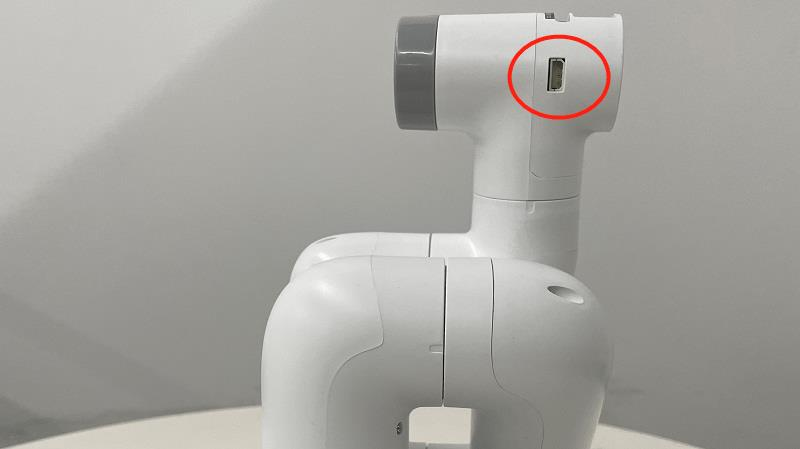
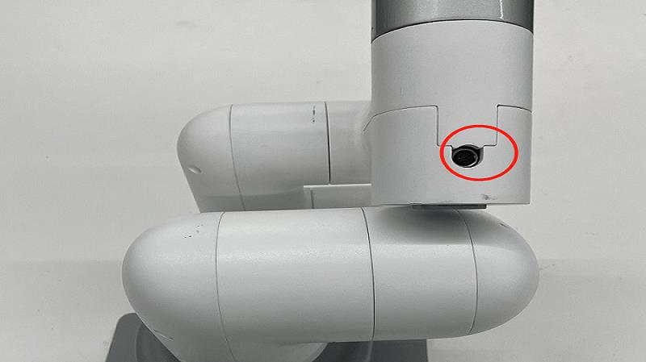

# Gripper Control

First install and connect the gripper onto the robot arm. Different types of gripper is compatible with different types of robots. Refer to **[2.8 Accessories](https://docs.elephantrobotics.com/docs/gitbook/2-serialproduct/2.7-accessories/2.7-accessories.html)** for more information.

> **Notice:**
>
> For MyCobot 280, the adaptive gripper is attached to Atom.
>
> 
>
> The electric gripper is attached to 495 port.
>
> 
>
> ***** MyCobot 280-m5 is not compatible with electric gripper, and MyCobot 320-m5 is only compatible with electric gripper.

## mechArm

### Controlling Gripper

**`is_gripper_moving( )`**

- **Function:** Determine whether the gripper is running
- **return value:**
  - `0 `: Indicates that the gripper of the robot arm is not running
  - `1`: Indicates that the gripper of the robot arm is running
  - `-1`: indicates an error

**`set_gripper_value(value, speed, gripper_type=None)`**

- **Function:** Let the gripper rotate to the specified position at the specified speed
- **Parameter Description:**
  - `value`: Indicates the position that the clamping jaw wants to reach, the value range is 0~256
  - `speed`: indicates the speed at which to rotate, the value range is 0~100
  - `gripper_type`: Gripper type, the default is adaptive gripper
    - `1`: Adaptive gripper
    - `3`: Parallel jaws
    - `4`: Flexible gripper
- **Return value:** None

**`get_gripper_value(gripper_type=None)`**

- **Function:** Get the current position data information of the gripper
- **Parameter Description:**
  - `gripper_type`: Gripper type, the default is adaptive gripper
    - `1`: Adaptive gripper
    - `3`: Parallel jaws
    - `4`: Flexible gripper
- **Return value:** Gripper data information

**`set_gripper_calibration()`**

- **Function:** Set the initial position of the gripper and set the current position to 2048
- **Return value:** None

**`set_gripper_state(flag, speed, _type=None)`**

- **Function:** Let the gripper enter the specified state at the specified speed
- **Parameter Description:**
  - `flag`: 1 means the clamping jaw is closed, 0 means the clamping jaw is open.
  - `speed`: Indicates how fast to reach the specified state, the value range is 0~100
  - `_type`: Gripper type, the default is adaptive gripper
    - `1`: Adaptive gripper
    - `2`: Five-fingered dexterity
    - `3`: Parallel jaws
    - `4`: Flexible gripper
- **Return value:** None

**`set_gripper_calibration()`**

- **Function:** Set the current position of the gripper to zero
- **Return value:** None


**`set_eletric_gripper(status)`**

- **Function:** Set gripper mode (only for 350)
- **Parameter description:** `status`: 1 means the clamping jaw is closed, 0 means the clamping jaw is open.
- **Return value:** None

**`set_gripper_mode(status)`**

- **Function:** Set gripper mode
- **Parameter description:** `status`: 1 transparent transmission mode, 0 I/O mode
- **Return value:** None


**`get_gripper_mode()`**

- **Function:** Get gripper status
- **Return value:** `status(int)`: 0 - Transparent transmission mode 1 - I/O mode

**`set_HTS_gripper_torque(torque)`**

- **Function:** Set adaptive gripper torque
- **Parameter Description:**
  - `torque`: 150 ~ 900
- **Return value:** 0 - Setting failed; 1 - Setting successful

**`get_HTS_gripper_torque()`**

- **Function:** Get adaptive gripper torque
- **Return value:** 150 ~ 900

**`get_gripper_protect_current()`**

- **Function:** Get gripper protection current
- **Return value:** 1 ~ 500

**`init_gripper()`**

- **Function:** Initialize gripper
- **Return value:** 0 - initialization failed; 1 - initialization successful

**`set_gripper_protect_current(current)`**

- **Function:** Set gripper protection current
- **Parameter Description:**
  - `current`: 1 ~ 500
- **Return value:** 0 - initialization failed; 1 - initialization successful

### Simple Demo


```python
from pymycobot.mecharm import MechArm		
from pymycobot import PI_PORT, PI_BAUD  # When using the Raspberry Pi version of MechArm, these two variables can be referenced to initialize MechArm
import time
#Enter the above code to import the packages required by the project

def gripper_test(mc):
    print("Start check IO part of api\n")
    # Check if the gripper is moving
    flag = mc.is_gripper_moving()
    print("Is gripper moving: {}".format(flag))
    time.sleep(1)

    # Set the current position to (2048).
    # Use it when you are sure you need it.
    # Gripper has been initialized for a long time. Generally, there
    # is no need to change the method.
    # mc.set_gripper_ini()
    # Set joint point 1 to rotate to the position of 2048
    mc.set_encoder(1, 2048)
    time.sleep(2)
    # Set six joint positions and let the robotic arm rotate to this position at a speed of 20
    mc.set_encoders([1024, 1024, 1024, 1024, 1024, 1024], 20)
    time.sleep(3)

    # Let the gripper reach the state of 100 at a speed of 70
    mc.set_gripper_value(100, 70)
    time.sleep(3)
    # Let the gripper reach the state of 0 at a speed of 70
    mc.set_gripper_value(0, 70)
    time.sleep(3)

    # Set the state of the gripper to quickly open the gripper at a speed of 70
    mc.set_gripper_state(0, 70)
    time.sleep(3)
    # Set the state of the gripper so that it quickly closes the gripper at a speed of 70
    mc.set_gripper_state(1, 70)
    time.sleep(3)

    # Get the value of the gripper
    print("")
    print(mc.get_gripper_value())


if __name__ == "__main__":
    # MechArm class initialization requires two parameters:
    #   The first is the serial port string, such as:
    #       linux:  "/dev/ttyAMA0"
    #          or "/dev/ttyAMA0"
    #       windows: "COM3"
    #   The second is the baud rate:: 
    #       M5 version is:  115200
    #
    #    Example:
    #       MechArm-M5:
    #           linux:
    #              mc = MechArm("/dev/ttyAMA0", 1000000)
    #          or mc = MechArm("/dev/ttyAMA0", 115200)
    #           windows:
    #              mc = MechArm("COM3", 115200)
    #      MechArm-raspi:
    #           mc = MechArm(PI_PORT, PI_BAUD)
    #
    # Initialize a MechArm object
    # Create object code here for Raspberry Pi version below
    mc = MechArm(PI_PORT, PI_BAUD)
    # make it move to zero position
    mc.set_encoders([2048, 2048, 2048, 2048, 2048, 2048], 20)
    time.sleep(3)
    gripper_test(mc)
```

## myCobot

### Controlling Gripper

**`is_gripper_moving( )`**

- **Function:** Determine whether the gripper is running
- **return value:**
   - `0 `: Indicates that the gripper of the robot arm is not running
   - `1`: Indicates that the gripper of the robot arm is running
   - `-1`: indicates an error

**`set_gripper_value(value, speed, gripper_type=None)`**

- **Function:** Let the gripper rotate to the specified position at the specified speed
- **Parameter Description:**
   - `value`: Indicates the position that the clamping jaw wants to reach, the value range is 0~256
   - `speed`: indicates the speed at which to rotate, the value range is 0~100
   - `gripper_type`: Gripper type, the default is adaptive gripper
     - `1`: Adaptive gripper
     - `3`: Parallel jaws
     - `4`: Flexible gripper
- **Return value:** None

**`get_gripper_value(gripper_type=None)`**

- **Function:** Get the current position data information of the gripper
- **Parameter Description:**
   - `gripper_type`: Gripper type, the default is adaptive gripper
     - `1`: Adaptive gripper
     - `3`: Parallel jaws
     - `4`: Flexible gripper
- **Return value:** Gripper data information

**`set_gripper_calibration()`**

- **Function:** Set the initial position of the gripper and set the current position to 2048
- **Return value:** None

**`set_gripper_state(flag, speed, _type=None)`**

- **Function:** Let the gripper enter the specified state at the specified speed
- **Parameter Description:**
   - `flag`: 1 means the clamping jaw is closed, 0 means the clamping jaw is open.
   - `speed`: Indicates how fast to reach the specified state, the value range is 0~100
   - `_type`: Gripper type, the default is adaptive gripper
     - `1`: Adaptive gripper
     - `2`: Five-fingered dexterity
     - `3`: Parallel jaws
     - `4`: Flexible gripper
- **Return value:** None

**`set_gripper_calibration()`**

- **Function:** Set the current position of the gripper to zero
- **Return value:** None


**`set_eletric_gripper(status)`**

- **Function:** Set gripper mode (only for 350)
- **Parameter description:** `status`: 1 means the clamping jaw is closed, 0 means the clamping jaw is open.
- **Return value:** None

**`set_gripper_mode(status)`**

- **Function:** Set gripper mode
- **Parameter description:** `status`: 1 transparent transmission mode, 0 I/O mode
- **Return value:** None


**`get_gripper_mode()`**

- **Function:** Get gripper status
- **Return value:** `status(int)`: 0 - Transparent transmission mode 1 - I/O mode

**`set_HTS_gripper_torque(torque)`**

- **Function:** Set adaptive gripper torque
- **Parameter Description:**
   - `torque`: 150 ~ 900
- **Return value:** 0 - Setting failed; 1 - Setting successful

**`get_HTS_gripper_torque()`**

- **Function:** Get adaptive gripper torque
- **Return value:** 150 ~ 900

**`get_gripper_protect_current()`**

- **Function:** Get gripper protection current
- **Return value:** 1 ~ 500

**`init_gripper()`**

- **Function:** Initialize gripper
- **Return value:** 0 - initialization failed; 1 - initialization successful

**`set_gripper_protect_current(current)`**

- **Function:** Set gripper protection current
- **Parameter Description:**
   - `current`: 1 ~ 500
- **Return value:** 0 - initialization failed; 1 - initialization successful

### Simple Demo


```python
from pymycobot.mycobot import MyCobot		
from pymycobot import PI_PORT, PI_BAUD  # When using the Raspberry Pi version of mycobot, these two variables can be referenced to initialize MyCobot
import time
#Enter the above code to import the packages required by the project

def gripper_test(mc):
    print("Start check IO part of api\n")
    # Check if the gripper is moving
    flag = mc.is_gripper_moving()
    print("Is gripper moving: {}".format(flag))
    time.sleep(1)

    # Set the current position to (2048).
    # Use it when you are sure you need it.
    # Gripper has been initialized for a long time. Generally, there
    # is no need to change the method.
    # mc.set_gripper_ini()
    # Set joint point 1 to rotate to the position of 2048
    mc.set_encoder(1, 2048)
    time.sleep(2)
    # Set six joint positions and let the robotic arm rotate to this position at a speed of 20
    mc.set_encoders([1024, 1024, 1024, 1024, 1024, 1024], 20)
    time.sleep(3)

    # Let the gripper reach the state of 100 at a speed of 70
    mc.set_gripper_value(100, 70)
    time.sleep(3)
    # Let the gripper reach the state of 0 at a speed of 70
    mc.set_gripper_value(0, 70)
    time.sleep(3)

    # Set the state of the gripper to quickly open the gripper at a speed of 70
    mc.set_gripper_state(0, 70)
    time.sleep(3)
    # Set the state of the gripper so that it quickly closes the gripper at a speed of 70
    mc.set_gripper_state(1, 70)
    time.sleep(3)

    # Get the value of the gripper
    print("")
    print(mc.get_gripper_value())


if __name__ == "__main__":
    # MyCobot class initialization requires two parameters:
    #   The first is the serial port string, such as:
    #       linux:  "/dev/ttyAMA0"
    #          or "/dev/ttyAMA0"
    #       windows: "COM3"
    #   The second is the baud rate:: 
    #       M5 version is:  115200
    #
    #    Example:
    #       mycobot-M5:
    #           linux:
    #              mc = MyCobot("/dev/ttyAMA0", 1000000)
    #          or mc = MyCobot("/dev/ttyAMA0", 115200)
    #           windows:
    #              mc = MyCobot("COM3", 115200)
    #       mycobot-raspi:
    #           mc = MyCobot(PI_PORT, PI_BAUD)
    #
    # Initialize a MyCobot object
    # Create object code here for Raspberry Pi version below
    mc = MyCobot(PI_PORT, PI_BAUD)
    # make it move to zero position
    mc.set_encoders([2048, 2048, 2048, 2048, 2048, 2048], 20)
    time.sleep(3)
    gripper_test(mc)
```


## myBuddy


### Controlling Gripper
**is_gripper_moving(id)**

* **Function** Judge whether the gripper is moving or not

* **Parameters**

    **id** – 1/2 (L/R)

* **Returns**

    * 0 - not moving
    * 1 - is moving
    * -1 - error data

**set_gripper_value(id, value, speed)**

* **Function** Set gripper value

* **Parameters**

  * **id** – 1/2 (L/R)

  * **value** (_int_) – 0 ~ 100

  * **speed** (_int_) – 0 ~ 100

**get_gripper_value(id)**

* **Function** Get the value of gripper.

* **Parameters**

    **id** – 1/2 (L/R)

* **Returns**

    gripper value (int)

**set_gripper_calibration(id)**

* **Function** Set the current position to zero, set current position value is 2048.

* **Parameters**

    **id** – 1/2 (L/R)

**is_gripper_moving(id)**

* **Function** Judge whether the gripper is moving or not

* **Parameters**

    **id** – 1/2 (L/R)

* **Returns**

    * 0 - not moving
    * 1 - is moving
    * -1 - error data

​	

## myPalletizer
### Simple Demo

```python
from pymycobot.mypalletizer import MyPalletizer
from pymycobot.genre import Angle
import time
#Enter the above code to import the packages required by the project

# initiate MyPalletizer 
mc = MyPalletizer("COM3", 115200)

# let joint2 move to 30 degree at the speed of 50
mc.send_angle(2,30,50)
# waite for 2 seconds
time.sleep(2)

#set a variable num, and then set a loop
num = 5
while num > 0:
    #let gripper open at the speed of 70
    mc.set_gripper_state(0,70)
    # waite for 2 seconds
    time.sleep(2)
    # let gripper close at the speed of 70
    mc.set_gripper_state(1, 70)
    # waite for 2 seconds
    time.sleep(2)
    num -= 1
```


## myArm
### Simple Demo

```python
from pymycobot.myarm import MyArm
import time
#Enter the above code to import the packages required by the project

def gripper_test(mc):
    print("Start check IO part of api\n")
    # Check if the gripper is moving
    flag = mc.is_gripper_moving()
    print("Is gripper moving: {}".format(flag))
    time.sleep(1)

    # Set the current position to (2048).
    # Use it when you are sure you need it.
    # Gripper has been initialized for a long time. Generally, there
    # is no need to change the method.
    # mc.set_gripper_ini()
    # Set joint point 1 to rotate to the position of 2048
    mc.set_encoder(1, 2048)
    time.sleep(2)
    # Set six joint positions and let the robotic arm rotate to this position at a speed of 20
    mc.set_encoders([1024, 1024, 1024, 1024, 1024, 1024,1024], 20)
    time.sleep(3)

    # Let the gripper reach the state of 100 at a speed of 70
    mc.set_gripper_value(100, 70)
    time.sleep(3)
    # Let the gripper reach the state of 0 at a speed of 70
    mc.set_gripper_value(0, 70)
    time.sleep(3)

    # Set the state of the gripper to quickly open the gripper at a speed of 70
    mc.set_gripper_state(0, 70)
    time.sleep(3)
    # Set the state of the gripper so that it quickly closes the gripper at a speed of 70
    mc.set_gripper_state(1, 70)
    time.sleep(3)

    # Get the value of the gripper
    print("")
    print(mc.get_gripper_value())


if __name__ == "__main__":
    
    # Initialize a MyArm object
    mc = MyArm("/dev/ttyAMA0", 115200)
    # make it move to zero position
    mc.set_encoders([2048, 2048, 2048, 2048, 2048, 2048, 2048], 20)
    time.sleep(3)
    gripper_test(mc)
```