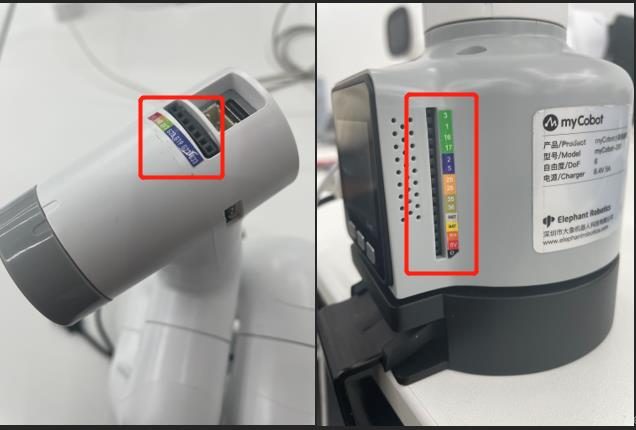
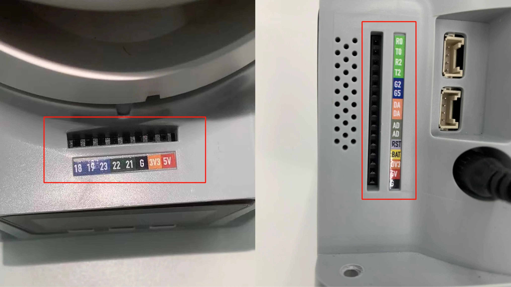

# IO control

IO is the input and output of data. There are multiple pins on the Basic and Atom of our robot arm. The input and output modes can be set through the following function interface.





## mechArm

### Basic IO

**get_basic_input(pin_no)**

- **Function:** to obtain the working state of the bottom pin number
- **Parameters:** `pin_no`: represents the specific pin
  number at the bottom of the robot.
- **Return Value:** `pin_signal`(`int`) When the returned value
  is 0, it means running in the working state; when it is 1, it means
  the stop state.


**set_basic_output(pin_no, pin_signal)**

- **Function:** to set the working state of the bottom pin number.
- **Parameters:** 
- `pin_no` (`int`). Only the numerical part of
  the numbers marked at the bottom of the equipment is taken.
- `pin_signal` (`int` ): Inputting 0 means setting to the running
  state, which inputting 1 means setting to the stop state
- **Return Value:** None


**get_tof_distance()**

- **Function:** to obtain a detected distance (An external distance detector is required). 
- **Return value:** The detected distance value (in mm).


### Atom IO

**set_pin_mode(pin_no, pin_mode)**

- **Function:** to set the state mode of the specified pin in the
  atom.
- **Parameters:**
  -   `pin_no` (int): represents the specific pin number on the top of
      the robot.
  -   `pin_mode` (int): limited to 0-2
      -   0 means setting it to the running state;
      -   1 means setting it to the stop state;
      -   2 means setting to the pull-up mode.
- **Return Value:** None

**set_digital_output(pin_no, pin_signa)**

- **Function:** to set the working state of the end pin number.
- **Parameters:**
  -   `pin_no` (`int`). Only the numerical part of the number marked
      at the end of the equipment is taken.
  -   `pin_signal`(`int`). Inputting 0 means setting to the
      running state, while inputting 1 means setting to the stop
      state.
- **Return Value:** None

**get_digital_input(self, pin_no)**

- **Function:** to obtain the working state of the end pin number.
- **Parameters:** `pin_no`: represents the specific pin
  number at the end of the robot.
- **Return Value:** `pin_signal`(`int`) When the returned value
  is 0, it means running in the working state; when it is 1, it means
  the stop state.


### Raspberry Pi——GPIO

For Raspberry Pi version, use the following API.

Type the code at the beginning:

```python
from pymycobot import MechArm
from pymycobot import PI_PORT, PI_BAUD  
import RPi.GPIO as GPIO
```

**gpio_init()**

- **Function:** Initialize GPIO module, set BCM mode.
- **Return value:** None

**set_gpio_mode**

- **Function:** Set Raspberry Pi GPIO Pin Mode
- **Parameter**
  - `mode` (`str`) Input: "BCM" or "BOARD" to enter the corresponding mode


**set_gpio_output(pin_no, state)**

- **Function:** Set the pin to high, low.
- **Parameter:**
  - `pin`( `int`) pin number.
  - `state`：0 is set to low level 1 is set to high level (low level of suction pump starts working, high level stops working)
  - **Return Value:** None


**get_gpio_in(pin_no)**

- **Function:** Get the pin level status.
- **Parameter Description:**
  - `pin_no`( `int`) pin number.
- **Return Value:** 0 is low level 1 is high level


### Simple Demo

270-M5 version:

```python
from pymycobot.mecharm import MechArm
from pymycobot import PI_PORT, PI_BAUD  # When using the Raspberry Pi version of MechArm, you can refer to these two variables to initialize MechArm
import time
# Enter the above code to import the packages required by the project

# MechArm class initialization requires two parameters:
#   The first is the serial port string, such as:
#       linux:  "/dev/ttyAMA0"
#          or "/dev/ttyAMA0"
#       windows: "COM3"
#   The second is the baud rate:: 
#       M5 version is:  115200
#
#    Example:
#       MechArm-M5:
#           linux:
#              mc = MechArm("/dev/ttyAMA0", 1000000)
#          or mc = MechArm("/dev/ttyAMA0", 115200)
#           windows:
#              mc = MechArm("COM3", 115200)
#       MechArm-raspi:
#           mc = MechArm(PI_PORT, PI_BAUD)
#
# Initialize a MechArm object
# Create object code here for windows version
mc = MechArm("COM3", 115200)

for count in range(5):
# set a loop
    mc.set_basic_output(2,0)
    # Let the basic2 position enter the working state
    mc.set_basic_output(5,0)
    # Let the basic5 position enter the working state
    time.sleep(2)
    #等待两秒
    mc.set_basic_output(2,1)
    #Let the basic2 position stop working
    mc.set_basic_output(5,1)
    #Let the basic5 position stop working 
```

270-Pi version:

```python
from pymycobot.mecharm import MechArm
from pymycobot import PI_PORT, PI_BAUD  #When using the Raspberry Pi version of MechArm, you can refer to these two variables for MechArm initialization
import time
#Enter the above code to import the packages required by the project

# MechArm class initialization requires two parameters:
#   The first is the serial port string, such as:
#       linux:  "/dev/ttyAMA0"
#          or "/dev/ttyAMA0"
#       windows: "COM3"
#   The second is the baud rate:: 
#       M5 version is:  115200
#
#    Example:
#       MechArm-M5:
#           linux:
#              mc = MechArm("/dev/ttyAMA0", 1000000)
#          or mc = MechArm("/dev/ttyAMA0", 115200)
#           windows:
#              mc = MechArm("COM3", 115200)
#       mycobot-raspi:
#           mc = MechArm(PI_PORT, PI_BAUD)
#
# Initialize a MechArm object
# Create object code here for Raspberry Pi version
mc = MechArm(PI_PORT, PI_BAUD)
    
# initialization
GPIO.setmode(GPIO.BCM)
GPIO.setup(20, GPIO.OUT)
GPIO.setup(21, GPIO.OUT)
# open suction pump
GPIO.output(20, 0)
GPIO.output(21, 0)
# wait 2 seconds
time.sleep(2)
# Turn off the suction pump
GPIO.output(20, 1)
GPIO.output(21, 1)
```

## myCobot

### Basic IO

**get_basic_input(pin_no)**

- **Function:** to obtain the working state of the bottom pin number
-   **Parameters:** `pin_no`: represents the specific pin
    number at the bottom of the robot.
-   **Return Value:** `pin_signal`(`int`) When the returned value
    is 0, it means running in the working state; when it is 1, it means
    the stop state.


**set_basic_output(pin_no, pin_signal)**
- **Function:** to set the working state of the bottom pin number.
- **Parameters:** 
- `pin_no` (`int`). Only the numerical part of
the numbers marked at the bottom of the equipment is taken.
- `pin_signal` (`int` ): Inputting 0 means setting to the running
state, which inputting 1 means setting to the stop state
- **Return Value:** None


**get_tof_distance()**
- **Function:** to obtain a detected distance (An external distance detector is required). 
- **Return value:** The detected distance value (in mm).


### Atom IO

**set_pin_mode(pin_no, pin_mode)**

- **Function:** to set the state mode of the specified pin in the
    atom.
-   **Parameters:**
    -   `pin_no` (int): represents the specific pin number on the top of
        the robot.
    -   `pin_mode` (int): limited to 0-2
        -   0 means setting it to the input state;
        -   1 means setting it to the output state;
        -   2 means setting to the pull-up mode.
-   **Return Value:** None

**set_digital_output(pin_no, pin_signa)**

- **Function:** to set the working state of the end pin number.
-   **Parameters:**
    -   `pin_no` (`int`). Only the numerical part of the number marked
        at the end of the equipment is taken.
    -   `pin_signal`(`int`). Inputting 0 means setting to the
        running state, while inputting 1 means setting to the stop
        state.
-   **Return Value:** None

**get_digital_input(self, pin_no)**

- **Function:** to obtain the working state of the end pin number.
-   **Parameters:** `pin_no`: represents the specific pin
    number at the end of the robot.
-   **Return Value:** `pin_signal`(`int`) When the returned value
    is 0, it means running in the working state; when it is 1, it means
    the stop state.


### Raspberry Pi——GPIO

For Raspberry Pi version, use the following API.

Type the code at the beginning:

```python
from pymycobot import MyCobot
from pymycobot import PI_PORT, PI_BAUD  
import RPi.GPIO as GPIO
```
**gpio_init()**

- **Function:** Initialize GPIO module, set BCM mode.
- **Return value:** None

**set_gpio_mode**
- **Function:** Set Raspberry Pi GPIO Pin Mode
- **Parameter**
  - `mode` (`str`) Input: "BCM" or "BOARD" to enter the corresponding mode


**set_gpio_output(pin_no, state)**

- **Function:** Set the pin to high, low.
- **Parameter:**
  - `pin`( `int`) pin number.
  - `state`：0 is set to low level 1 is set to high level (low level of suction pump starts working, high level stops working)
  - **Return Value:** None


**get_gpio_in(pin_no)**
- **Function:** Get the pin level status.
- **Parameter Description:**
  - `pin_no`( `int`) pin number.
- **Return Value:** 0 is low level 1 is high level


### Simple Demo

280-M5 version:

```python
from pymycobot.mycobot import MyCobot
from pymycobot import PI_PORT, PI_BAUD  # When using the Raspberry Pi version of mycobot, you can refer to these two variables to initialize MyCobot
import time
# Enter the above code to import the packages required by the project

# MyCobot class initialization requires two parameters:
#   The first is the serial port string, such as:
#       linux:  "/dev/ttyUSB0"
#          or "/dev/ttyAMA0"
#       windows: "COM3"
#   The second is the baud rate:: 
#       M5 version is:  115200
#
#    Example:
#       mycobot-M5:
#           linux:
#              mc = MyCobot("/dev/ttyUSB0", 115200)
#          or mc = MyCobot("/dev/ttyAMA0", 115200)
#           windows:
#              mc = MyCobot("COM3", 115200)
#       mycobot-raspi:
#           mc = MyCobot(PI_PORT, PI_BAUD)
#
# Initialize a MyCobot object
# Create object code here for windows version
mc = MyCobot("COM3", 115200)

for count in range(5):
# set a loop
    mc.set_basic_output(2,0)
    # Let the basic2 position enter the working state
    mc.set_basic_output(5,0)
    # Let the basic5 position enter the working state
    time.sleep(2)
    #等待两秒
    mc.set_basic_output(2,1)
    #Let the basic2 position stop working
    mc.set_basic_output(5,1)
    #Let the basic5 position stop working 
```

280-Pi version:

```python
from pymycobot.mycobot import MyCobot
from pymycobot import PI_PORT, PI_BAUD  #When using the Raspberry Pi version of mycobot, you can refer to these two variables for MyCobot initialization
import time
#Enter the above code to import the packages required by the project

# MyCobot class initialization requires two parameters:
#   The first is the serial port string, such as:
#       linux:  "/dev/ttyAMA0"
#          or "/dev/ttyAMA0"
#       windows: "COM3"
#   The second is the baud rate:: 
#       M5 version is:  115200
#
#    Example:
#       mycobot-M5:
#           linux:
#              mc = MyCobot("/dev/ttyAMA0", 1000000)
#          or mc = MyCobot("/dev/ttyAMA0", 115200)
#           windows:
#              mc = MyCobot("COM3", 115200)
#       mycobot-raspi:
#           mc = MyCobot(PI_PORT, PI_BAUD)
#
# Initialize a MyCobot object
# Create object code here for Raspberry Pi version
mc = MyCobot(PI_PORT, PI_BAUD)
    
# initialization
GPIO.setmode(GPIO.BCM)
GPIO.setup(20, GPIO.OUT)
GPIO.setup(21, GPIO.OUT)
# open suction pump
GPIO.output(20, 0)
GPIO.output(21, 0)
# wait 2 seconds
time.sleep(2)
# Turn off the suction pump
GPIO.output(20, 1)
GPIO.output(21, 1)
```


## myBuddy

### Atom IO
**set_pin_mode(id, pin_no, pin_mode)**

- **Function** Set the state mode of the specified pin in atom.

* **Parameters**

  * **id** – 1/2 (L/R)

  * **pin_no** (_int_) – pin number (1 - 5).

  * **pin_mode** (_int_) – 0 - input, 1 - output

**set_digital_output(id, pin_no, pin_signal)**

- **Function** Set atom IO output level

* **Parameters**

  * **id** – 1/2 (L/R)

  * **pin_no** (_int_) – 1 - 5

  * **pin_signal** (_int_) – 0 / 1

**get_digital_input(id, pin_no)**

- **Function** singal value

* **Parameters**

  * **id** – 1/2 (L/R)

  * **pin_no** (_int_) – 1 - 5

**set_pwm_output(id, channel, frequency, pin_val)**

- **Function** PWM control

* **Parameters**

  * **id** – 1/2 (L/R)

  * **channel** (_int_) – IO number (1 - 5).

  * **frequency** (_int_) – clock frequency (0/1: 0 - 1Mhz 1 - 10Mhz)

  * **pin_val** (_int_) – Duty cycle 0 ~ 100: 0 ~ 100%


### Raspberry Pi IO

**set_gpio_input(pin)**

- **Function** Set GPIO input value.

* **Parameters**

    **pin** – (int)pin number.

**set_gpio_mode(pin_no, mode)**

- **Function** Init GPIO module, and set BCM mode.

* **Parameters**

  * **pin_no** – (int)pin number.

  * **mode** – 0 - input 1 - output

**set_gpio_output(pin, v)**

- **Function** Set GPIO output value.

* **Parameters**

  * **pin** – (int)pin number.

  * **v** – (int) 0 / 1

**set_gpio_pwm(pin, baud, dc)**

- **Function** Set GPIO PWM value.

* **Parameters**

  * **pin** – (int)pin number.

  * **baud** – (int) 10 - 1000000

  * **dc** – (int) 0 - 100


### Simple Demo

```python
from pymycobot import MyBuddy
import time
mc = MyBuddy("/dev/ttyACM0")

# 设置树莓派IO 20为输出模式
mc.set_gpio_mode(20， 1)

mc.set_gpio_output(20, 1)
time.sleep(2)
mc.set_gpio_output(20, 0)
```

## myPalletizer
### Simple Demo

```python
from pymycobot.mypalletizer import MyPalletizer
import time
#Enter the above code to import the packages required by the project

# initiate MyPalletizer
mc = MyPalletizer("COM3", 115200)

for count in range(5):
# set a loop
    mc.set_basic_output(2,0)
    # Let the basic2 position enter the working state
    mc.set_basic_output(5,0)
    # Let the basic5 position enter the working state
    time.sleep(2)
    #等待两秒
    mc.set_basic_output(2,1)
    #Let the basic2 position stop working
    mc.set_basic_output(5,1)
    #Let the basic5 position stop working 
```

## MyArm
### Simple Demo

```python
from pymycobot.myarm import MyArm
import time
#Enter the above code to import the packages required by the project

# Initialize a MyArm object
mc = MyArm("/dev/ttyAMA0", 115200)
    
# initialization
GPIO.setmode(GPIO.BCM)
GPIO.setup(20, GPIO.OUT)
GPIO.setup(21, GPIO.OUT)
# open suction pump
GPIO.output(20, 0)
GPIO.output(21, 0)
# wait 2 seconds
time.sleep(2)
# Turn off the suction pump
GPIO.output(20, 1)
GPIO.output(21, 1)
```