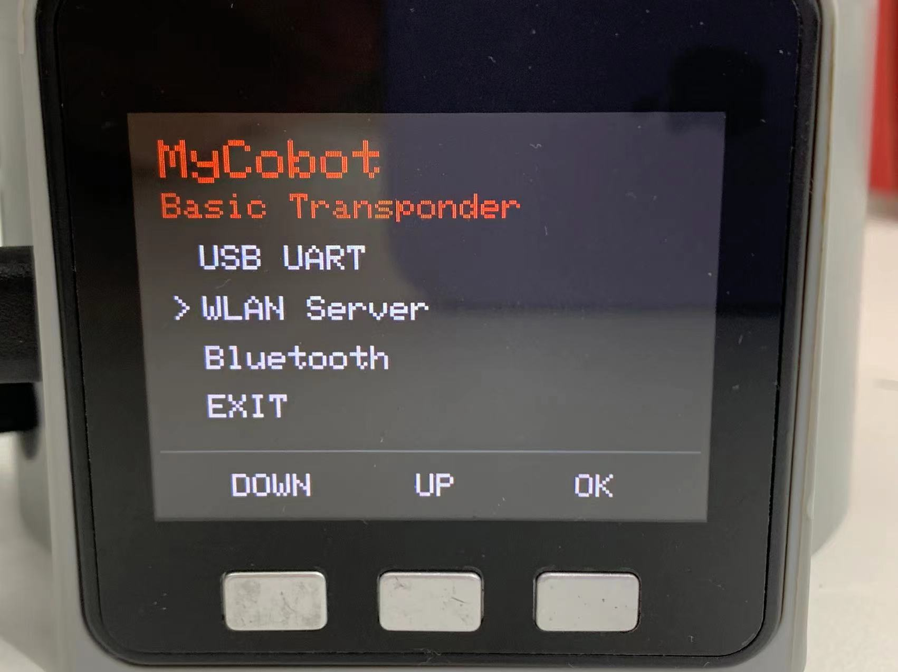
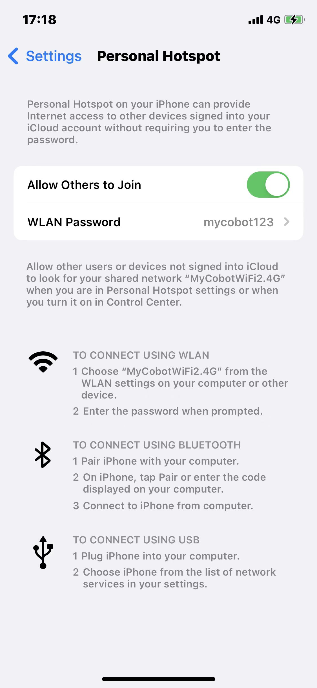

# TCP/IP

TCP/IP, or Transmission Control Protocol/Internet Protocol, is one of the most fundemental communicative protocol on Internet, which stipulates the standard and methods of the Internet communication. Users can control robotic arms remotely through connecting with IP address instead of the USB port.

In this chapter, myCobot 280 M5 is used as an example for explanation.

**Make sure that M5Stack-basic and Atom are both burnt before using.**

## myCobot

### Connection

#### 1.1 WIFI

Follow the steps below.

**Step 1:** Press WLAN Server, and "WIFI Connecting" appears, signaling that the robotic arm is connecting with WIFI.




**Step 2:** If the screen shows WIFI Connected, IP and Port, it means that robotic arm is successfully connected with WIFI.


##### 1.2 Mobile Network

**Step 1:** It is required to change the name of hotspot on your smartphone into the same as that on the robotic arm, namely "MyCobotWiFi2.4G". Meanwhile, change the password of hotspot as "mycobot123".




**Step 2:** Press WLAN Server to connect with mobile network.


> **Notice:** If it fails to connect, go back to press USB UART and then try the steps above again.

##### 1.3 Solution to Failed Connection

**Step 1:** Update the version of Atom and M5Stakc-basic to the minirobot v2.0 and atommain v4.1.

**Step 2:** Click on the icon to open the software UartAssist.exe.


**Step 3:** Click on "取消".


**Step 4:** Click on History, and then BatchSend. After that, right-click in the white space, and then New to add a data item.


**Step 5:** Add a data item according to the settings shown in the figure below. And then, save that item.


**Step 6:** Continue to add item in accordance with the settings shown in the figure below. Remember to type your personal WIFI name and password into the blank box. Make sure that WIFI name is surrounded by quotation mark (English) and password is surround by bracket (English). And then save it.


**Step 6:** Press `Transponder` on the M5Stack-basic and then press USB UART.

**Step 7:** Set COM configurations, and then click on "Open". After that, click on "Start Send".


**Step 8:** After sending the data items, there is a response.


**Step 9:** Press WLAN Server on the M5Stack-basic to connect successfully.


#### 1.4 Raspberry Pi Connections

- When using Raspberry Pi for remote connection, you need to pay attention to the following points
  1. The Raspberry Pi and the control end need to be on the same network
  2. The server file needs to be executed first in the Raspberry Pi (For specific operations, see the gif operation diagram)
  3. After the server file is executed, the prompt "Binding succeeded and waiting connect" indicates that the opening is successful, and the control terminal can refer to **2 Simple Demo**

​	

*specific operation is:*

*clone our project library：*`git clone https://github.com/elephantrobotics/pymycobot.git`

*find the [Server.py](https://github.com/elephantrobotics/pymycobot/blob/main/demo/Server.py) file in the demo folder and execute it with python*

### Instructions for use:

Please update pymycobot to the latest version before use.

`pip install pymycobot --upgrade`


Please change the parameters passed in the last line of the [Server.py](https://github.com/elephantrobotics/pymycobot/blob/main/demo/Server.py) file, MycobotServer, based on your model.


The default model is the 280PI.

    The default parameters are: 

        serial_num: /dev/ttyAMA0

        baud: 1000000

### Simple Demo

```python
from pymycobot import MyCobotSocket
# Use port 9000 by default
# Where "192.168.10.22" is the IP of the robot arm
mc = MyCobotSocket("192.168.10.22",9000)

#After the connections is normal, the robot arm can be controlled.
res = mc.get_angles()
print(res)
mc.send_angles([0,0,0,0,0,0],20)
...
```


## myArm
### Simple Demo

```python
from pymycobot import MyArmSocket
# Use port 9000 by default
# Where "192.168.10.22" is the IP of the robot arm
mc = MyArmSocket("192.168.11.15",9000)  

#After the connections is normal, the robot arm can be controlled.
mc.send_angles([0,0,0,0,0,0,0],20)
res = mc.get_angles()
print(res)

...
```


## mybuddy

> Note: This function must be used under the same network

### start the server
1.Double click to open this software on the desktop


2.Select Transponder, the port is /dev/ttyACM0, click Connect


3.Select "Wlan Socket"


4.Click "OPEN" to open the server


### Client connection

```python
from pymycobot import MyBuddySocket

mst = MyBuddySocket("192.168.0.1", 9000)
mst.connect("/dev/ttyACM0", "115200")

print(mst.get_angles(1))
```