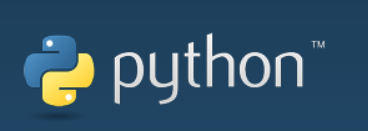

## What is Python?

**Our products are friendly to python and also becomes increasingly perfect for the development of a python API library. Through python, the joint angle, coordinates, gripper and other aspects of the robot can be controlled, and there are many options available. If you want to control our robot arms via Python programming, you are recommended to learn this chapter.**

## 

**Python**  was designed in the early 1990s by Guido van Rossum of the Netherlands Society for Mathematics and Computer Science as an alternative to a language called ABC.

**Python** not only provides efficient, advanced data structures, but also can be used to do simple and effective object-oriented programming.

The Syntax and dynamic typing of **Python** as well as the nature of interpreted languages, make it become a programming language for scripting and rapid application development on most platforms. With the continuous updating of the version and the addition of new features, it is gradually used to develop independent, large-scale projects.

The interpreter of **Python** is easily extensible, and new functions and data types can be extended using the C or C++ language (or other languages that can be called through C language).。

**Python** can also be used for extending program languages in customizable software. **Python** has rich standard libraries and provides source or machine codes suitable for each major system platform.

## Installing Python

- **Python** Python's official downloading address：https://www.python.org/downloads/
- [**Python** downloading and Installation Tutorial](https://python.land/installing-python#Install_Python_on_Windows) for reference only

**Applicable equipment:**

- myCobot 280
  - myCobot 280 M5
  - myCobot 280 PI
  - myCobot 280 Jetson Nano
  - myCobot 280 for Arduino  

- myCobot 320
  - myCobot 320 M5
  - myCobot 320 PI  

- myPalletizer 260
  - myPalletizer 260 M5
  - myPalletizer 260 PI  
- mechArm-270
  - mechArm-270 M5
  - mechArm-270 PI

**Preconditions for use：**

- **M5** series version， the bottom **M5Stack-basic** is programmed to miniRobot , select the  **Transponder** function, and the end **ATOM** is programmed to the latest version of atomMain (the factory default has been programmed)
- **Pi \ jetsonnano** series, **ATOM** burns the latest version of **atomMain** (factory default already burnt)
