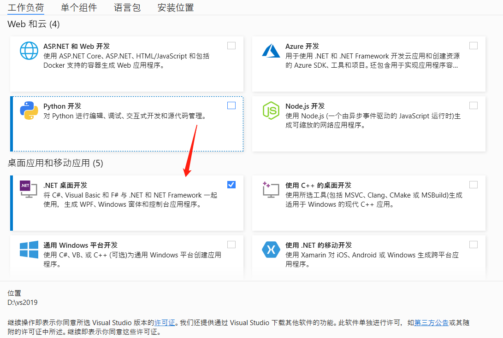

# C# Environment building

## 1 Confirming development goals
Mycobot.csharp is a program used for serial communication with a robot. It contains simple use cases. If you want to make developments using C# to control the robots that have been developed by us, it is your choice.  
Available for: **myCobot280, 320 and myPalletizer 260**. 

Run the software recommended by Mycobot.csharp: vs2019 (Windows development), and MonoDevelop (Development on the Raspberry Pi robot arm). 

## 2 Windows Environment Configuration

### 2.1 Installing vs2019
- Downloading: First download [vs2019](https://visualstudio.microsoft.com/zh-hans/vs/) from the official website. 

- Installation: After installation is complete, the interface shown in the figure below will appear. .NET desktop development is mainly chosen (This is just a suggestion, you can choose according to your own needs. The installation time of vs2019 is long). 
 

## 3 Environment configuration of Raspberry Pi robot arm

### 3.1 Installing monodevelop
- Installation 
  Execute the following commands in order to install it. You may also view the [instructions](https://www.monodevelop.com/download/#fndtn-download-lin) on the official website.  
  sudo apt install apt-transport-https dirmngr 
  sudo apt-key adv --keyserver hkp://keyserver.ubuntu.com:80 --recv-keys 3FA7E0328081BFF6A14DA29AA6A19B38D3D831EF
  echo "deb https://download.mono-project.com/repo/ubuntu vs-bionic main" | sudo tee /etc/apt/sources.list.d/mono-official-vs.list 
  sudo apt update 
  sudo apt-get install monodevelop 

- Test 
  Test whether the installation is successful. Check this [document](https://www.monodevelop.com/documentation/creating-a-simple-solution/). 
