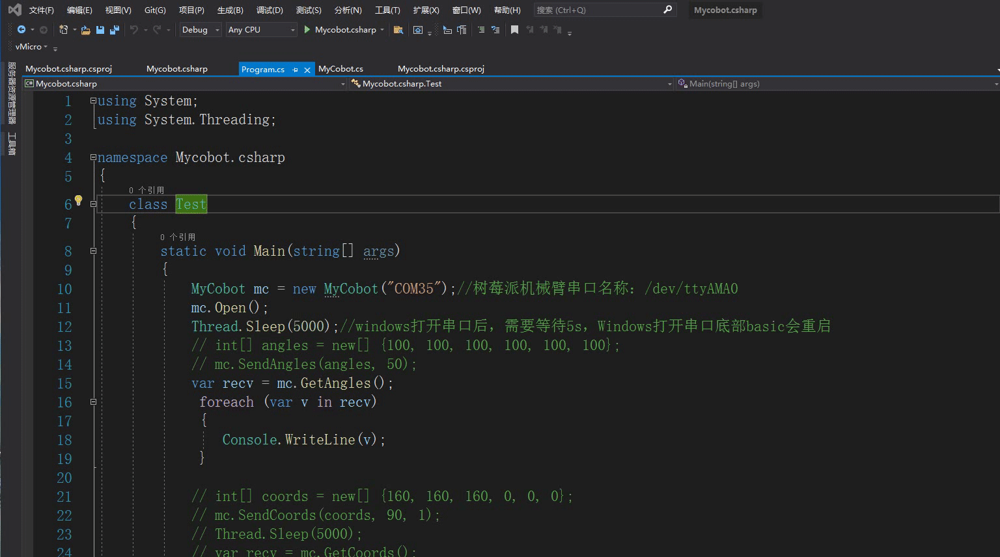

# Compiling and Running of a MycobotCpp Case

## 1 Downloading

### 1.1 Downloading source code
Download [Mycobot.csharp](https://github.com/elephantrobotics/Mycobot.csharp) from github.

### 1.2 Downloading a dynamic library
To run the case, you need to use this [dynamic library](https://github.com/elephantrobotics/Mycobot.csharp/tags), which encapsulates the API to control the robot arm:  
- Select the latest version, as shown in the following figure:  
 

- The dynamic library is divided into two versions: Windows (Windows is divided into .net and .net framework. For the way to distinguish them, see running under Windows below) and Raspberry Pi system, as shown in the following figure.  
 
1 适用于树莓派机械臂系统 
2 适用于Windows系统 
## 2 Running in Windows

### 2.1 Directly running the Mycobot.csharp case downloaded from github.
- Double-click Mycobot.csharp.sln to open it (Make sure that vs2019 has been installed in the computer. If not, see 9.1 Environment building) 
 

- Compile and run the project, and check the serial port number of the robot arm. If it is inconsistent with the example, modify the serial port number, as shown in the picture below. 
   

### 2.2 Calling a Mycobot.csharp dynamic library in your own project
- Check the target frame of the project, and then download the dynamic library corresponding thereto. If the target frame is .net core, download net core/Mycobot.csharp.dll; if it is .net framework, download net framework/Mycobot.csharp.dll )  
  
- Import Mycobot.csharp.dll into the project.  
  
- Add system.io.ports to .csproj (the project name, and the file is located in the directory of the project), as shown in the picture below: 
frame: .net core 
 
frame: .net framework 
 
In versions prior to vs2019, SerialPort can be used by simply using System.IO.Ports. If you get the error: No type name found in the namespace, you need to configure the dll for your project as follows:
Tools - >Nuget Package Manager (N) - > Manage solution Nuget package (N) - > Browse, search for the corresponding dll(e.g. SerialPort) in the left bar, check the item you want to add on the right, click Download and install. 
 

4. For the use of library functions, see 9.7 Mycobot API, 9.8 Use Cases and the separate use of joints, coordinates, etc. in the following chapters. 

### 2.3 Problems
Problems that may be encountered during use:  
- Problem: System.Runtime, Version=5.0.0.0, Culture=neutral, PublicKeyToken=b03f5f7f11d50a3a' or one of its dependencies… Solution: update your sdk (if .net core, update to 5.0 and choose, if .net framework update to 4.0 and choose 4.7.2), watch the following animation:  
 
- Problem: System.IO.FileNotFoundException: "Could not load file or assembly 'System.IO.Ports, Version=6.0.0.0, Culture=neutral, PublicKeyToken=cc7b13ffcd2ddd51'. Solution: See the step 3 of 9.2.2.2 above. 

## 3 Running in the Raspberry Pi robot arm
- Create a C# console application;  
- copy the program.cs and paste it to the application; 
- change the port number in program.cs to /dev/ttyAMA0 (MyCobot mc = new MyCobot(“/dev/ttyAMA0”));  
 
- change the compilation method to Release ; 
 
- Add the Mycobot.csharp.dll library file to the project, library: ReFerences–>Edit References–>.Net Assembly–>Browse(path for .dll) 
 
- Run it. Note: compile and run it. For the whole operation process, watch the the following animation. 
 
