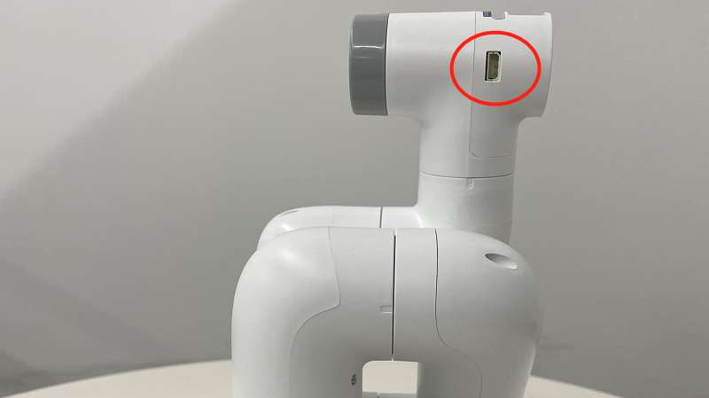

# Gripper control
Installing the gripper:  
- For an adaptive gripper, insert it on the pin on the atom, as shown in the following figure:  
 
- For an electric gripper, insert it into the 485 interface on the top, as shown in the following figure:  
Notice: myCobot280 and myPalletizer 260 have no electric gripper, only myCobot320 has an electric gripper.  
 

## 1 Adaptive gripper control 
supports：**myCobot280, 320&&myPalletizer 260**  
1.1 **setGripperValue(byte angle, byte speed)**  
Return value: none  
Parameter description: Parameter 1: gripper opening and closing angles (ranging from 0  to 100; 0–closed; 100-maximum open angle); Parameter 2: gripper opening and closing speeds (0-100)  
Case: 

	mc.setGripperValue(0, 10);
	Thread.Sleep(3000);
	mc.setGripperValue(50, 100);
	Thread.Sleep(3000);
1.2 **getGripperValue()**  
Return value: int type, returning the gripper angle (0 - closed; 100 - maximum open angle)  Parameter description: none  
Case:  

	Console.WriteLine(mc.getGripperValue());

## 2 Electric gripper control
Available for: **myCobot320**  
2.1 **setEletricGripper(int state)**  
Return value: none  
Parameter description: gripper switch state (0-off; 1-on) 
Case: 

	mc.setEletricGripper(0);

## 3 Complete use cases

	using System;
	using System.Threading;
	
	namespace Mycobot.csharp
	{
	    class Test
	    {
	        static void Main(string[] args)
	        {
	            MyCobot mc = new MyCobot("COM57");
	            mc.Open();
	            Thread.Sleep(5000);
	
	            //set gripper open or close 0--close 100-open max 0-100
	            mc.setGripperValue(0, 10);
	            Thread.Sleep(3000);
	            mc.setGripperValue(50, 100);
	            Thread.Sleep(3000);
	
				//set electric gripper
				mc.setEletricGripper(0);
				Thread.Sleep(100);
				mc.setEletricGripper(1);
				Thread.Sleep(100);
	
	            //get gripper state 0--close 1--open
	            Console.WriteLine(mc.getGripperValue());
	            mc.Close();
	        }
	    }
	}
